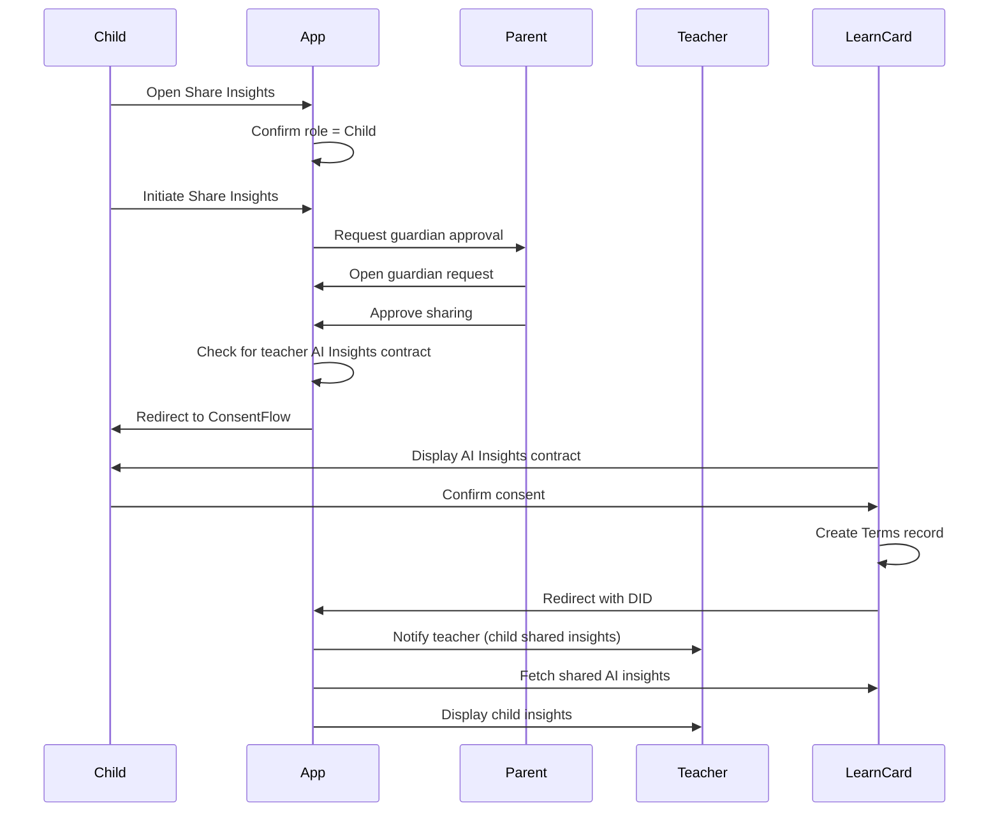

# Child Directly Shares Insights (Existing Contract)

This flow describes when a child directly shares their AI insights with a teacher with parent approval, and the teacher already has an AI Insights contract.

