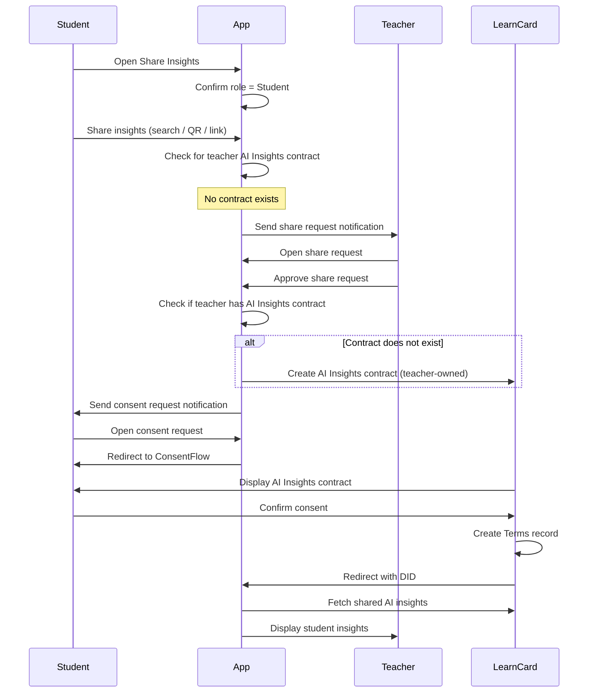

# Student Directly Shares Insights (No Contract)

This flow describes when a student wants to share their AI insights directly with a teacher, but the teacher has not yet created an AI Insights contract.

