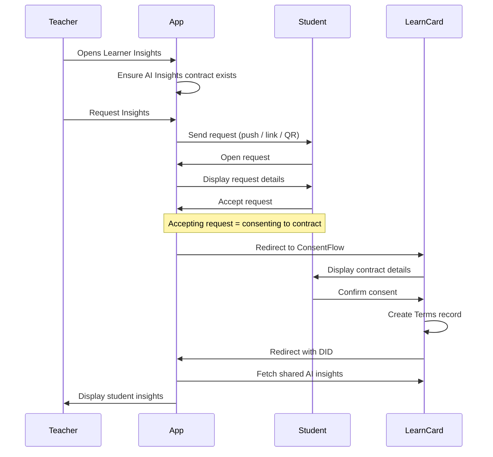

# Teacher Requests Insights Flow

```mermaid
sequenceDiagram
    participant Teacher
    participant App
    participant Student
    participant LearnCard

    Teacher->>App: Opens Learner Insights
    App->>App: Ensure AI Insights contract exists

    Teacher->>App: Request Insights
    App->>Student: Send request (push / link / QR)

    Student->>App: Open request
    App->>Student: Display request details

    Student->>App: Accept request
    Note over Student,App: Accepting request = consenting to contract

    App->>LearnCard: Redirect to ConsentFlow
    LearnCard->>Student: Display contract details
    Student->>LearnCard: Confirm consent

    LearnCard->>LearnCard: Create Terms record
    LearnCard->>App: Redirect with DID

    App->>LearnCard: Fetch shared AI insights
    App->>Teacher: Display student insights
```
