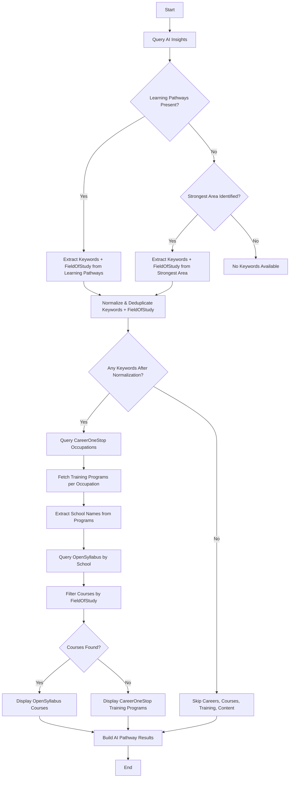

# AI Pathways - Flow Diagram

```mermaid
flowchart TD
    A[Start] --> B[Query AI Insights]

    B --> C{Learning Pathways Present?}

    C -->|Yes| D[Extract Keywords + FieldOfStudy from Learning Pathways]
    C -->|No| E{Strongest Area Identified?}

    E -->|Yes| F[Extract Keywords + FieldOfStudy from Strongest Area]
    E -->|No| G[No Keywords Available]

    D --> H[Normalize & Deduplicate Keywords + FieldOfStudy]
    F --> H

    H --> I{Any Keywords After Normalization?}

    I -->|No| Z[Skip Careers, Courses, Training, Content]

    I -->|Yes| J[Query CareerOneStop Occupations]

    J --> K[Fetch Training Programs per Occupation]

    K --> L[Extract School Names from Programs]

    L --> M[Query OpenSyllabus by School]

    M --> N[Filter Courses by FieldOfStudy]

    N --> O{Courses Found?}

    O -->|Yes| P[Display OpenSyllabus Courses]
    O -->|No| Q[Display CareerOneStop Training Programs]

    P --> R[Build AI Pathway Results]
    Q --> R
    Z --> R

    R --> S[End]
```
