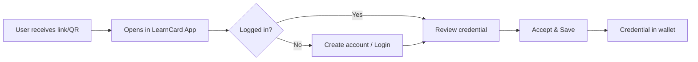
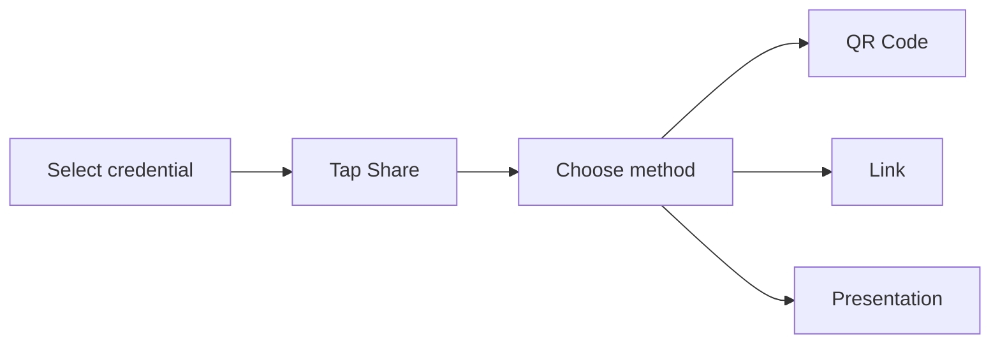
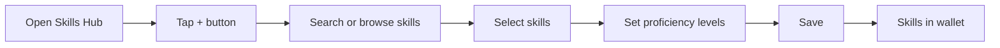

# LearnCard App

The **LearnCard App** is a digital wallet for verifiable credentials. It allows users to claim, store, organize, and share their achievements, badges, certifications, and IDs.

Available on:

-   📱 iOS ([App Store](https://apps.apple.com/us/app/learncard/id1635841898))
-   📱 Android ([Google Play](https://play.google.com/store/apps/details?id=com.learncard.app))
-   🌐 Web ([app.learncard.com](https://app.learncard.com))

---

## Key Features

| Feature               | Description                                                            |
| --------------------- | ---------------------------------------------------------------------- |
| **Claim Credentials** | Scan QR codes or click links to add credentials to your wallet         |
| **Organize**          | Categorize credentials by type (achievements, IDs, work history, etc.) |
| **Share**             | Generate shareable links or presentations for verifiers                |
| **Connect**           | Find and connect with other profiles on the LearnCard Network          |
| **Consent**           | Control what data you share and with whom                              |

---

## User Flows

### Claiming a Credential

1. User receives a claim link or scans a QR code
2. Link opens the LearnCard App
3. User logs in (or creates an account)
4. User reviews the credential details
5. User accepts and saves to their wallet

### Sharing a Credential

1. User selects a credential from their wallet
2. Taps "Share"
3. Chooses sharing method:
    - **QR Code** — For in-person verification
    - **Link** — For sending digitally
    - **Presentation** — For formal verification requests

### Self-Assigning Skills

1. User opens the Skills Hub from their wallet
2. Taps the **+** button to add skills
3. Searches by skill name or occupation, or browses suggested skills
4. Selects one or more skills from the framework
5. Sets a proficiency level for each skill:
    - **Hidden** — Do not display proficiency status
    - **Novice** — Just starting and needs guidance
    - **Beginner** — Handles simple tasks without support
    - **Proficient** — Works independently on routine tasks
    - **Advanced** — Solves complex tasks efficiently
    - **Expert** — Deep mastery; can lead and mentor others
6. Saves the self-attested skills to their wallet


Self-assigned skills are **self-attested credentials**. They represent what a user claims about their own abilities. For third-party verified skills, see issued credentials from organizations.


---

## Related Documentation

-   [Create a Credential](../../tutorials/create-a-credential.md) — For issuers
-   [Verify Credentials](../../tutorials/verify-credentials.md) — For verifiers
-   [ConsentFlow Overview](../../core-concepts/consent-and-permissions/consentflow-overview.md) — Understanding consent
