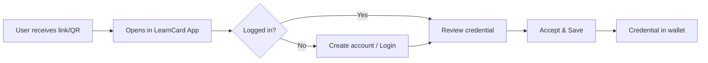
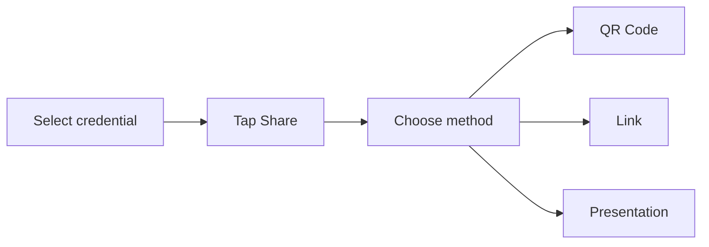
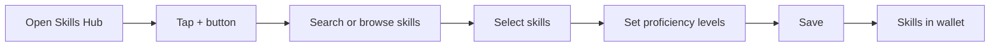

# LearnCard App

The **LearnCard App** is a digital wallet for verifiable credentials. It allows users to claim, store, organize, and share their achievements, badges, certifications, and IDs.

Available on:

-   📱 iOS ([App Store](https://apps.apple.com/us/app/learncard/id1635841898))
-   📱 Android ([Google Play](https://play.google.com/store/apps/details?id=com.learncard.app))
-   🌐 Web ([app.learncard.com](https://app.learncard.com))

---

## Key Features

| Feature               | Description                                                            |
| --------------------- | ---------------------------------------------------------------------- |
| **Claim Credentials** | Scan QR codes or click links to add credentials to your wallet         |
| **Organize**          | Categorize credentials by type (achievements, IDs, work history, etc.) |
| **Share**             | Generate shareable links or presentations for verifiers                |
| **Connect**           | Find and connect with other profiles on the LearnCard Network          |
| **Consent**           | Control what data you share and with whom                              |

---

## User Flows

### Claiming a Credential

```mermaid
flowchart LR
    A[User receives link/QR] --> B[Opens in LearnCard App]
    B --> C{Logged in?}
    C -->|No| D[Create account / Login]
    C -->|Yes| E[Review credential]
    D --> E
    E --> F[Accept & Save]
    F --> G[Credential in wallet]
```

1. User receives a claim link or scans a QR code
2. Link opens the LearnCard App
3. User logs in (or creates an account)
4. User reviews the credential details
5. User accepts and saves to their wallet

### Sharing a Credential

```mermaid
flowchart LR
    A[Select credential] --> B[Tap Share]
    B --> C[Choose method]
    C --> D[QR Code]
    C --> E[Link]
    C --> F[Presentation]
```

1. User selects a credential from their wallet
2. Taps "Share"
3. Chooses sharing method:
    - **QR Code** — For in-person verification
    - **Link** — For sending digitally
    - **Presentation** — For formal verification requests

### Self-Assigning Skills

```mermaid
flowchart LR
    A[Open Skills Hub] --> B[Tap + button]
    B --> C[Search or browse skills]
    C --> D[Select skills]
    D --> E[Set proficiency levels]
    E --> F[Save]
    F --> G[Skills in wallet]
```

1. User opens the Skills Hub from their wallet
2. Taps the **+** button to add skills
3. Searches by skill name or occupation, or browses suggested skills
4. Selects one or more skills from the framework
5. Sets a proficiency level for each skill:
    - **Hidden** — Do not display proficiency status
    - **Novice** — Just starting and needs guidance
    - **Beginner** — Handles simple tasks without support
    - **Proficient** — Works independently on routine tasks
    - **Advanced** — Solves complex tasks efficiently
    - **Expert** — Deep mastery; can lead and mentor others
6. Saves the self-attested skills to their wallet


Self-assigned skills are **self-attested credentials**. They represent what a user claims about their own abilities. For third-party verified skills, see issued credentials from organizations.


---

## Authentication & Key Management

The LearnCard App uses the [AuthCoordinator](../../core-concepts/architecture-and-principles/auth-coordinator.md) to manage the full authentication and key derivation lifecycle. Private keys are protected using [Shamir Secret Sharing (SSS)](../../core-concepts/identities-and-keys/key-management-sss.md) — the key is split into three shares so that no single party ever holds the complete key.

### Key Flows

- **New User Setup** — After first login, a private key is generated and split into device, server, and recovery shares automatically.
- **Account Recovery** — If a user logs in on a new device, they can [recover their key](../../core-concepts/identities-and-keys/account-recovery.md) using a passkey, recovery phrase, backup file, or email backup.
- **Cross-Device Login** — Users can transfer their device share to a new device by [scanning a QR code](../../core-concepts/identities-and-keys/cross-device-login.md) from an already-authenticated device.
- **Migration** — Existing Web3Auth users are automatically detected and migrated to SSS.

### Recovery Methods

Users are prompted to set up recovery methods after initial key setup. A persistent banner appears until at least one method is configured. Available methods:

| Method | Description |
|---|---|
| **Passkey** | Hardware-bound recovery via WebAuthn PRF (Touch ID, Face ID, YubiKey) |
| **Recovery Phrase** | 24-word mnemonic written down by the user |
| **Backup File** | Password-protected JSON file downloaded by the user |
| **Email Backup** | Encrypted share sent to a verified recovery email |

Recovery methods are managed from the **Account Recovery** section in the user's profile settings.

---

## Related Documentation

-   [Resume Builder LER-RS Mapping](resume-builder-ler-rs-mapping.md) — Field/category mapping for resume issuance
-   [Create a Credential](../../tutorials/create-a-credential.md) — For issuers
-   [Verify Credentials](../../tutorials/verify-credentials.md) — For verifiers
-   [ConsentFlow Overview](../../core-concepts/consent-and-permissions/consentflow-overview.md) — Understanding consent
-   [Key Management (SSS)](../../core-concepts/identities-and-keys/key-management-sss.md) — How private keys are protected
-   [Account Recovery](../../core-concepts/identities-and-keys/account-recovery.md) — Recovery methods and flows
-   [AuthCoordinator](../../core-concepts/architecture-and-principles/auth-coordinator.md) — The auth state machine
-   [SSS Configuration](../../how-to-guides/deploy-infrastructure/sss-key-management-config.md) — Deployment and env vars
