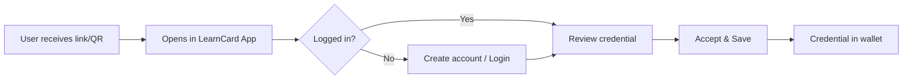
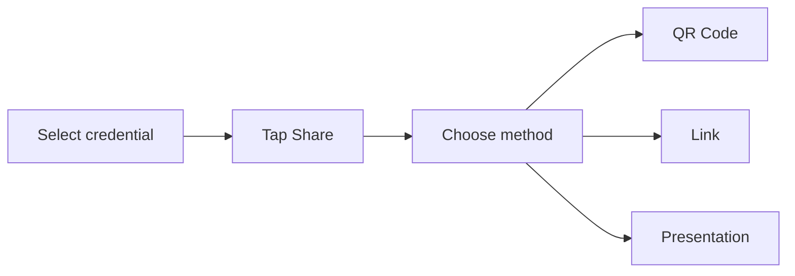
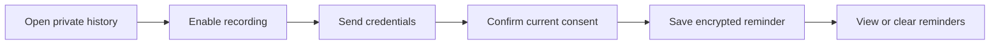
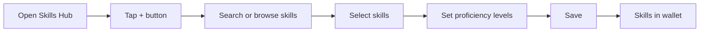

# LearnCard App

The **LearnCard App** is a digital wallet for verifiable credentials. It allows users to claim, store, organize, and share their achievements, badges, certifications, and IDs.

Available on:

- 📱 iOS ([App Store](https://apps.apple.com/us/app/learncard/id1635841898))
- 📱 Android ([Google Play](https://play.google.com/store/apps/details?id=com.learncard.app))
- 🌐 Web ([app.learncard.com](https://app.learncard.com))

---

## Key Features

| Feature               | Description                                                            |
| --------------------- | ---------------------------------------------------------------------- |
| **Claim Credentials** | Scan QR codes or click links to add credentials to your wallet         |
| **Organize**          | Categorize credentials by type (achievements, IDs, work history, etc.) |
| **Share**             | Generate shareable links or presentations for verifiers                |
| **Connect**           | Find and connect with other profiles on the LearnCard Network          |
| **Consent**           | Control what data you share and with whom                              |

---

## User Flows

### Claiming a Credential

```mermaid
flowchart LR
    A[User receives link/QR] --> B[Opens in LearnCard App]
    B --> C{Logged in?}
    C -->|No| D[Create account / Login]
    C -->|Yes| E[Review credential]
    D --> E
    E --> F[Accept & Save]
    F --> G[Credential in wallet]
```

1. User receives a claim link or scans a QR code
2. Link opens the LearnCard App
3. User logs in (or creates an account)
4. User reviews the credential details
5. User accepts and saves to their wallet

### Sharing a Credential

```mermaid
flowchart LR
    A[Select credential] --> B[Tap Share]
    B --> C[Choose method]
    C --> D[QR Code]
    C --> E[Link]
    C --> F[Presentation]
```

1. User selects a credential from their wallet
2. Taps "Share"
3. Chooses sharing method:
    - **QR Code** — For in-person verification
    - **Link** — For sending digitally
    - **Presentation** — For formal verification requests

For browser application requests (CHAPI or VC-API), use the credential list to search and filter by category. **View selected** shows the entire selected batch, even when search hides some items. **Deselect all** clears the selection. Open **Review** to check or remove items before sending; returning to selection sends nothing. Suggested credentials remain editable.

### Private Verifier History

The card shows the five newest reminders. Choose **View all** to open the full history, with 20 reminders per page. Refresh, Clear history and Delete reminder are available in the history window; changes also update the card.

In **Data Sharing Center**, open **Shared with verifiers** to enable private recording, delete individual reminders or clear history. Recording is off by default and is unavailable for managed accounts. Disabling recording keeps previous reminders; clearing readable history keeps the preference.

```mermaid
flowchart LR
    A[Open private history] --> B[Enable recording]
    B --> C[Send credentials]
    C --> D[Confirm current consent]
    D --> E[Save encrypted reminder]
    E --> F[View or clear reminders]
```

A reminder records successful sending or a browser handoff, not verifier acceptance. It contains the visible credential titles and, where shown during review, the verifier name, origin and purpose. It contains no credentials, claims, credential addresses or link keys. Deleting history cannot retract information already sent.

The app keeps an owner-encrypted consent snapshot on the device. Sending does not look up history in Cloud first. Without a readable local snapshot, recording is skipped until you open private history on that device; current consent is checked after sending before a reminder is saved.

History displays at most 500 entries from the last 90 days. Cleanup runs when history is successfully accessed; offline clients cannot guarantee immediate physical deletion. Unreadable records are hidden and are not automatically deleted. **Clear history** can remove them by their exact document IDs; unknown consent is then kept off for safety. Future-dated reminders are hidden until the local clock catches up and are not removed solely because of clock skew.

If history cannot be loaded, **Clear history** remains available to reset recording to off when its settings are missing or unreadable. A cleanup warning means some records could not be removed; try Clear again. An unreadable encrypted document also prevents recording until recovery. A confirmed reminder remains saved even when cleanup is incomplete.

### Self-Assigning Skills

```mermaid
flowchart LR
    A[Open Skills Hub] --> B[Tap + button]
    B --> C[Search or browse skills]
    C --> D[Select skills]
    D --> E[Set proficiency levels]
    E --> F[Save]
    F --> G[Skills in wallet]
```

1. User opens the Skills Hub from their wallet
2. Taps the **+** button to add skills
3. Searches by skill name or occupation, or browses suggested skills across the available frameworks
4. Selects one or more skills from a framework
5. Sets a proficiency level for each skill:
    - **Hidden** — Do not display proficiency status
    - **Novice** — Just starting and needs guidance
    - **Beginner** — Handles simple tasks without support
    - **Proficient** — Works independently on routine tasks
    - **Advanced** — Solves complex tasks efficiently
    - **Expert** — Deep mastery; can lead and mentor others
6. Saves the self-attested skills to their wallet


Self-assigned skills are **self-attested credentials**. They represent what a user claims about their own abilities. For third-party verified skills, see issued credentials from organizations.


---

## Account Security & Recovery

Each account is controlled by a private key that never exists in one place: it is split into pieces held by the user's device, LearnCard's servers, and the user's recovery methods, and any two pieces are needed to sign in. Neither LearnCard nor a stolen phone alone can access the account.

After signing up, users are prompted to set up at least one recovery method:

| Method              | What it is                                                |
| ------------------- | --------------------------------------------------------- |
| **Passkey**         | Face ID, Touch ID, or a hardware key on the user's device |
| **Recovery Phrase** | A 24-word phrase the user writes down                     |
| **Backup File**     | A password-protected file the user downloads              |
| **Email Backup**    | An encrypted backup sent to a verified email address      |

Signing in on a new device works either by scanning a QR code from a device that's already signed in, or by using one of the recovery methods. Recovery settings live under **Account Recovery** in the profile.

For how this works under the hood, see [Key Management (SSS)](../../core-concepts/identities-and-keys/key-management-sss.md).

---

## Related Documentation

- [Export & Import Your Data](../../how-to-guides/export-and-import-your-data.md) — Take your data with you
- [Send & Issue Credentials](../../how-to-guides/send-credentials.md) — For organizations issuing into the app
- [Build an App Inside LearnCard](../../how-to-guides/publish-your-app.md) — Build an experience inside the app
- [Verify Credentials](../../tutorials/verify-credentials.md) — For verifiers
- [ConsentFlow Overview](../../core-concepts/consent-and-permissions/consentflow-overview.md) — How users control what they share
