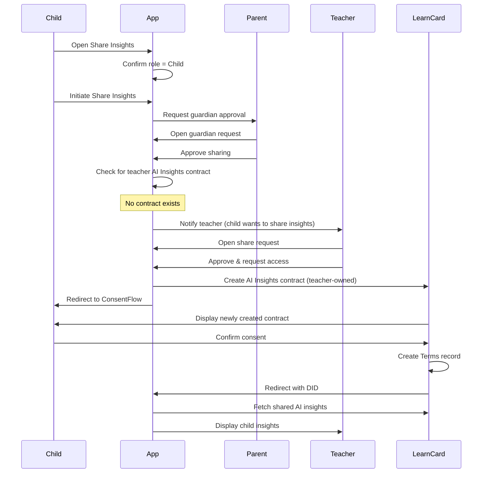

# Child Directly Shares Insights (No Contract)

This flow describes when a child directly shares their AI insights with a teacher with parent approval, but the teacher has not yet created an AI Insights contract.

