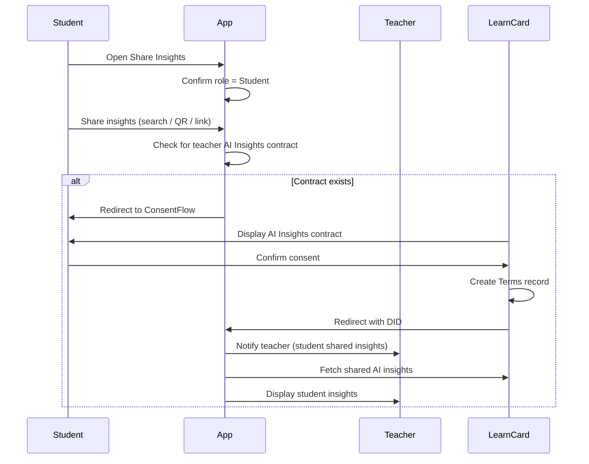

# Student Directly Shares Insights (Existing Contract)

This flow describes when a student wants to share their AI insights directly with a teacher, without the teacher first requesting them (i.e., the teacher has an existing AI Insights contract).

