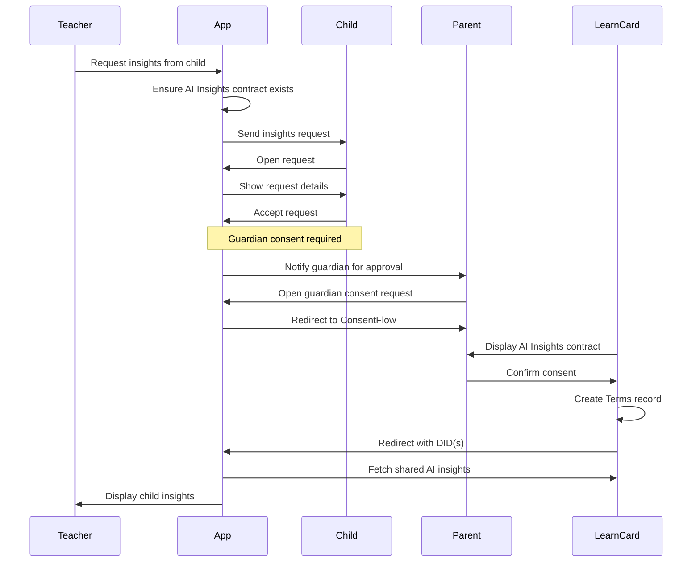

# Teacher Requests Child Insights

This flow describes when a teacher requests AI insights from a child, where the parent must provide consent.

```mermaid
sequenceDiagram
    participant Teacher
    participant App
    participant Child
    participant Parent
    participant LearnCard

    Teacher->>App: Request insights from child
    App->>App: Ensure AI Insights contract exists
    App->>Child: Send insights request

    Child->>App: Open request
    App->>Child: Show request details
    Child->>App: Accept request

    Note over Child,App: Guardian consent required

    App->>Parent: Notify guardian for approval
    Parent->>App: Open guardian consent request

    App->>Parent: Redirect to ConsentFlow
    LearnCard->>Parent: Display AI Insights contract
    Parent->>LearnCard: Confirm consent

    LearnCard->>LearnCard: Create Terms record
    LearnCard->>App: Redirect with DID(s)

    App->>LearnCard: Fetch shared AI insights
    App->>Teacher: Display child insights
```
