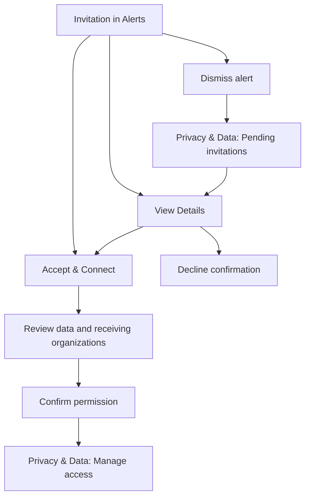

# Referral invitations

When an organization refers you to a partner, an invitation appears in Alerts. It names the referring organization and the partner. Choose **View Details** to review its purpose, requested data, and the organizations that would receive it.

**Accept & Connect** opens data review. Choose which data to provide and confirm the receiving organizations before connecting. Required parent approval follows the existing account permission flow.

**Decline** asks for confirmation and records your decision. **Not Now** closes details, and the close button dismisses the alert. Both leave the invitation pending. Find dismissed invitations in **Privacy & Data → Pending invitations**.

After connecting, Privacy & Data shows the receiving organizations and lets you update permissions or stop sharing. Stopping access prevents future sharing; organizations may retain copies already received. A partner's newly issued credential becomes available to those organizations after you claim it and the app synchronizes it under your permissions.

Choosing all credentials in a category includes credentials from any source in that category. Select individual credentials when you want to limit that access.

This experience appears when your app's tenant configuration and rollout flag enable referral invitations. Existing consent links and AI requests retain their existing flows.

