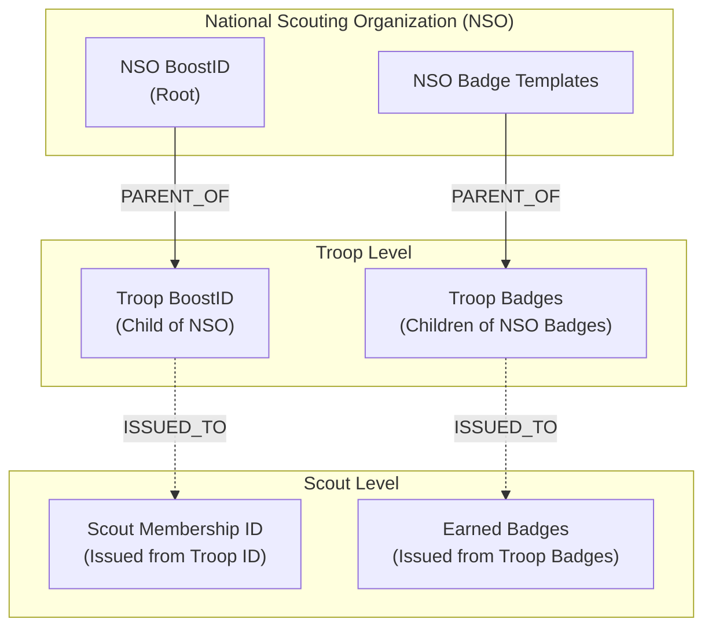
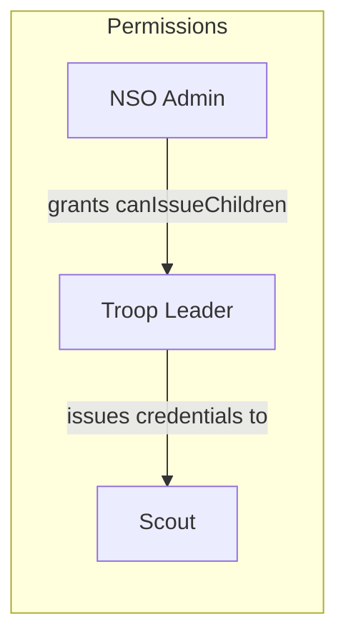
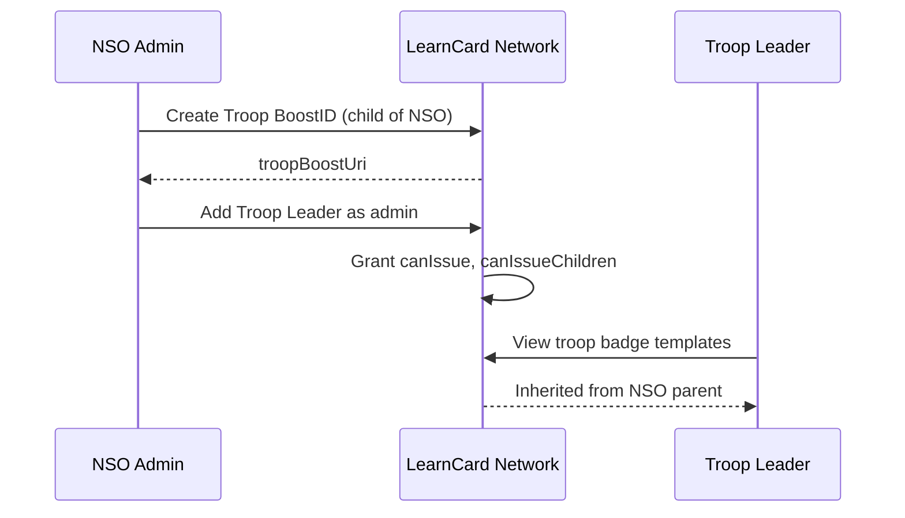
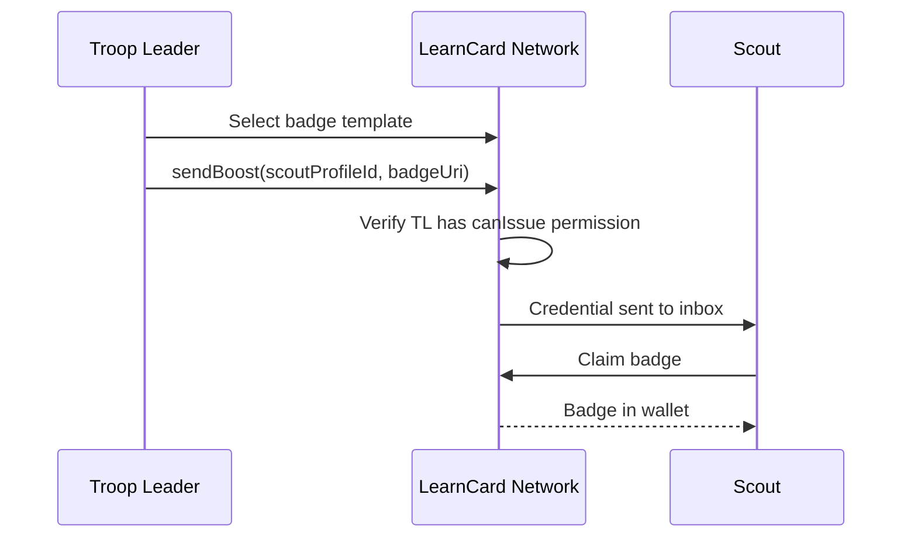

# ScoutPass

**ScoutPass** is a specialized LearnCard application designed for scouting organizations to issue and manage achievement badges digitally. It uses LearnCard's **Boost hierarchy** system to model the organizational structure of scouting: National Organizations → Troops → Scouts.

Available on:
- 📱 iOS ([App Store](https://apps.apple.com/us/app/scoutpass/id6451271002))
- 📱 Android ([Google Play](https://play.google.com/store/apps/details?id=com.scoutpass.app))
- 🌐 Web ([pass.scout.org](https://pass.scout.org/))

---

## Key Features

| Feature | Description |
|---------|-------------|
| **Hierarchical Structure** | NSO → Troop → Scout organization modeled with parent-child Boosts |
| **BoostID Membership** | Digital ID cards for troop membership at each level |
| **Badge Issuance** | Issue digital badges for achievements, ranks, and milestones |
| **Role-Based Permissions** | NSO admins, troop leaders, and scouts have scoped permissions |
| **Verifiable Credentials** | All badges and IDs are W3C Verifiable Credentials |

---

## Organizational Hierarchy

ScoutPass uses LearnCard's parent-child Boost relationships to create a hierarchical structure:

### How It Works

1. **NSO creates root Boosts** — The National Scouting Organization creates BoostID templates and badge templates at the top level
2. **Troops are child Boosts** — Each troop is created as a child of the NSO, inheriting badge templates
3. **Scouts receive credentials** — Troop leaders issue membership IDs and badges to individual scouts

---

## User Roles & Permissions

Permissions flow down through the hierarchy using LearnCard's permission model:

| Role | Scope | Permissions |
|------|-------|-------------|
| **NSO Admin** | Organization-wide | Create badge templates, manage troops, `canCreateChildren`, `canManageChildrenPermissions` |
| **Troop Leader** | Troop-level | Issue badges to scouts, manage troop roster, `canIssue`, `canIssueChildren` |
| **Scout** | Individual | View and share earned badges and membership ID |

---

## Key Flows

### Setting Up a Troop

### Issuing a Badge

---

## Related Documentation

- [Boost Credentials](../../core-concepts/credentials-and-data/boost-credentials.md) — Understanding hierarchies and permissions
- [Getting Started with Boosts](../../core-concepts/credentials-and-data/getting-started-with-boosts.md) — Creating and issuing boosts
- [Network Profiles](../../core-concepts/identities-and-keys/network-profiles.md) — Managing organizational profiles
