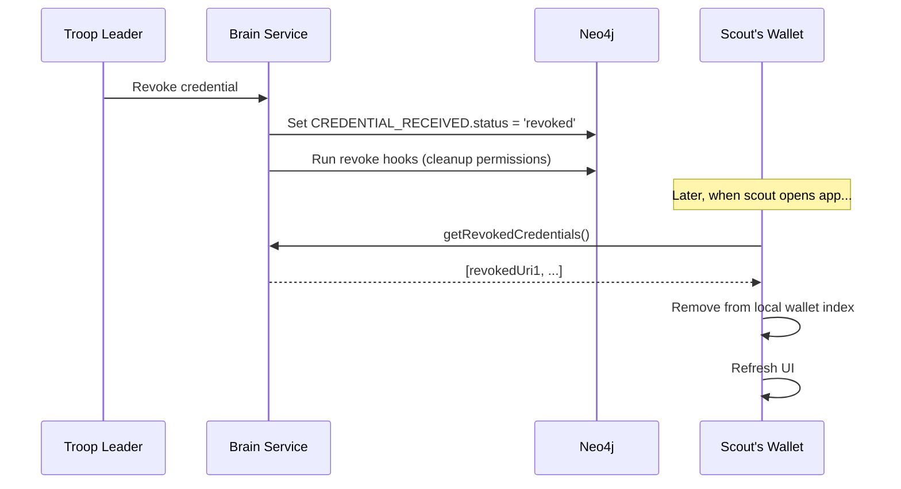

# Credential Revocation

When a scout leaves a troop or their credential needs to be invalidated, ScoutPass uses LearnCard's revocation system to cleanly remove access while preserving audit history.

---

## How Revocation Works

Revocation is tracked via a `status` property on the Neo4j `CREDENTIAL_RECEIVED` relationship:

| Status Value | Meaning |
|--------------|---------|
| `null` | Active/claimed credential |
| `'pending'` | Sent but not yet accepted |
| `'revoked'` | Credential has been revoked |

When a credential is revoked:
1. The credential is **marked as revoked** (not deleted) for audit purposes
2. The scout is **filtered out** of member/recipient lists
3. Any **permissions granted via claim hooks** are reversed
4. Any **auto-connect relationships** are cleaned up
5. The scout's **wallet syncs** to remove the credential from view

---

## Revocation Flow



---

## Cleanup Hooks

When revocation occurs, these cleanup operations run automatically:

| Hook | Purpose |
|------|---------|
| `processPermissionsRevokeHooks` | Removes roles granted via GRANT_PERMISSIONS claim hooks |
| `processAutoConnectRevokeHooks` | Removes AUTO_CONNECT_RECIPIENT relationships |
| `processAdminRevokeHooks` | Removes admin roles granted via ADD_ADMIN claim hooks |
| `processConnectionRevoke` | Removes CONNECTED_WITH relationships sourced from the boost |

---

## Query Filtering

All recipient queries automatically exclude revoked credentials:

```cypher
MATCH (c:Credential)-[r:CREDENTIAL_RECEIVED]->(p:Profile)
WHERE (r.status IS NULL OR r.status <> 'revoked')
RETURN p
```

| Query | Default Behavior |
|-------|------------------|
| `getBoostRecipients` | Returns only claimed credentials |
| `countBoostRecipients` | Counts only claimed credentials |

> **Note:** Revoked credentials are always filtered out, regardless of query options.

---

## Wallet Sync

The scout's wallet syncs with the network to remove revoked credentials using the `useSyncRevokedCredentials` hook:

```typescript
import { useSyncRevokedCredentials } from 'learn-card-base';

// In AppRouter.tsx or top-level component
useSyncRevokedCredentials(enabled);
```

This hook:
1. Fetches revoked URIs from `wallet.invoke.getRevokedCredentials()`
2. Removes matching records from the LearnCloud personal index
3. Invalidates UI queries to refresh the display

---

## Why Two Storage Layers?

Credentials exist in two places:

| Layer | Purpose |
|-------|---------|
| **Brain Service (Neo4j)** | Network-level tracking, source of truth for status |
| **LearnCloud (MongoDB)** | User's personal wallet, what shows in the app |

The brain service cannot directly modify the user's LearnCloud index (it's user-authenticated). The frontend sync hook bridges this gap.

---

## Related Documentation

- [Boost Credentials](../../core-concepts/credentials-and-data/boost-credentials.md) — Boost hierarchy and permissions
- [Credential Lifecycle](../../core-concepts/credentials-and-data/credential-lifecycle.md) — Full credential lifecycle
