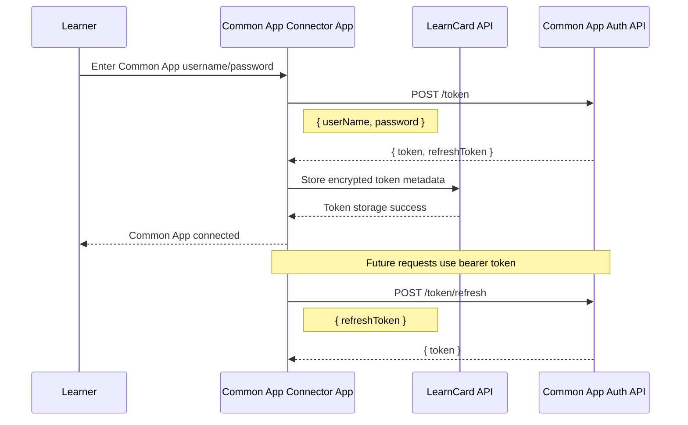

# Common App Connector - Auth Flow

## Relevant Common App APIs

### Auth API

Swagger Documentation:

-   [Common App Auth API Swagger](https://partners.commonapp.org/index.html?url=%2Fdocumentation%2Fauthapi-external-partner.json&utm_source=chatgpt.com#/)

---

## Endpoint: POST /token

Authenticate using Common App username/password.

### Request

```json
{
    "userName": "string",
    "password": "string"
}
```

### Response

```json
{
    "token": "string",
    "refreshToken": "string"
}
```

### Notes

-   Connector app likely presents login UI directly inside LearnCard
-   User authenticates with existing Common App credentials
-   Returned token is used for authenticated Partner API requests
-   Refresh token supports persistent sessions

---

## Endpoint: POST /token/refresh

Refresh expired access token.

### Request

```json
{
    "refreshToken": "string"
}
```

### Response

```json
{
    "token": "string"
}
```

### Notes

-   Connector app should automatically refresh expired tokens
-   Refresh token should be securely stored server-side
-   Connector should gracefully handle invalid/expired refresh tokens

---

## Proposed Auth Responsibilities

### Common App Connector App

-   Render Common App login form
-   Authenticate via `/token`
-   Handle auth errors
-   Trigger token refresh flow
-   Surface connection state to learner

### LearnCard Backend

-   Encrypt and store:
    -   token
    -   refreshToken
-   Associate token metadata with:
    -   LearnCard account
    -   wallet/DID
    -   connector installation
-   Support future authenticated API requests

---

## Auth Flow Diagram


