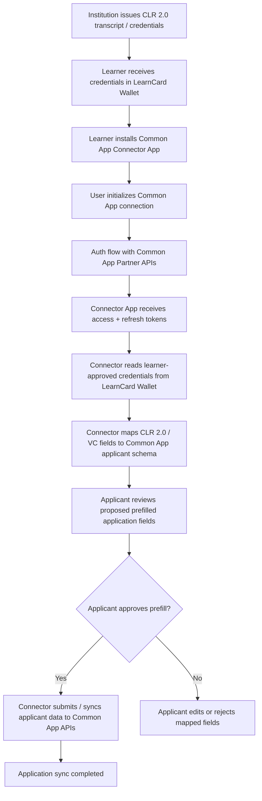

# Common App Connector - Applicant Prefill Flow

## Overview

This flow represents the proposed high-level integration between LearnCard and the Common App Partner APIs.

Primary goal:

-   Use learner-owned CLR 2.0 transcripts and credentials stored in LearnCard
-   Map verified credential data into Common App applicant fields
-   Allow applicants to review and approve prefilled application data
-   Sync approved data to Common App through authenticated Partner APIs

This integration is envisioned as a LearnCard App Store connector application, rather than a direct hardcoded integration inside core LearnCard services.

---

## High-Level Integration Notes

### LearnCard Responsibilities

LearnCard acts as:

-   Credential wallet
-   Consent layer
-   VC/CLR parsing layer
-   Mapping/orchestration layer
-   Connector app platform

LearnCard does NOT replace Common App.

Instead, LearnCard helps applicants reuse verified academic and achievement data already stored in their wallet.

---

## Common App Responsibilities

Common App Partner APIs provide:

-   Applicant authentication
-   Applicant profile/application APIs
-   Institutional/program metadata
-   Recommendation/counselor workflows

The Common App system remains the source of truth for the actual college application process.

---

## Potential LearnCard Credential Sources

Potential LearnCard data used for prefill:

-   CLR 2.0 transcripts
-   Academic credentials
-   Achievement credentials
-   Certifications
-   Volunteer/service credentials
-   Employment/work-based learning credentials
-   Self-attested profile data
-   Learner interests/pathways

---

## Important Architectural Assumption

This flow assumes:

-   LearnCard has approved partner access to Common App APIs
-   A stable backend integration contract exists between:
    -   LearnCard Connector App
    -   Common App Partner APIs

---

## Applicant Prefill Flow Diagram

---

## Proposed Connector Responsibilities

### Common App Connector App

-   Authenticate learner with Common App
-   Read learner-approved wallet credentials
-   Parse CLR 2.0 / VC data
-   Map LearnCard fields to Common App applicant schema
-   Surface review/edit UI
-   Submit approved applicant data
-   Handle sync errors and validation feedback

### LearnCard Backend

-   Store Common App auth tokens securely
-   Support credential retrieval
-   Support VC parsing + normalization
-   Associate connector installation with learner identity

---
