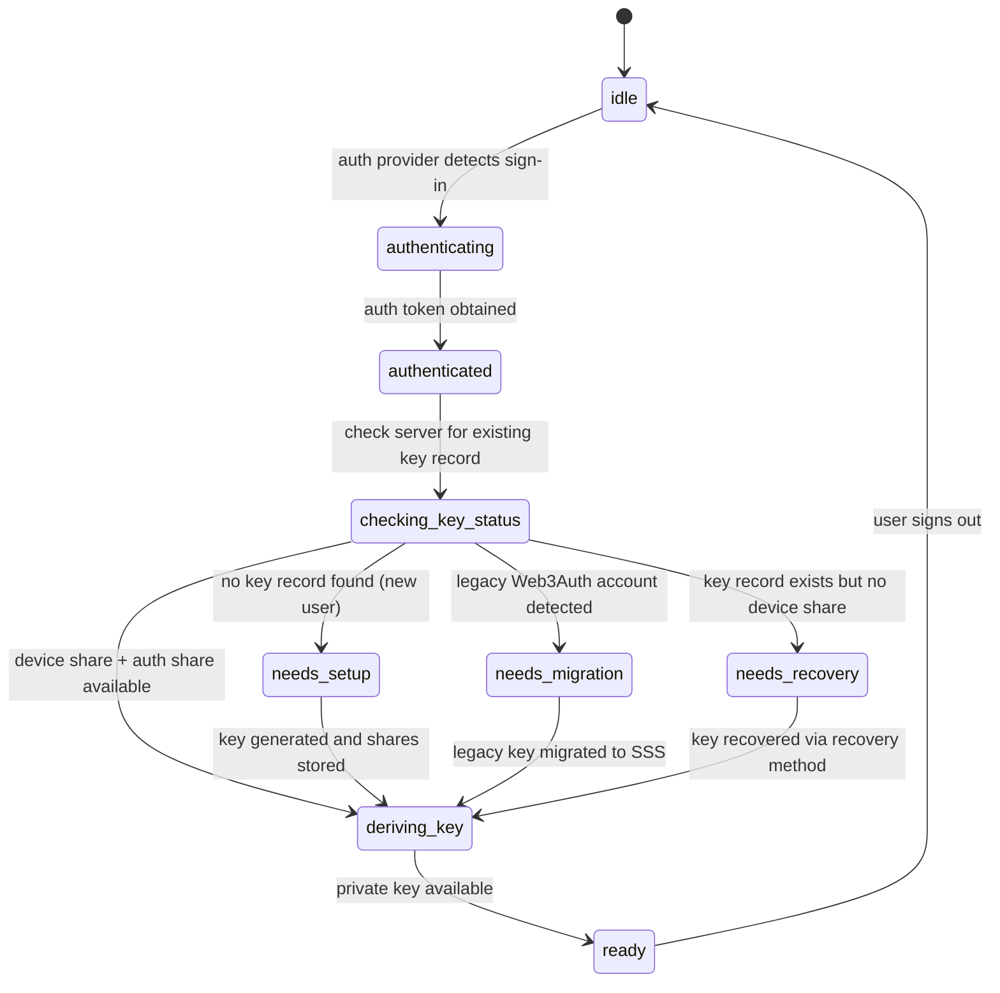

# Auth Coordinator

## What is this section about?

The **AuthCoordinator** is a provider-agnostic state machine that orchestrates the entire authentication and key derivation lifecycle. It is the central piece that connects auth providers (e.g., Firebase), key derivation strategies (e.g., SSS), and the application UI into a single, predictable flow.

## Why is this important?

Before the AuthCoordinator, authentication and key management were tightly coupled to specific providers (Firebase for auth, Web3Auth for keys). The AuthCoordinator decouples these concerns, making it possible to:

- **Swap auth providers** (Firebase, Supertokens, Keycloak, OIDC) via environment variables.
- **Swap key derivation strategies** (SSS, Web3Auth, MPC) without changing app code.
- **Handle complex flows** (migration, recovery, re-authentication) through a predictable state machine.
- **Share logic** between apps (LearnCard App and ScoutPass use the same coordinator).

---

## State Machine

The AuthCoordinator moves through a well-defined set of states:



### State Descriptions

| State | Meaning |
|---|---|
| `idle` | No user is authenticated. Waiting for sign-in. |
| `authenticating` | The auth provider has detected a sign-in attempt. Obtaining the auth token. |
| `authenticated` | Auth token obtained. About to check key status on the server. |
| `checking_key_status` | Querying the server for the user's key record (via `KeyDerivationStrategy.fetchServerKeyStatus`). |
| `needs_setup` | No key record exists. The user is new and needs a key generated. |
| `needs_migration` | A legacy Web3Auth account was detected (account exists but no SSS record). Migration is required. |
| `needs_recovery` | A key record exists on the server, but no device share is available locally. The user must recover. |
| `deriving_key` | The key is being reconstructed or generated. Shares are being stored. |
| `ready` | The private key is available. The app can proceed normally. |

---

## Provider-Agnostic Design

The AuthCoordinator depends on two abstract interfaces:

### AuthProvider

Handles authentication (sign-in, sign-out, token management). Defined in `@learncard/types`:

```typescript
interface AuthProvider {
    getProviderType(): string;
    getCurrentUser(): Promise<AuthUser | null>;
    getIdToken(): Promise<string>;
    signOut(): Promise<void>;
    onAuthStateChanged(callback: (user: AuthUser | null) => void): () => void;
    reauthenticateWithToken?(token: string): Promise<void>;
}
```

The default implementation wraps Firebase Auth. New providers can be added by implementing this interface and registering them via the provider registry.

### KeyDerivationStrategy

Handles key generation, storage, recovery, and server communication. Defined in `@learncard/types`:

```typescript
interface KeyDerivationStrategy<TRecoveryInput, TSetupInput, TSetupResult> {
    fetchServerKeyStatus(token: string, providerType: string): Promise<ServerKeyStatus>;
    setupNewKey(token: string, providerType: string, signDidAuthVp: Function): Promise<string>;
    reconstructKey(token: string, providerType: string): Promise<string>;
    recoverKey(token: string, providerType: string, input: TRecoveryInput): Promise<string>;
    migrateFromLegacy?(token: string, providerType: string, legacyKey: string): Promise<string>;
    hasLocalKey(): Promise<boolean>;
    clearLocalKey(): Promise<void>;
    // ... recovery method management
}
```

The default implementation is the **SSS strategy** from `@learncard/sss-key-manager`.

---

## Configuration

The AuthCoordinator is configured via environment variables, read by `authConfig.ts` in `learn-card-base`:

| Variable | Default | Purpose |
|---|---|---|
| `VITE_AUTH_PROVIDER` | `'firebase'` | Which auth provider to use |
| `VITE_KEY_DERIVATION` | `'sss'` | Which key derivation strategy to use |
| `VITE_SSS_SERVER_URL` | `'http://localhost:5100/api'` | Server URL for SSS key operations |
Environment variables use a dual-prefix fallback: `VITE_*` first, then `REACT_APP_*`.

---

## React Integration

The AuthCoordinator is exposed to React apps via:

- **`AuthCoordinatorProvider`** — wraps the app and initializes the coordinator with the configured auth provider and key derivation strategy.
- **`useAuthCoordinator`** hook — provides access to the current state, the wallet, capabilities, and actions like `openRecoverySetup` and `showDeviceLinkModal`.
- **`useAppAuth`** — app-level convenience hook that combines coordinator state with app-specific logic.

### Example Usage

```tsx
import { useAppAuth } from './providers/AuthCoordinatorProvider';

const MyComponent = () => {
    const { isLoading, walletReady, capabilities } = useAppAuth();

    if (isLoading) return <LoadingSpinner />;
    if (!walletReady) return <SetupPrompt />;

    return (
        <div>
            {capabilities.recovery && <RecoveryBanner />}
            {capabilities.deviceLinking && <DeviceLinkButton />}
            {/* ... app content */}
        </div>
    );
};
```

---

## Capabilities

The coordinator exposes a `capabilities` object that the UI can use to conditionally render features:

| Capability | Meaning |
|---|---|
| `recovery` | The current key derivation strategy supports recovery method management |
| `deviceLinking` | The current strategy supports QR-based cross-device login |
| `migration` | The current strategy supports migrating from a legacy key provider |

---

## Error Handling

The coordinator provides typed error states for common failure scenarios:

- **Stalled migration** — the migration process was interrupted (e.g., browser tab closed). A `StalledMigrationOverlay` guides the user through resolution.
- **Expired session** — the auth token has expired during a long operation. A `ReAuthOverlay` prompts the user to re-authenticate.
- **Network errors** — server communication failures are surfaced with user-friendly messages.

---

## Key Takeaways

- The AuthCoordinator is a **state machine** that manages the full auth + key lifecycle.
- It is **provider-agnostic** — auth providers and key derivation strategies are pluggable.
- Configuration is **environment-driven** — swap providers by changing env vars.
- React integration is via `AuthCoordinatorProvider` and the `useAppAuth` hook.
- The coordinator handles **setup, migration, recovery, and re-authentication** flows automatically.
