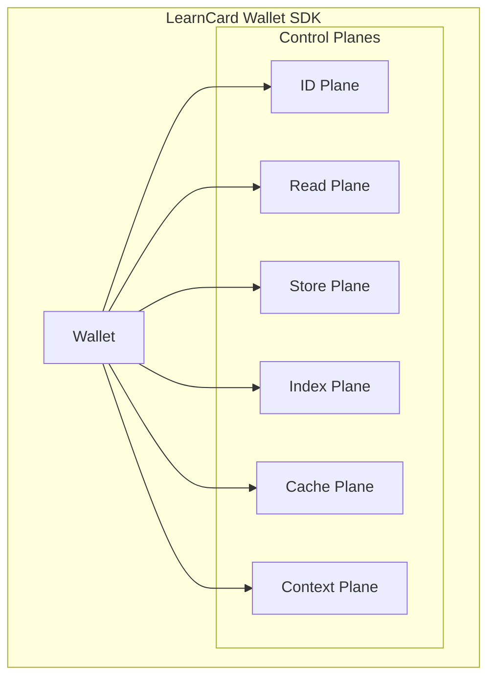

# Control Planes

Control Planes are a primary way for consumers to interact with a LearnCard. A Control Plane provides an abstraction for a higher-order wallet object to initiate complex workflows while being agnostic to the means of accomplishing the workflow.&#x20;



### Control Planes:

* Align plugins based on **primary action categories**: Identity, Signing, Verification, Storage, Caching, and Communication.
* Specify **interfaces** for conforming plugins to implement.&#x20;
* Provide execution environments that support more complex workflows.&#x20;
* Allows for utilizing multiple plugins to support a particular request.
* Streamline functionality for high-quality UX requirements, such as caching and querying capabilities.
* Incentivizes plugin convergence, rather than divergence.
* Enables plugin discovery, both internal and external.


**For Example:** when a user stores a credential, they may have a preference over _where_ the credential is stored. Leveraging Controls Planes, a consumer of LearnCard may query for available storage options (IPFS, LocalStorage, DWN, Device Storage, etc.), ask the user which option they would like to use, and then initiate the storage workflow for the user's selection from a **generic** **store** function.&#x20;


Each control plane serves a specific purpose:

| Control Plane | Purpose                         | Key Methods                               |
| ------------- | ------------------------------- | ----------------------------------------- |
| ID            | Identity management             | `did`, `keypair`                          |
| Read          | Resolving URIs to credentials   | `get`                                     |
| Store         | Storing credentials             | `upload`, `uploadEncrypted`, `uploadMany` |
| Index         | Managing credential references  | `get`, `add`, `update`, `remove`          |
| Cache         | Caching for performance         | `getIndex`, `setIndex`, `getVc`, `setVc`  |
| Context       | Managing contextual information | `resolveDocument`                         |


Diagram showing basic lifecycle of control plane interactions.


A key feature of the control planes system is that when appropriate, a specific plugin implementing a plane can be chosen. For example, when storing a credential, you can specify which storage plugin to use:

```typescript
// Store a credential using the Ceramic plugin
const uri = await learnCard.store.Ceramic.upload(credential);

// Store a credential using the default (first available) plugin
const uri = await learnCard.store.upload(credential);
```

To help better understand what Control Planes are, it may be easiest for you to take a look at the available Control Planes within LearnCard:

## ID Control Plane

The ID Control Plane is the interface responsible for managing the holder's identity. This means storing/managing key material.

Plugins that implement this Control Plane will generally need to be instantiated in some way, and with some kind of input, such as a seed/existing key material, or by making a request to a third party that can provide key material.

The ID Plane implements two methods: `did`, and `keypair`

### id.did

The `did` method (optionally) takes in a [method](https://www.w3.org/TR/did-core/#methods), and returns a did.

### id.keypair

The `keypair` method (optionally) takes in a cryptographic algorithm (e.g. ed25519, secp256k1, etc), and returns  a [JWK](https://www.rfc-editor.org/rfc/rfc7517).

### Example plugins that implement the ID Plane


[did-key.md](../../sdks/official-plugins/did-key.md)


##

## Read Control Plane

The Read Control Plane is the interface responsible for resolving a [URI](../credentials-and-data/uris.md) to its Verifiable Credential.&#x20;


If the LearnCard also implements the [Cache Plane](control-planes.md#cache-control-plane), then this Plane will automatically be cached!


The Read Plane implements one method: `get`

### read.get

The `get` method takes in a [URI](../credentials-and-data/uris.md) and resolves it to a Verifiable Credential.&#x20;

If a plugin implementing get is unable to resolve a URI, it should return undefined, allowing other plugins to take a crack at resolving that URI. If no plugins are able to resolve the URI, the LearnCard will return `undefined`.

### read.getMany

The `getMany` method takes in an array of [URI](../credentials-and-data/uris.md)s and resolves them to an array of Verifiable Credentials.&#x20;

### Example plugins that implement the Read Plane


[ceramic.md](../../sdks/official-plugins/ceramic.md)



[learncloud.md](../../sdks/official-plugins/learncloud.md)


##

## Store Control Plane

The Store Control Plane is the interface responsible for storing a Verifiable Credential and returning a [URI](../credentials-and-data/uris.md) that resolves to it.


If the LearnCard also implements the [Cache Plane](control-planes.md#cache-control-plane), then this Plane will automatically be cached!



**Note:** In order to use this plane, you will have to choose _where_ to store the Verifiable Credential!

You can get a list of available storage providers using the `providers` field:

```typescript
console.log(learnCard.store.providers);
// {
//     Ceramic: {
//       name: 'Ceramic',
//       displayName: 'Ceramic',
//       description: 'Uploads/resolves credentials using the Ceramic Network (https://ceramic.network/)'
//     },
//     LearnCloud: {
//         name: 'LearnCloud',
//         displayName: 'LearnCloud',
//         description: 'LearnCloud Integration'
//     }
// }
```


The Store Plane implements three methods: `upload`, (optionally) `uploadEncrypted`, and (optionally) `uploadMany`

### store.upload

The `upload` method takes in a Verifiable Credential, stores the credential, and converts it into a resolvable [URI](../credentials-and-data/uris.md).

### store.uploadEncrypted


Note: This method is optional


The `uploadEncrypted` method allows you to encrypt a credential before uploading it, optionally specifying recipients who are allowed to decrypt the resolved credential. This is generally going to be safer, and it is heavily encouraged for Providers to implement this method!

### store.uploadMany


Note: This method is optional


The `uploadMany` method takes in an array of Verifiable Credentials, stores the credentials, and converts them into an array of resolvable [URIs](../credentials-and-data/uris.md).

### Example plugins that implement the Store Plane


[ceramic.md](../../sdks/official-plugins/ceramic.md)



[learncloud.md](../../sdks/official-plugins/learncloud.md)


##

## Index Control Plane

The Index Control Plane is the interface responsible for managing [CRUD](https://en.wikipedia.org/wiki/Create,_read,_update_and_delete) operations on the holder's personal index.


If the LearnCard also implements the [Cache Plane](control-planes.md#cache-control-plane), then this method will automatically be cached!



**Note:** In order to use some of the methods of this plane, you will have to choose _where_ to store the index!

You can get a list of available index providers using the `providers` field:

```typescript
console.log(learnCard.index.providers);
// {
//     LearnCloud: {
//         name: 'LearnCloud',
//         displayName: 'LearnCloud',
//         description: 'LearnCloud Integration'
//     },
//     IDX: {
//       name: 'IDX',
//       displayName: 'IDX',
//       description: 'Stores a bespoke index of credentials for an individual based on their did'
//     }
// }
```


The Index Plane implements eight  methods: `get`, (optionally) `getPage`, (optionally) `getCount`, `add`, `addMany`, `update`, `remove`, and `removeAll.`

### index.get


**Hint:** You may use the "all" provider to combine the `CredentialRecord`s of _all_ providers with this method:

```typescript
console.log(await learnCard.index.all.get());
// []
```


The `get` method takes in a Mongo-style query and returns a list of `CredentialRecords`, which are primarily an ID, a [URI](../credentials-and-data/uris.md), and some metadata.

### index.getPage


Note: This method is optional



If the LearnCard also implements the [Cache Plane](control-planes.md#cache-control-plane), then this method will automatically be cached!


When there are a lot of credentials stored in the index for a given query, it can be useful to paginate your queries rather than request all of them at once. That is what `getPage` is for! This call will return an object of the following shape:

```typescript
type GetPageResult<Metadata extends Record<string, any>> = {
    cursor?: string;
    hasMore: boolean;
    records: CredentialRecord<Metadata>[];
};
```

Using the `hasMore` and `cursor` fields, you can determine if you should request the next page, as well as how to request the next page. The below example shows a simple way to request all available pages:

```typescript
const records: CredentialRecord[] = [];

let result = await learnCard.index.LearnCloud.getPage();
records.push(result.records);

while (result.hasMore) {
    result = await learnCard.index.LearnCloud.getPage(undefined, { cursor: result.cursor });
    records.push(result.records);
}
```

### index.getCount


Note: This method is optional



If the LearnCard also implements the [Cache Plane](control-planes.md#cache-control-plane), then this Plane will automatically be cached!


Sometimes, it can be useful for an app to display the total number of records for a given query without wanting to actual grab every credential for that query. This is where `getCount` comes in handy!

```typescript
const totalRecords = await learnCard.index.LearnCloud.getCount();
const totalAchievementRecords = await learnCard.index.LearnCloud.getCount({ type: 'Achievement' });
```

### index.add

The `add` method takes in a `CredentialRecord` and adds it to the holder's personal index.

### index.addMany

The optional `addMany` method takes in an array of `CredentialRecord`s and adds them to the holder's personal index.

### index.update

The `update` method takes in an ID and an update object and updates a `CredentialRecord` in the holder's personal index.

### index.remove

The `remove` method takes in an ID and removes the `CredentialRecord` with the corresponding ID from the holder's personal index.

### index.removeAll

The optional `removeAll` method flushes all `CredentialRecord`s from the holder's personal index.

### Example plugins that implement the Index Plane


[idx.md](../../sdks/official-plugins/idx.md)



[learncloud.md](../../sdks/official-plugins/learncloud.md)


##

## Cache Control Plane

The Cache Control Plane is responsible for speeding up and making a LearnCard more efficient through the use of Caching.

To better encourage and allow separation of the caching between different planes, Cache plugins are required to implement separate caching methods for each plane. In general, when consuming a LearnCard object, you should rarely, if ever, need to interact with the cache directl&#x79;_—_&#x69;t should just work underneath each of the other Planes 🚀!

The Cache Plane implements ten methods: `getIndex`, `setIndex`, `getIndexPage`, `setIndexPage`, (optionally) `getIndexCount`, (optionally) `setIndexCount`, `flushIndex`, `getVc`, `setVc`, and `flushVc`

### cache.getIndex

The `getIndex` method takes in a query returns a list of `CredentialRecords`, similar to the Index Plane's `get` method.

### cache.setIndex

The `setIndex` method takes in a query and a list of `CredentialRecords` and caches the records against the query, returning `true` if successful and `false` if not.

### cache.getIndexPage

The `getIndexPage` method takes in a query with pagination options and returns a paginated result of `CredentialRecord`s, similar to the Index Plane's `getPage` method.

### cache.setIndexPage

The `setIndexPage` method takes in a query with pagination options and a paginated result of `CredentialRecord`s and caches the result against the query/options, returning `true` if successful and `false` if not.

### cache.getIndexCount

The `getIndexCount` method takes in a query and returns a number, intending to cache the Index Plane's `getCount` method.

### cache.setIndexCount

The `setIndexCount` method takes in a query and number and caches the number against the query, returning `true` if successful and `false` if not.

### cache.flushIndex

The `flushIndex` method empties out everything in the cache that can be returned by `getIndex`, `getIndexPage`, or `getIndexCount`

### cache.getVc

The `getVc` method takes in a URI and returns a Verifiable Credential, similar to the Read Plane's `get` method.

### cache.setVc

The `setVc` method takes in a URI and a Verifiable Credential and caches the Verifiable Credential against the URI, returning `true` if successful and `false` if not.

### cache.flushVc

The `flushVc` method empties out everything in the cache that can be returned by `getVc.`

##

## Context Control Plane

When working with [JSON-LD](https://json-ld.org/), such as with [Verifiable Credentials](https://www.w3.org/TR/vc-data-model/), you'll often need to resolve contexts. These contexts are themselves JSON-LD documents, being hosted at the URL embedded in the JSON-LD object. While it is easy enough to make a simple request to that URL and retrieve that document, there are many reasons why you might not want to do that every time. Most notably, for security and performance.

The Context Control Plane allows plugins to control how these JSON-LD contexts get resolved. Because it should be considered a security hole to resolve a context at runtime, plugins are expected to expose two different methods for static and dynamic resolution. On the final resulting `LearnCard` object, there is then only one method with an argument allowing for contexts to be resolved dynamically.

The Context Plane implements one method: `resolveDocument`

### context.resolveDocument

The `resolveDocument` method takes in the URI to a JSON-LD Context and returns the full JSON-LD Context. By passing in `true` as the second argument, contexts may be resolved dynamically.

### context.resolveStaticDocument \[For Plugins]

When creating a Plugin that implements the Context Plane, you _must_ implement the `resolveStaticDocument` method. This method simply does the same as the `LearnCard`-level `resolveDocument` method, but does not allow passing in a second argument to denote resolving dynamically.

### context.resolveRemoteDocument \[For Plugins]

When creating a Plugin that implements the Context Plane, you _may_ implement the `resolveRemoteDocument` method. This method is identical to `resolveStaticDocument`, but by using this method, you are signifying that contexts will be loaded dynamically.


### Security Considerations

Resolving JSON-LD contexts dynamically comes with some serious security implications. Please read the following for more detail: [https://www.w3.org/TR/json-ld11/#iana-security](https://www.w3.org/TR/json-ld11/#iana-security)


## Example Plugins that implement the Context Plane


[didkit.md](../../sdks/official-plugins/didkit.md)



[dynamic-loader.md](../../sdks/official-plugins/dynamic-loader.md)

