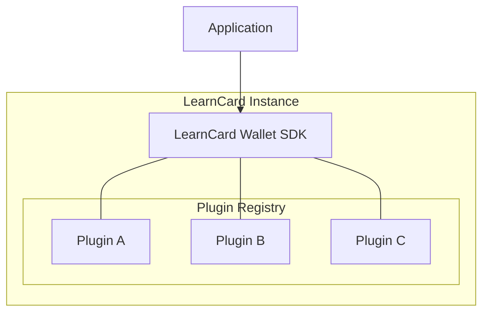
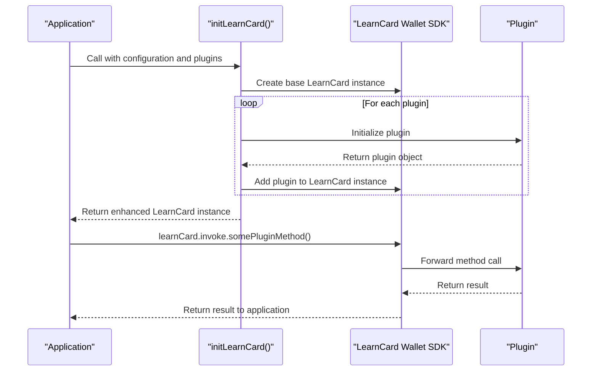
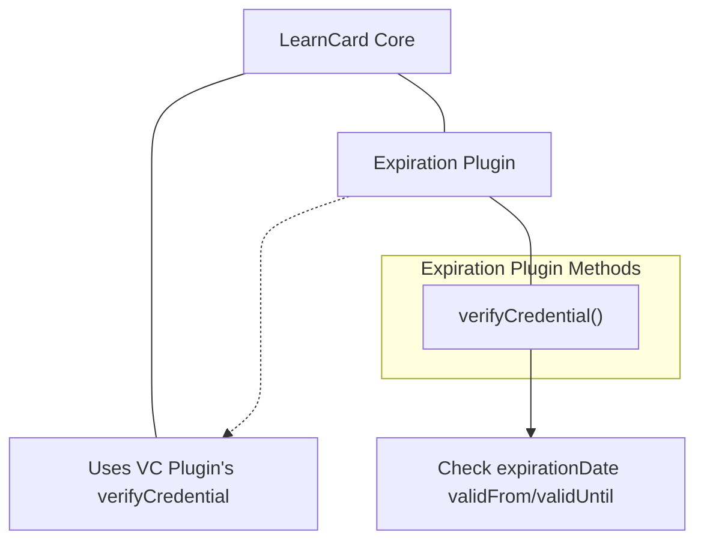
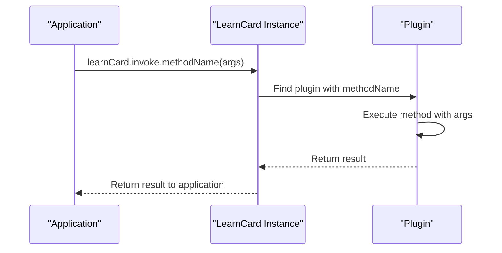
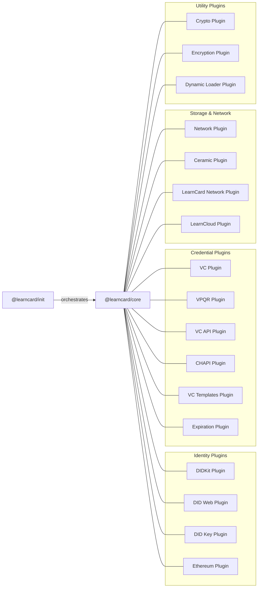

# Plugin System

The LearnCard Plugin System is the modular foundation that enables extensibility of the LearnCard Core through encapsulated units of functionality. This document explains how plugins are structured, loaded, and used within the LearnCard ecosystem.&#x20;

### Plugins Are:

* Core bundles of execution.
* Have no hard requirements they must conform to.
* Atomic.
* Not categorical.
* Typically fall into larger execution workflows. _See_ [_Control Planes_](control-planes.md)_._

Plugins can implement arbitrary functionality, or optionally choose to implement any number of Control Planes. Via a common instantiation pattern, it is also easily possible for plugins to depend on other plugins via their exposed interfaces, as well as to happily hold private and public fields.

The LearnCard Core is designed with minimal base functionality, which is extended through plugins that provide specific capabilities. The plugin system enables developers to include only the features they need, resulting in more lightweight and focused implementations.


Plugins are at the heart of LearnCard. The base LearnCard wallet without _any_ plugins attached to it can do, well... nothing!&#x20;


Additionally, because plugins and plugin hierarchies work entirely through interfaces rather than explicit dependencies, any plugin can be easily hotswapped by another plugin that implements the same interface, and plugins implementing Control Planes can easily be stacked on top of each other to further enhance the functionality of that Control Plane for the wallet.




### Plugin Interface&#x20;

A LearnCard plugin follows a standard interface structure which includes:

* **name**: A unique identifier string
* **displayName**: A human-readable name for UI display
* **description**: A description of the plugin's functionality
* **methods**: An object containing the functions provided by the plugin

The type system uses generics to track which plugins are added to a LearnCard instance, ensuring type safety when accessing plugin methods.

### Adding Plugins

In order to create a fully functioning LearnCard, you will need to add some plugins. Specifically, you will (probably) want to add at least one plugin that implements each Control Plane.


To learn more about [Control Planes](control-planes.md), as well as find recommended Plugins for each Control Plane, click [here](control-planes.md)!


In code, constructing a LearnCard completely from scratch looks like this:

```typescript
const baseLearnCard = await initLearnCard({ custom: true });
const didkitLearnCard = await baseLearnCard.addPlugin(await getDidKitPlugin());
const didkeyLearnCard = await didkitLearnCard.addPlugin(await getDidKeyPlugin(didkitLearnCard, 'a', 'key'));
// repeat for any more plugins you'd like to add
```

However, you don't have to start from scratch! Each instantiation function is completely able to add bespoke plugins to it:

```typescript
const emptyLearnCard = await initLearnCard();
const customLearnCard = await emptyLearnCard.addPlugin(CustomPlugin);
```





### Example: Expiration Plugin

Let's examine how the Expiration Plugin is implemented to understand a typical plugin structure:



The Expiration Plugin extends the credential verification process to check expiration dates:

1. It depends on the VC Plugin's `verifyCredential` method
2. It calls the original method to perform base verification
3. It adds additional checks for credential expiration
4. It returns an enhanced verification result

This demonstrates how plugins can build upon each other's functionality in a composable manner.



### Interacting with Plugins

After initialization, applications interact with plugins through the LearnCard instance's `invoke` property. The method calls follow this pattern:



This unified interface allows applications to access all plugin functionality through a single entry point, abstracting away the details of which plugin provides which method.

### Plugin Data Types

Plugins often work with specific data types, particularly for credential operations. The core types used across plugins include:

| Type       | Description                                   |
| ---------- | --------------------------------------------- |
| UnsignedVC | Unsigned Verifiable Credential data structure |
| VC         | Signed Verifiable Credential with proof       |
| UnsignedVP | Unsigned Verifiable Presentation              |
| VP         | Signed Verifiable Presentation with proof     |
| Proof      | Cryptographic proof structure                 |
| Profile    | Entity profile information                    |

These types are defined in the `@learncard/types` package and used consistently across all plugins to ensure interoperability.





### Graph of Plugins



