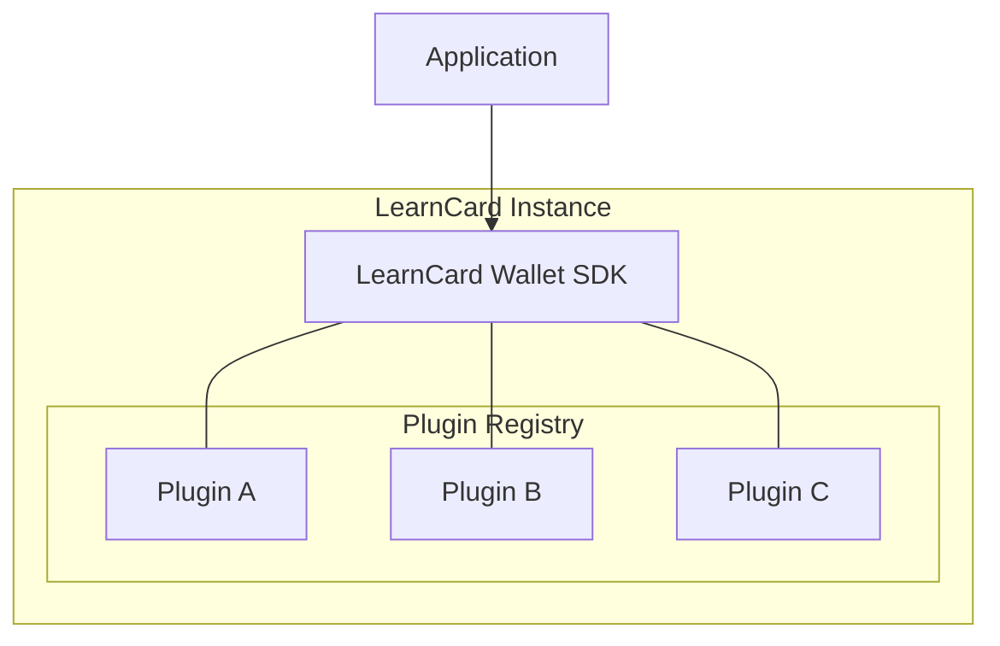
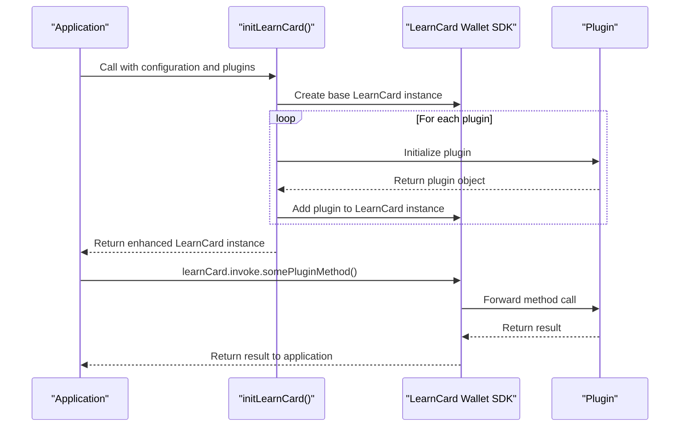
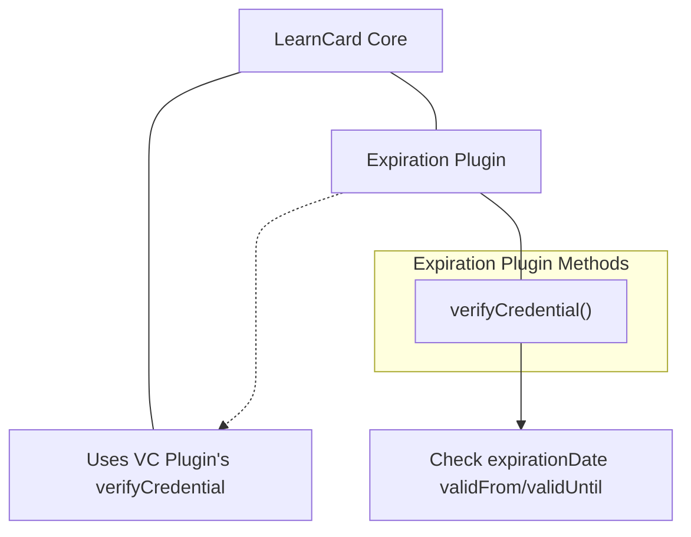
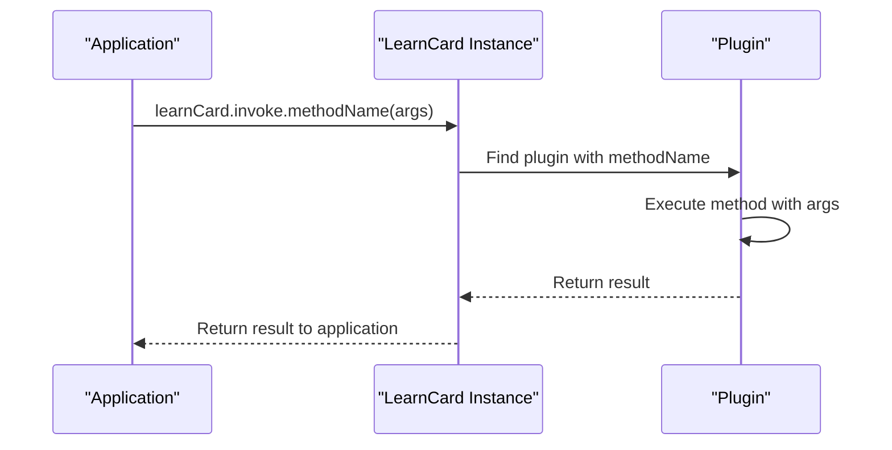
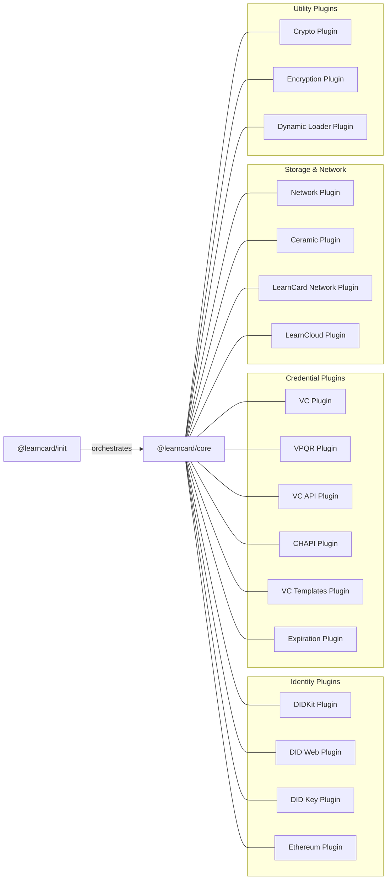

# Plugin System

`initLearnCard()` gives you an object with methods like `issueCredential`, `send`, and `read.get`. None of those live in the core. Each comes from a **plugin**, and the core's only job is to load plugins in order and merge what they expose.

That matters to you in three ways:

- **You only carry what you use.** A server that just verifies credentials needs three plugins; a full network client needs a dozen. `initLearnCard` picks the right stack from the options you pass (`seed`, `network`, `didWeb`…), so you rarely assemble it by hand.
- **Plugins can be swapped.** Anything that implements the same interface can stand in — a different storage backend, a different DID method, a test double. Plugins that implement a [control plane](control-planes.md) stack: three storage plugins all answer `store.upload`, and you pick which by name.
- **You can add your own.** A plugin is a plain object with a name and some methods; it can depend on the methods of plugins loaded before it. See [Build a Plugin](../../how-to-guides/deploy-infrastructure/the-simplest-plugin.md) for a 10-minute walkthrough.

The rest of this page is how that works underneath.


```mermaid
graph TD
    subgraph "LearnCard Instance"
        Core["LearnCard Wallet SDK"]

        subgraph "Plugin Registry"
            P1["Plugin A"]
            P2["Plugin B"]
            P3["Plugin C"]
        end

        Core --- P1
        Core --- P2
        Core --- P3
    end

    App["Application"] --> Core
```

### Plugin Interface

A LearnCard plugin follows a standard interface structure which includes:

- **name**: A unique identifier string
- **displayName**: A human-readable name for UI display
- **description**: A description of the plugin's functionality
- **methods**: An object containing the functions provided by the plugin

The type system uses generics to track which plugins are added to a LearnCard instance, ensuring type safety when accessing plugin methods.

### Adding Plugins

In order to create a fully functioning LearnCard, you will need to add some plugins. Specifically, you will (probably) want to add at least one plugin that implements each Control Plane.


To learn more about [Control Planes](control-planes.md), as well as find recommended Plugins for each Control Plane, click [here](control-planes.md)!


In code, constructing a LearnCard completely from scratch looks like this:

Install `@learncard/init`, `@learncard/didkit-plugin`, and `@learncard/didkey-plugin`. Use a 32-byte (64-hex) seed; this example generates one if `SECURE_SEED` is unset.

<!-- snippet: understand/compose-plugins.mjs -->

```javascript
import { randomBytes } from 'node:crypto';
import { readFile } from 'node:fs/promises';
import { createRequire } from 'node:module';
import { initLearnCard } from '@learncard/init';
import { getDidKitPlugin } from '@learncard/didkit-plugin';
import { getDidKeyPlugin } from '@learncard/didkey-plugin';

const seed = process.env.SECURE_SEED ?? randomBytes(32).toString('hex');
const require = createRequire(import.meta.url);
const didkit = readFile(
    require.resolve('@learncard/didkit-plugin/dist/didkit/didkit_wasm_bg.wasm')
);
const baseLearnCard = await initLearnCard({ custom: true });
const didkitLearnCard = await baseLearnCard.addPlugin(await getDidKitPlugin(didkit));
const learnCard = await didkitLearnCard.addPlugin(
    await getDidKeyPlugin(didkitLearnCard, seed, 'key')
);
console.log(learnCard.id.did());
```

<!-- /snippet -->

However, you don't have to start from scratch! Each instantiation function is completely able to add bespoke plugins to it:

<!-- snippet: understand/add-plugin.mjs -->

```javascript
import { initLearnCard } from '@learncard/init';

const HelloPlugin = {
    name: 'Hello',
    methods: {
        hello: () => 'world',
    },
};
const baseLearnCard = await initLearnCard({ custom: true });
const learnCard = await baseLearnCard.addPlugin(HelloPlugin);
console.log(learnCard.invoke.hello());
```

<!-- /snippet -->


```mermaid
sequenceDiagram
    participant App as "Application"
    participant Init as "initLearnCard()"
    participant Core as "LearnCard Wallet SDK"
    participant Plugin as "Plugin"

    App->>Init: Call with configuration and plugins
    Init->>Core: Create base LearnCard instance

    loop For each plugin
        Init->>Plugin: Initialize plugin
        Plugin-->>Init: Return plugin object
        Init->>Core: Add plugin to LearnCard instance
    end

    Init-->>App: Return enhanced LearnCard instance

    App->>Core: learnCard.invoke.somePluginMethod()
    Core->>Plugin: Forward method call
    Plugin-->>Core: Return result
    Core-->>App: Return result to application
```



### Example: Expiration Plugin

Let's examine how the Expiration Plugin is implemented to understand a typical plugin structure:


```mermaid
graph TD
    Core["LearnCard Core"]
    VCPlugin["VC Plugin"]
    ExpirationPlugin["Expiration Plugin"]

    Core --- VCPlugin
    Core --- ExpirationPlugin

    ExpirationPlugin -..-> VCPlugin["Uses VC Plugin's verifyCredential"]

    subgraph "Expiration Plugin Methods"
        VerifyMethod["verifyCredential()"]
    end

    ExpirationPlugin --- VerifyMethod

    VerifyMethod --> CheckExpiration["Check expirationDate validFrom/validUntil"]
```

The Expiration Plugin extends the credential verification process to check expiration dates:

1. It depends on the VC Plugin's `verifyCredential` method
2. It calls the original method to perform base verification
3. It adds additional checks for credential expiration
4. It returns an enhanced verification result

This demonstrates how plugins can build upon each other's functionality in a composable manner.



### Interacting with Plugins

After initialization, applications interact with plugins through the LearnCard instance's `invoke` property. The method calls follow this pattern:


```mermaid
sequenceDiagram
    participant App as "Application"
    participant LC as "LearnCard Instance"
    participant Plugin as "Plugin"

    App->>LC: learnCard.invoke.methodName(args)
    LC->>Plugin: Find plugin with methodName
    Plugin->>Plugin: Execute method with args
    Plugin-->>LC: Return result
    LC-->>App: Return result to application
```

This unified interface allows applications to access all plugin functionality through a single entry point, abstracting away the details of which plugin provides which method.

### Plugin Data Types

Plugins often work with specific data types, particularly for credential operations. The core types used across plugins include:

| Type       | Description                                   |
| ---------- | --------------------------------------------- |
| UnsignedVC | Unsigned Verifiable Credential data structure |
| VC         | Signed Verifiable Credential with proof       |
| UnsignedVP | Unsigned Verifiable Presentation              |
| VP         | Signed Verifiable Presentation with proof     |
| Proof      | Cryptographic proof structure                 |
| Profile    | Entity profile information                    |

These types are defined in the `@learncard/types` package and used consistently across all plugins to ensure interoperability.





### Graph of Plugins


```mermaid
graph LR
    core["@learncard/core"]

    subgraph "Identity Plugins"
        didkit["DIDKit Plugin"]
        didweb["DID Web Plugin"]
        didkey["DID Key Plugin"]
        ethereum["Ethereum Plugin"]
    end

    subgraph "Credential Plugins"
        vc["VC Plugin"]
        vpqr["VPQR Plugin"]
        vcapi["VC API Plugin"]
        chapi["CHAPI Plugin"]
        templates["VC Templates Plugin"]
        expiration["Expiration Plugin"]
    end

    subgraph "Storage & Network"
        network["Network Plugin"]
        ceramic["Ceramic Plugin"]
        lcn["LearnCard Network Plugin"]
        learncloud["LearnCloud Plugin"]
    end

    subgraph "Utility Plugins"
        crypto["Crypto Plugin"]
        encryption["Encryption Plugin"]
        dynamic["Dynamic Loader Plugin"]
    end

    core --- didkit
    core --- didweb
    core --- didkey
    core --- ethereum
    core --- vc
    core --- vpqr
    core --- vcapi
    core --- chapi
    core --- templates
    core --- expiration
    core --- network
    core --- ceramic
    core --- lcn
    core --- learncloud
    core --- crypto
    core --- encryption
    core --- dynamic

    init["@learncard/init"] -->|"orchestrates"| core
```
