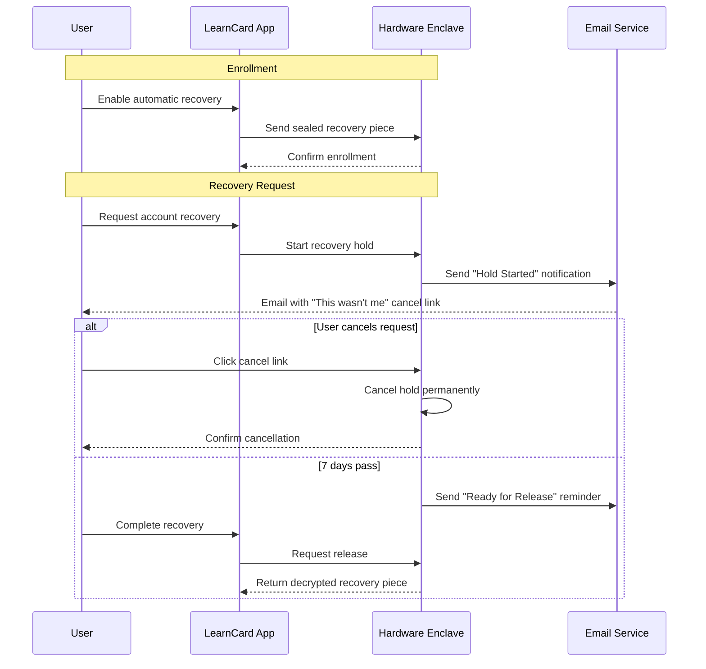

# Automatic Account Recovery

Automatic account recovery provides a safety net for users who lose access to their primary devices or recovery phrases. Instead of relying on a central database that could be compromised, LearnCard uses a hardware-secured environment to hold a sealed recovery piece. This piece can only be released after a mandatory waiting period or by providing a correct Personal Identification Number (PIN).

## What is Automatic Recovery?

When a user sets up automatic recovery, their device encrypts one piece of their recovery key. This encrypted piece is sent to a specialized, isolated server environment called a hardware enclave.

The enclave is programmed with strict rules:

1. **Delayed Release**: It will only release the decrypted recovery piece after a mandatory 7-day waiting period.
2. **PIN Release**: It will release the piece immediately if the user provides the correct PIN, but permanently locks the piece after 10 failed attempts.

Because the rules are enforced by the hardware enclave itself, no human operator or database administrator can bypass them to access the recovery piece early or without the PIN.

## The Recovery Flow

The recovery process is designed to give the legitimate owner time to react if an unauthorized person attempts to recover their account.

Until a second independent time source is in place, waiting-period releases are refused entirely rather than proceed on an unverified wait — the system fails closed.

## What is Attestation?

To ensure the hardware enclave is actually running the correct, unmodified code, LearnCard uses a process called **attestation**.

In plain words, attestation is how a device checks a hardware-signed proof of exactly which code is running before trusting it. When the LearnCard App communicates with the enclave, the enclave provides a cryptographic certificate generated by the underlying hardware (like Amazon Web Services Nitro). This certificate proves that the enclave is running the exact software version approved by LearnCard, without any modifications or backdoors. If the proof doesn't match the expected version, the app refuses to send the recovery piece.

## Operator Capabilities and Limits

The hardware enclave design strictly limits what LearnCard operators (or attackers who compromise the operator's systems) can do.

**What the operator CAN do:**

- Turn off the servers (causing an outage where recovery is unavailable).
- Delete the encrypted recovery pieces (causing permanent data loss, meaning users cannot recover their accounts).
- See when a user requests a recovery and when it completes.

**What the operator CANNOT do:**

- Read the decrypted recovery piece.
- Bypass the 7-day waiting period.
- Guess the PIN infinitely (the enclave enforces the 10-attempt limit).
- Modify the enclave's code without changing the attestation proof (which the app would detect and reject).

## Honest Limits

While the enclave provides strong security, it is not magic. There are specific technical limits to its guarantees:

- **Rollback Detection**: The system detects if an attacker tries to roll back the enclave's memory to an older state (to reset the PIN counter, for example), but it cannot prevent it in all scenarios. If a rollback is detected, the system fails closed and refuses to release the key. The PIN attempt budget is only as strong as this rollback detection.
- **Time Sources**: The enclave relies on external time servers to measure the 7-day waiting period. It requires at least two agreeing signed sources and fails closed otherwise. Time intervals describe signed processing events, not an authenticated upper bound on receipt time.
- **Enrollment Verification**: Production release also awaits a reviewed way for the secure environment to confirm the current enrollment.

For a comprehensive technical breakdown of the threat model, cryptographic guarantees, and known limitations, please review the [Security Review Packet](https://github.com/learningeconomy/LearnCard/blob/main/services/escrow-enclave-app/SECURITY.md).
