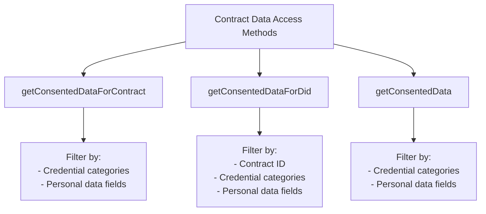

# Accessing Consented Data

Learn how contract owners or authorized applications can securely access or query the specific data that users have explicitly consented to share via a Consent Contract. This page covers the available methods, filtering capabilities, and data retrieval patterns.

### Contract Data Access 

Contract owners can access data shared by consenters through:

* `getConsentedDataForContract`: Data from all consenters for a specific contract
* `getConsentedDataForDid`: Data consented between specific profiles
* `getConsentedData`: All data consented to any of your contracts

Data queries can filter based on:

* Required credential categories
* Excluded credential categories
* Personal data fields
* Date ranges via cursor pagination

All queries return paginated results with:

* `hasMore`: Whether more records exist
* `cursor`: Pagination token for next page
* `records`: The actual data records
