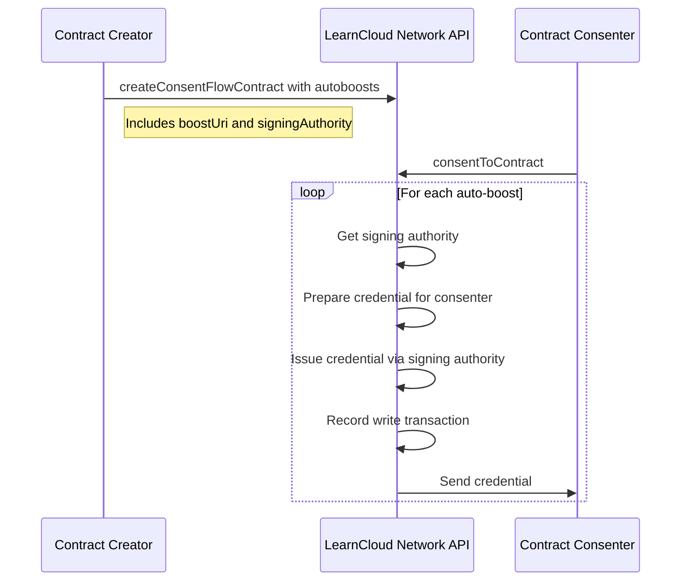

# Auto-Boosts

Learn about Auto-Boosts, a feature enabling the automatic issuance of credentials (Boosts) to users immediately upon their consent to a specific contract. This section details their configuration within contracts and the automated issuance process.

### Auto-Boost System <a href="#auto-boost-system" id="auto-boost-system"></a>

Auto-boosts are credentials automatically issued when a user consents to a contract. This feature allows contract creators to automatically reward users who consent to their contracts.



#### Configuration <a href="#configuration" id="configuration"></a>

Auto-boosts are configured when creating a contract:

```typescript
{
  // other contract fields
  autoboosts: [
    {
      boostUri: 'boost:123',
      signingAuthority: {
        endpoint: 'https://signing-authority.example.com',
        name: 'my-authority'
      }
    }
  ]
}
```

Key requirements:

1. The contract creator must have permission to issue the boost
2. The boost must be published (not a draft)
3. The specified signing authority must exist for the contract creator
4. Each auto-boost can use a different signing authority

#### Issuance Process

Auto-boosts are processed during:

1. Initial consent via `consentToContract()`
2. Re-consent via `reconsentTerms()`
3. Terms update via `updateTerms()`

For each auto-boost, the system:

1. Gets the signing authority information from the relationship
2. Gets the contract owner's signing authority
3. Prepares the boost credential with the consenter's information
4. Issues the credential using the contract owner's signing authority
5. Records a "write" transaction
6. Sends the boost to the consenter

If a signing authority doesn't exist, that specific auto-boost will be skipped.
