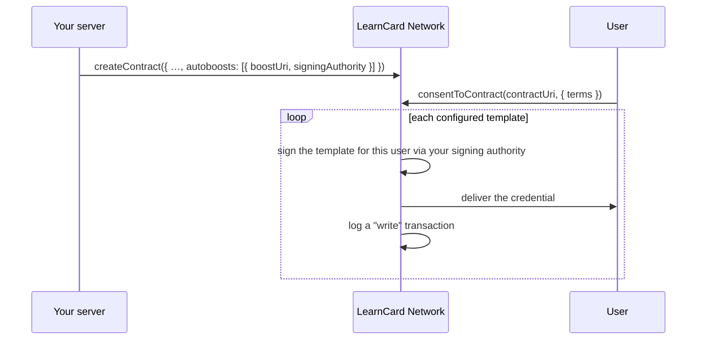

# Issue on Consent

When a user consents to your contract, the network can issue them a credential **immediately** — no call from your server. Use it for the thing every user should get on joining: a membership card, a "connected to Acme" badge, a starter achievement.

## How it works


```mermaid
sequenceDiagram
    participant You as Your server
    participant Net as LearnCard Network
    participant User
    You->>Net: createContract({ …, autoboosts: [{ boostUri, signingAuthority }] })
    User->>Net: consentToContract(contractUri, { terms })
    loop each configured template
        Net->>Net: sign the template for this user via your signing authority
        Net->>User: deliver the credential
        Net->>Net: log a "write" transaction
    end
```

This runs on first consent and again whenever the user updates their terms.

## Configuring it

Set `SECURE_SEED` to your 64-hex seed and `PROFILE_ID` to a unique profile ID. Install `@learncard/lca-api-plugin` for hosted signing authority creation; the network plugin alone does not provide `createSigningAuthority`. This creates a live template, registers its signer, and configures `autoboosts` on `createContract`:

<!-- snippet: understand/issue-on-consent.mjs -->

```javascript
import { randomUUID } from 'node:crypto';
import { initLCALearnCard } from '@learncard/lca-api-plugin';

const { SECURE_SEED, PROFILE_ID } = process.env;
if (!SECURE_SEED || !PROFILE_ID) throw new Error('Set SECURE_SEED and PROFILE_ID');
const learnCard = await initLCALearnCard({
    seed: SECURE_SEED,
    network: true,
    ...(process.env.LCA_API_URL ? { lcaAPI: process.env.LCA_API_URL } : {}),
});
if (!(await learnCard.invoke.getProfile())) {
    await learnCard.invoke.createProfile({ profileId: PROFILE_ID, displayName: 'Acme Learning' });
}
const boostUri = await learnCard.invoke.createBoost(
    {
        '@context': [
            'https://www.w3.org/ns/credentials/v2',
            'https://purl.imsglobal.org/spec/ob/v3p0/context-3.0.3.json',
        ],
        type: ['VerifiableCredential', 'OpenBadgeCredential'],
        issuer: learnCard.id.did(),
        name: 'Connected to Acme',
        credentialSubject: {
            type: ['AchievementSubject'],
            achievement: {
                id: `urn:uuid:${randomUUID()}`,
                type: ['Achievement'],
                name: 'Connected to Acme',
                description: 'Connected to Acme Learning.',
                criteria: { narrative: 'Consent to the Acme contract.' },
            },
        },
    },
    { name: 'Connected to Acme', category: 'Achievement', status: 'LIVE' }
);
const authority = await learnCard.invoke.createSigningAuthority('consent-issuer');
if (!authority) throw new Error('Could not create signing authority');
await learnCard.invoke.registerSigningAuthority(authority.endpoint, authority.name, authority.did);
await learnCard.invoke.setPrimaryRegisteredSigningAuthority(authority.endpoint, authority.name);
await learnCard.invoke.clearDidWebCache();
const contractUri = await learnCard.invoke.createContract({
    name: 'Acme Learning',
    contract: {
        read: { personal: {}, credentials: { categories: {} } },
        write: { personal: {}, credentials: { categories: { Achievement: {} } } },
    },
    autoboosts: [
        {
            boostUri,
            signingAuthority: { endpoint: authority.endpoint, name: authority.name },
        },
    ],
});
console.log('contract:', contractUri);
```

<!-- /snippet -->

Each entry names a **template** and the **signing authority** that will sign it. Because the network signs on your behalf, you must have a signing authority — the same one `send()` uses is fine. See [Who Signs Your Credentials?](../../how-to-guides/create-signing-authority.md)

Requirements:

- The template must be `LIVE` (not a draft) and you must have permission to issue from it.
- The signing authority must be registered to your profile. If it isn't, that template is **skipped silently** — the consent still succeeds.
- The user's terms must grant `write` permission for the template's category, or nothing is delivered.

## What the user sees

The credential appears in their LearnCard immediately after they tap Accept, issued by you, with no claim step. It shows up in their transaction history as a `write` under your contract.

## Related

- [Credential Templates (Boosts)](../credentials-and-data/boost-credentials.md)
- [Reading & Writing Consented Data](writing-consented-data.md) — issuing later, on your own schedule
