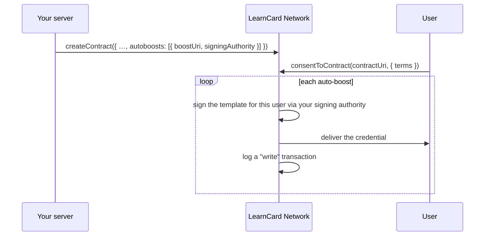

# Auto-Boosts

An auto-boost is a credential the network issues **the moment a user consents** to your contract — no call from your server. Use it for the thing every user should get on joining: a membership card, a "connected to Acme" badge, a starter achievement.

## How it works


```mermaid
sequenceDiagram
    participant You as Your server
    participant Net as LearnCard Network
    participant User
    You->>Net: createContract({ …, autoboosts: [{ boostUri, signingAuthority }] })
    User->>Net: consentToContract(contractUri, { terms })
    loop each auto-boost
        Net->>Net: sign the template for this user via your signing authority
        Net->>User: deliver the credential
        Net->>Net: log a "write" transaction
    end
```

Auto-boosts run on first consent and again whenever the user updates their terms.

## Configuring one

```typescript
const contractUri = await learnCard.invoke.createContract({
    name: 'Acme Learning',
    contract: {/* read/write permissions */},
    autoboosts: [
        {
            boostUri: templateUri, // from createBoost() — lc:network:…:boost:…
            signingAuthority: { endpoint: authority.endpoint, name: authority.name },
        },
    ],
});
```

Each entry names a **template** and the **signing authority** that will sign it. Because the network signs on your behalf, you must have a signing authority — the same one `send()` uses is fine. See [Who Signs Your Credentials?](../../how-to-guides/create-signing-authority.md)

Requirements:

- The template must be `LIVE` (not a draft) and you must have permission to issue from it.
- The signing authority must be registered to your profile. If it isn't, that auto-boost is **skipped silently** — the consent still succeeds.
- The user's terms must grant `write` permission for the template's category, or nothing is delivered.

## What the user sees

The credential appears in their LearnCard immediately after they tap Accept, issued by you, with no claim step. It shows up in their transaction history as a `write` under your contract.

## Related

- [Credential Templates (Boosts)](../credentials-and-data/boost-credentials.md)
- [Reading & Writing Consented Data](writing-consented-data.md) — issuing later, on your own schedule
