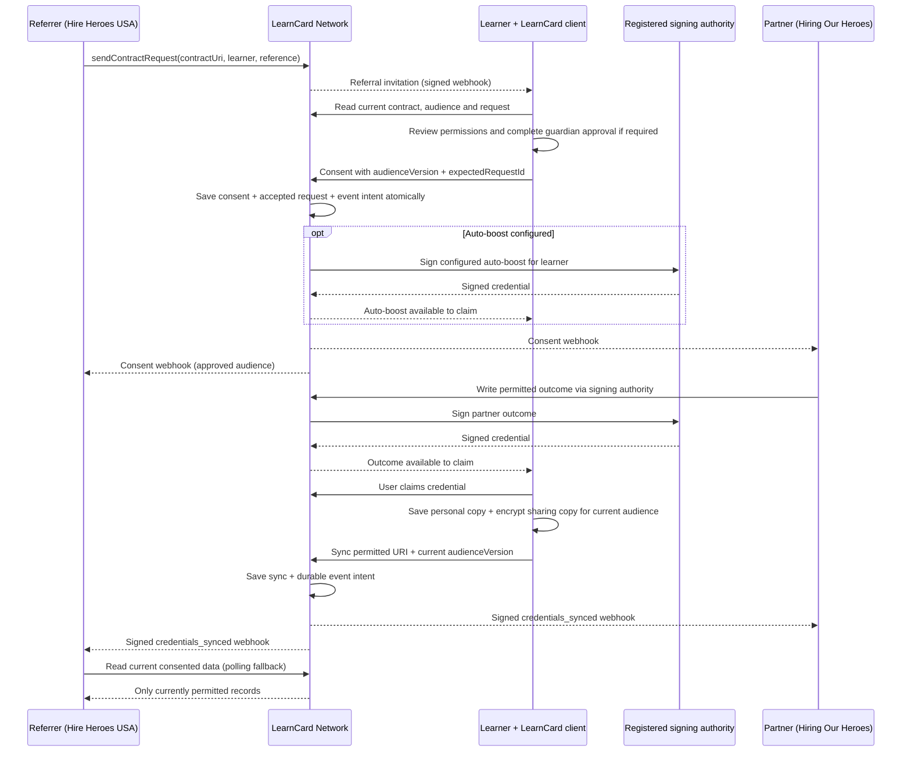

# The brokered referral lifecycle

A referral introduces a learner to a partner. It does not share their information. The learner reviews the contract's purpose, permissions and receiving organizations before deciding whether to connect. For example, Hire Heroes USA can refer a veteran to Hiring Our Heroes; the veteran decides which information both organizations may receive.

The partner owns the contract and includes the referrer in `recipients` when it should receive approved outcomes. The owner and current recipients can read permitted data. Only the owner and explicit writers can issue outcomes, and only within the learner's write permissions. A recipient is not automatically a writer. Salesforce's Data Mediator is an external client of these APIs and webhooks, outside the scope of LC-2226.

## From referral to a shared outcome

The diagram shows the logical order; webhook transport is asynchronous and at least once. Consent and event intents are committed together, while signing, delivery and client synchronization are separate operations. An auto-boost is a configured credential issued on consent, such as a connection badge. A partner write is a later outcome, such as enrollment. Both produce credentials the learner can claim; neither automatically makes a credential available in the audience's encrypted data view.

## What consent controls

An invitation can remain pending, be accepted through consent, or be denied or cancelled. Dismissing an alert leaves it pending. Referral acceptance is bound to the reviewed request ID; the server rejects a cancelled, replaced or otherwise terminal invitation. Direct legacy consent links remain available independently of invitation decisions.

Consent defines permitted fields, categories and receiving organizations. Recipient additions freeze after the first consent; removals revoke future API discovery and invalidate stale audience acknowledgements. Withdrawal and expiry stop future authorized reads and synchronization. Copies already delivered cannot be recalled. A one-time consent keeps its permitted snapshot until withdrawal or expiry and does not authorize live updates.

Sharing all credentials in a category includes credentials from different sources. Use separate categories or individually selected credentials when partner outcome streams must stay separate. Recipients can inspect only referrals they sent; the owner and explicit writers can manage all referrals. Other audience members receive approved data without another referrer's private message or external reference.

## Live sharing depends on the learner's client

The server does not continuously scan the learner's personal account. The learner must claim a credential, and a compatible active client must encrypt and synchronize it under the selected live-sharing permissions. An unopened client, disabled live sharing, or an unclaimed outcome delays reporting. Webhooks and polling can report only the state already saved on the network; polling does not trigger claim or sync.

Consumers verify signed webhook authentication, store events durably before acknowledging them, and deduplicate by `data.metadata.deliveryKey`. If delivery is unavailable or exhausts its bounded retries, poll request status and current permitted data to reconcile. A webhook is a change signal; current data APIs remain the authority for access.

Follow the [integrator how-to](../../how-to-guides/consent-flow/brokered-referrals.md) for signing authority setup, scoped tokens, requests and outcomes. See [Contract Requests and Events](../../sdks/learncard-network/contract-requests-and-events.md) for payload fields, privacy rules and delivery limits.
