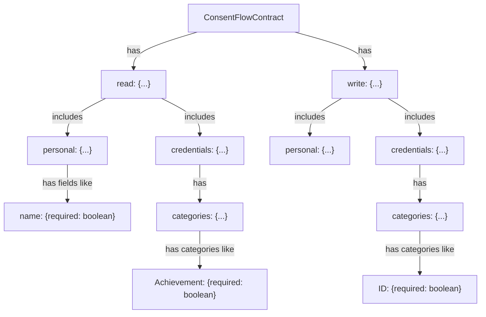
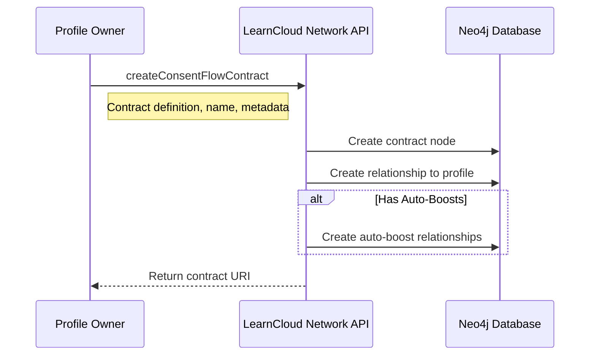

# Consent Contracts

Learn about Consent Contracts: the formal agreements created by organizations that define precisely what data can be shared or what actions can be performed. Explore their structure, common fields, and how they are managed throughout their lifecycle.

### Contract Structure

Contracts define what data a profile can read from or write to another profile. They have a structured format with read and write permissions.



A minimal contract example:

```json
{
  read: {
    personal: { name: { required: false } },
    credentials: {
      categories: {},
    },
  },
  write: {
    personal: {},
    credentials: {
      categories: {},
    },
  }
}
```

Contracts can also include:

* **Name** - A human-readable name for the contract
* **Description** - Explains the purpose of the contract
* **Reason for Accessing** - Why the contract owner needs this data
* **Needs Guardian Consent** - Flag for contracts involving minors
* **Redirect URL** - Where to direct users after consent
* **Front Door Boost URI** - A credential to display
* **Image** - Visual representation of the contract
* **Auto-Boosts** - Credentials to auto-issue upon consent

### Creating a Contract <a href="#creating-a-contract" id="creating-a-contract"></a>

Contracts are created using the `createConsentFlowContract` endpoint, which is implemented as a profile route requiring authentication with the `contracts:write` scope.



\
When creating a contract with auto-boosts, each boost must specify:

* A boost URI pointing to an existing boost credential
* A signing authority configuration (endpoint and name)

The contract creator must have permission to issue the boosts specified in auto-boosts.

### Managing Contracts <a href="#managing-contracts" id="managing-contracts"></a>

Contracts can be:

* **Retrieved** using `getConsentFlowContract` (single contract) or `getConsentFlowContracts` (paginated list)
* **Deleted** using `deleteConsentFlowContract` (if you're the owner)

When a contract is deleted, all consented terms for that contract are also removed.
