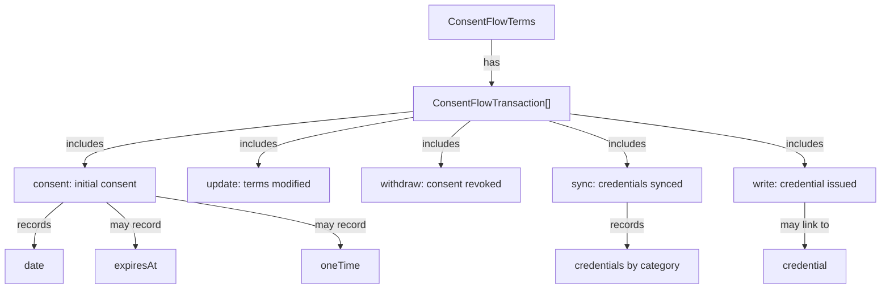

# Consent Transactions

Explore the Consent Transaction system, which provides a reliable audit trail of all significant consent-related activities. Understand the different transaction types and how they transparently record the history of consent decisions and changes.

### Transaction System 

Every action in the consent flow creates a transaction record, which provides an audit trail of all consent-related activities.

Transaction types:

* **consent**: Created when a user initially consents
* **update**: Created when a user updates their terms
* **withdraw**: Created when a user withdraws consent
* **sync**: Created when a user syncs credentials to the contract
* **write**: Created when a credential is issued through the contract

Transactions can be retrieved using `getConsentFlowTransactions` for a specific terms URI.
