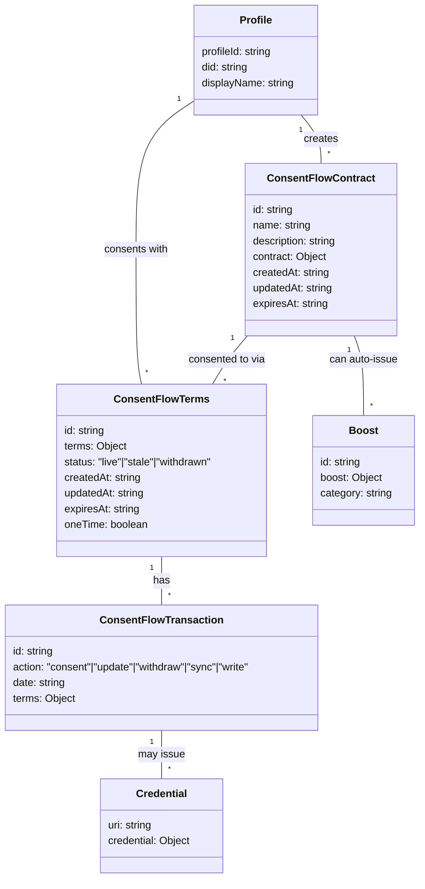
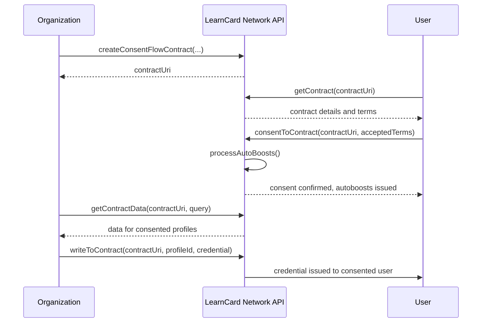

# ConsentFlow Overview

The Consent Flow system allows organizations to create contracts that users can consent to, enabling controlled data sharing and credential issuance.

## Architecture

The Consent Flow Contract system manages permissions and data sharing between profiles using a graph-based data model. It tracks what data can be shared, who has consented to share it, and maintains a transaction history of all consent-related activities.

The system consists of the following key components:

1. **Profiles**: Users who create contracts or consent to contracts
2. **Contracts**: Define data access requirements and permissions
3. **Terms**: Record a profile's consent to a contract with specific sharing preferences
4. **Transactions**: Record actions related to terms (consent, withdraw, update, sync, write)
5. **Credentials**: Can be issued or synced through contract consent
6. **Auto-Boosts**: Credentials automatically issued when a user consents to a contract

## ConsentFlow Process

When a profile consents to a contract, the following steps occur:

The consent flow includes:

1. Verifying the terms are valid for the contract
2. Creating a terms record with status (live/stale)
3. Recording a consent transaction
4. Processing any auto-boosts (if configured)
5. Notifying the contract owner

Options when consenting:

* **expiresAt**: Date when the consent expires
* **oneTime**: If true, marks terms as "stale" after consent
