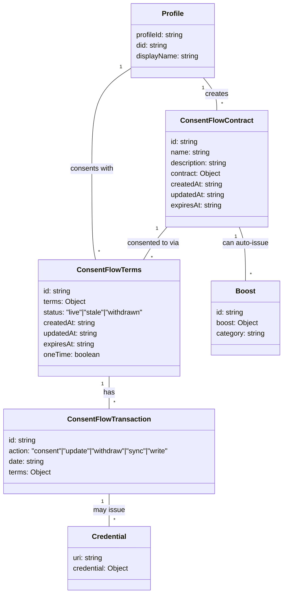
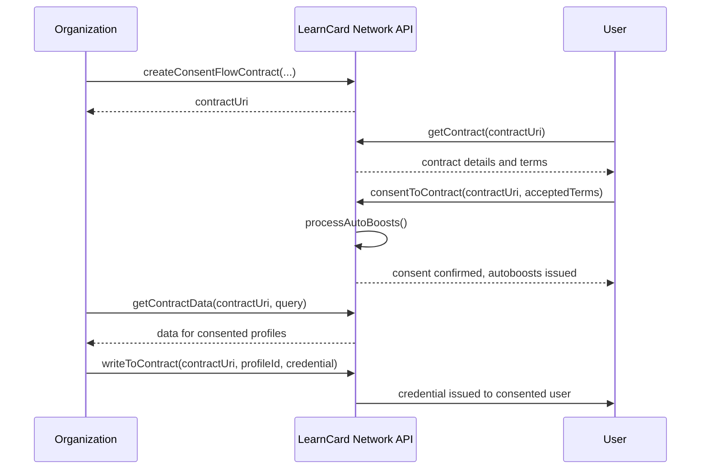

# ConsentFlow Overview

The Consent Flow system allows organizations to create contracts that users can consent to, enabling controlled data sharing and credential issuance.

## Architecture

The Consent Flow Contract system manages permissions and data sharing between profiles using a graph-based data model. It tracks what data can be shared, who has consented to share it, and maintains a transaction history of all consent-related activities.


```mermaid
classDiagram
    class Profile {
        profileId: string
        did: string
        displayName: string
    }

    class ConsentFlowContract {
        id: string
        name: string
        description: string
        contract: Object
        createdAt: string
        updatedAt: string
        expiresAt: string
    }

    class ConsentFlowTerms {
        id: string
        terms: Object
        status: "live"|"stale"|"withdrawn"
        createdAt: string
        updatedAt: string
        expiresAt: string
        oneTime: boolean
    }

    class ConsentFlowTransaction {
        id: string
        action: "consent"|"update"|"withdraw"|"sync"|"write"
        date: string
        terms: Object
    }

    class Boost {
        id: string
        boost: Object
        category: string
    }

    class Credential {
        uri: string
        credential: Object
    }

    Profile "1" -- "*" ConsentFlowContract : creates
    Profile "1" -- "*" ConsentFlowTerms : consents with
    ConsentFlowContract "1" -- "*" ConsentFlowTerms : consented to via
    ConsentFlowTerms "1" -- "*" ConsentFlowTransaction : has
    ConsentFlowTransaction "1" -- "*" Credential : may issue
    ConsentFlowContract "1" -- "*" Boost : can auto-issue
```

The system consists of the following key components:

1. **Profiles**: Users who create contracts or consent to contracts
2. **Contracts**: Define data access requirements and permissions
3. **Terms**: Record a profile's consent to a contract with specific sharing preferences
4. **Transactions**: Record actions related to terms (consent, withdraw, update, sync, write)
5. **Credentials**: Can be issued or synced through contract consent
6. **Auto-Boosts**: Credentials automatically issued when a user consents to a contract

## ConsentFlow Process

When a profile consents to a contract, the following steps occur:


```mermaid
sequenceDiagram
    participant Organization
    participant Network as LearnCard Network API
    participant User

    Organization->>Network: createConsentFlowContract(...)
    Network-->>Organization: contractUri

    User->>Network: getContract(contractUri)
    Network-->>User: contract details and terms

    User->>Network: consentToContract(contractUri, acceptedTerms)
    Network->>Network: processAutoBoosts()
    Network-->>User: consent confirmed, autoboosts issued

    Organization->>Network: getContractData(contractUri, query)
    Network-->>Organization: data for consented profiles

    Organization->>Network: writeToContract(contractUri, profileId, credential)
    Network->>User: credential issued to consented user
```

The consent flow includes:

1. Verifying the terms are valid for the contract
2. Creating a terms record with status (live/stale)
3. Recording a consent transaction
4. Processing any auto-boosts (if configured)
5. Notifying the contract owner

Options when consenting:

-   **expiresAt**: Date when the consent expires
-   **oneTime**: If true, marks terms as "stale" after consent

---

## App Store Integration Contracts

App Store listings can have a **configured consent contract** that simplifies the consent flow for embedded applications. Instead of managing contract URIs in your code, you configure the contract once in your App Store listing, and the SDK automatically resolves it at runtime.

### How It Works

```
┌─────────────────┐     ┌──────────────────┐     ┌─────────────────┐
│  Embedded App   │────▶│  LearnCard Host  │────▶│  App Listing    │
│                 │     │                  │     │                 │
│ requestConsent()│     │  Resolve contract│     │  Integration    │
│  (no contractUri)│    │  from listing    │     │  Config         │
└─────────────────┘     └──────────────────┘     └─────────────────┘
                                                          │
                                                          ▼
                                                   ┌─────────────────┐
                                                   │  ConsentFlow    │
                                                   │  Contract       │
                                                   └─────────────────┘
```

**The Resolution Flow:**

1. **Embedded app** calls `requestConsent()` without a `contractUri`
2. **LearnCard host** identifies the current app from the iframe context
3. **Host looks up** the app's listing integration configuration
4. **Configured contract** is retrieved and used for the consent request
5. **User sees** the standard consent modal with the contract terms

### Benefits

-   **Simplified Code** - No need to hardcode or manage contract URIs
-   **Consistent Terms** - All users consent to the same contract
-   **Easy Updates** - Change the contract in your listing without code changes
-   **Environment Flexibility** - Different contracts for staging/production

### Configuration

To configure a contract for your App Store listing:

1. Go to your app listing in the LearnCard Developer Portal
2. Navigate to the **Integration** tab
3. Select a **Consent Contract** from your existing contracts
4. Save the configuration

Once configured, your embedded app can request consent without specifying the contract:

```typescript
// The contract is automatically resolved from your listing
const result = await learnCard.requestConsent();

if (result.granted) {
    // User has consented to your configured contract
    proceedWithDataAccess();
}
```

### Comparison: With vs Without Configured Contract

**Without Configured Contract (External Apps):**

```typescript
// You must manage the contract URI
const CONTRACT_URI = 'lc:network:network.learncard.com/trpc:contract:abc123';

async function requestDataAccess() {
    const result = await learnCard.requestConsent(CONTRACT_URI);
    return result.granted;
}
```

**With Configured Contract (App Store Apps):**

```typescript
// Contract is resolved automatically from listing
async function requestDataAccess() {
    const result = await learnCard.requestConsent();
    return result.granted;
}
```

### Use Cases

**AI Tutor Apps**

-   Configure a contract that grants access to credentials and learning history
-   Use `requestConsent()` followed by `requestLearnerContext()` for AI personalization

**Data Visualization Apps**

-   Configure a contract for accessing credential data
-   Build dashboards without hardcoding contract references

**Multi-Environment Workflows**

-   Different contracts for development, staging, and production
-   Same code works across all environments

### Prerequisites

-   Your app must be published in the LearnCard App Store
-   You must have created a ConsentFlow contract
-   The contract must be linked in your listing's integration settings


If your listing doesn't have a configured contract and you call `requestConsent()` without a `contractUri`, the request will fail with an error indicating no contract is configured.

