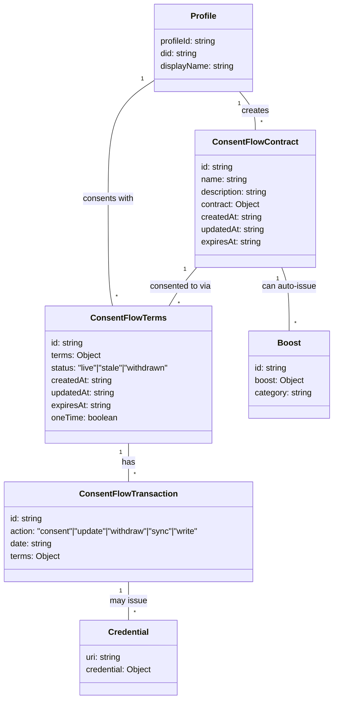
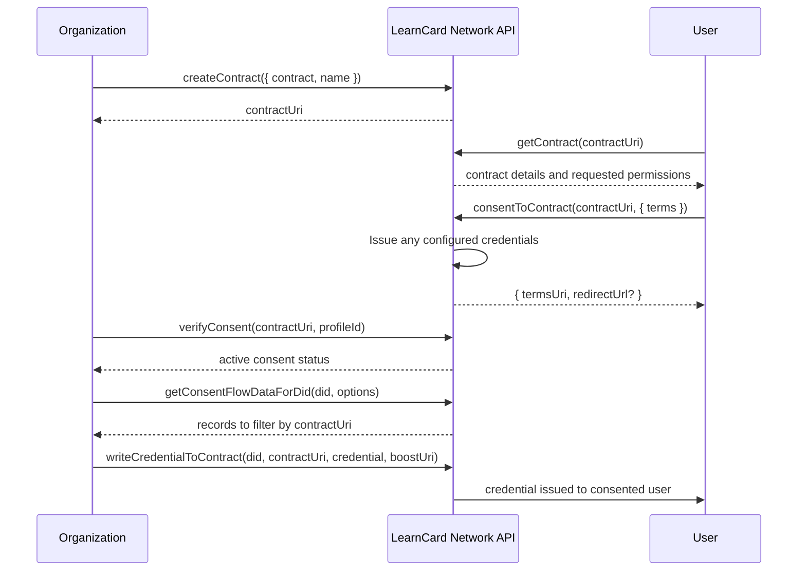

# ConsentFlow Overview

ConsentFlow is how a user gives your platform standing permission: to read some of their data, to issue credentials into their account, or both. You publish a **contract** saying what you'd like; each user answers with **terms** saying what they'll allow; every change is logged as a **transaction**. Once a user has consented, you can read and write within those terms without asking again — until they change or withdraw them.

If you just want to send someone a badge, you don't need this; use [`send()`](../../how-to-guides/send-credentials.md). ConsentFlow is for an ongoing relationship — a tutor that issues after every lesson, a game that saves progress, a platform that reads a learner's [skills profile](verifiable-data-in-consentflow.md). The end-to-end build is in [Connect a User's LearnCard to Your Platform](../../tutorials/create-a-consentflow.md).

## The pieces

Contracts, terms, and transactions are records on the network, linked to the profiles that created them:


```mermaid
classDiagram
    class Profile {
        profileId: string
        did: string
        displayName: string
    }

    class ConsentFlowContract {
        id: string
        name: string
        description: string
        contract: Object
        createdAt: string
        updatedAt: string
        expiresAt: string
    }

    class ConsentFlowTerms {
        id: string
        terms: Object
        status: "live"|"stale"|"withdrawn"
        createdAt: string
        updatedAt: string
        expiresAt: string
        oneTime: boolean
    }

    class ConsentFlowTransaction {
        id: string
        action: "consent"|"update"|"withdraw"|"sync"|"write"
        date: string
        terms: Object
    }

    class Boost {
        id: string
        boost: Object
        category: string
    }

    class Credential {
        uri: string
        credential: Object
    }

    Profile "1" -- "*" ConsentFlowContract : creates
    Profile "1" -- "*" ConsentFlowTerms : consents with
    ConsentFlowContract "1" -- "*" ConsentFlowTerms : consented to via
    ConsentFlowTerms "1" -- "*" ConsentFlowTransaction : has
    ConsentFlowTransaction "1" -- "*" Credential : may issue
    ConsentFlowContract "1" -- "*" Boost : can auto-issue
```

- **Contract** — what you're asking for. One per integration, owned by your profile.
- **Terms** — one user's answer. Lives as long as their consent does.
- **Transaction** — an audit entry every time terms are created, changed, synced, withdrawn, or used to issue.
- **Issue on consent** — credentials the network issues the moment someone consents. See [Issue on Consent](auto-boosts.md).

## What happens when a user consents


```mermaid
sequenceDiagram
    participant Organization
    participant Network as LearnCard Network API
    participant User

    Organization->>Network: createContract({ contract, name })
    Network-->>Organization: contractUri

    User->>Network: getContract(contractUri)
    Network-->>User: contract details and requested permissions

    User->>Network: consentToContract(contractUri, { terms })
    Network->>Network: Issue any configured credentials
    Network-->>User: { termsUri, redirectUrl? }

    Organization->>Network: verifyConsent(contractUri, profileId)
    Network-->>Organization: active consent status
    Organization->>Network: getConsentFlowDataForDid(did, options)
    Network-->>Organization: records to filter by contractUri

    Organization->>Network: writeCredentialToContract(did, contractUri, credential, boostUri)
    Network->>User: credential issued to consented user
```

On consent the network checks the terms satisfy the contract's required permissions, records them, logs a `consent` transaction, issues any credentials you configured to issue on consent, and notifies you. The user can set `expiresAt` on their consent, or `oneTime: true` to share once and immediately mark the terms stale.

In practice the user does this in the LearnCard app: you send them to `https://learncard.app/consent-flow?uri=<contractUri>&returnTo=<yourUrl>`, they review and accept, and LearnCard redirects back to you with a signed proof of who consented. That redirect, and how to verify it, is the heart of the [tutorial](../../tutorials/create-a-consentflow.md).

## Contracts

A contract describes the permissions an organization requests, not the permissions a user has already granted. Both `read` and `write` contain:

- `personal`: a map of field names to `{ required: boolean, defaultEnabled?: boolean }`.
- `credentials.categories`: a map of category names to the same permission shape.

For example, `read.personal.name: { required: false }` requests an optional name, while `write.credentials.categories.Achievement: { required: true }` requires permission to deliver achievements. Required permissions must be accepted for terms to be valid; optional permissions can be declined. `defaultEnabled` controls the initial selection, not consent itself. `read.anonymize` is optional.

Methods, all via `learnCard.invoke`:

- `createContract({ contract, name, description?, image?, expiresAt?, redirectUrl?, reasonForAccessing?, needsGuardianConsent?, autoboosts?, writers? })` → contract URI
- `getContract(contractUri)`, `getContracts(options?)`, `deleteContract(contractUri)`

`redirectUrl` is where LearnCard sends the user after they consent (a `returnTo` query parameter overrides it per link). `reasonForAccessing` is shown to the user. `needsGuardianConsent: true` makes this a [GameFlow](gameflow-overview.md) contract: minors need a guardian's approval before they can consent.

## Terms: what the user actually agreed to

Terms are a user's concrete response to a contract. Their shape differs from the requested permissions:

- `read.personal` maps field names to shared **string values**.
- `read.credentials` has optional `sharing` and `shareAll` flags and a `categories` map. Each category can contain optional `sharing`, `shared` (credential URI array), `shareAll`, and `shareUntil` fields.
- `write.personal` and `write.credentials.categories` map names to **boolean permissions**.
- `read.anonymize` and `deniedWriters` are optional controls.

The consenting user manages this record:

- `consentToContract(contractUri, { terms, expiresAt?, oneTime? })` → `{ termsUri, redirectUrl? }`
- `getConsentedContracts(options?)` — everything this user has consented to
- `updateContractTerms(termsUri, { terms, expiresAt?, oneTime? })`
- `withdrawConsent(termsUri)` — note: the **terms** URI, not the contract URI

Terms are `live`, `stale`, or `withdrawn`. The one call **you** make before touching a user's data or issuing to them is `verifyConsent(contractUri, profileId)` — it returns `true` only while terms are live and neither the contract nor the terms have expired. Having a terms record on file is not the same as having permission now.

## Transactions: the audit trail

Every change to a user's terms is logged: `consent`, `update`, `sync` (the user shared existing credentials), `withdraw`, and `write` (you issued a credential through the contract). The user can review this history with `getConsentFlowTransactions(termsUri, options?)`. It's their record of what you did with their permission — which is the point.

## Apps inside LearnCard

If your integration is an [app that runs inside LearnCard](../../how-to-guides/publish-your-app.md), you don't send the user anywhere. Attach a contract to your listing (Developer Portal → your app → **Integration** → **Consent Contract**) and call `requestConsent()` with no arguments; LearnCard shows the consent screen in place and resolves the contract from your listing. Staging and production listings can point at different contracts without a code change.

```typescript
// The contract is automatically resolved from your listing
const result = await learnCard.requestConsent();

if (result.granted) {
    // User has consented to your configured contract
    proceedWithDataAccess();
}
```

Here `learnCard` is the Partner Connect client, not the network SDK. You can also pass a contract URI explicitly: `requestConsent(contractUri)`. Calling it with no argument and no contract on the listing fails with a "no contract configured" error.
