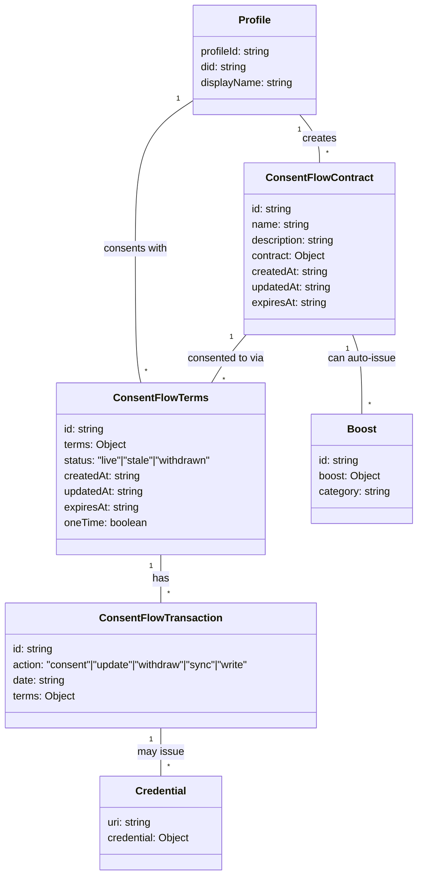

# ConsentFlow Overview

The Consent Flow system allows organizations to create contracts that users can consent to, enabling controlled data sharing and credential issuance.

ConsentFlow contracts can also read and share My Skill Profile verifiable data fields such as Goals, Professional Title, Role Experience, Work Experience, Pay Rate, Work Life Balance, Job Stability, and Self-Assigned Skills. See [Verifiable Data in ConsentFlow](verifiable-data-in-consentflow.md) for details.

## Architecture

The Consent Flow Contract system manages permissions and data sharing between profiles using a graph-based data model. It tracks what data can be shared, who has consented to share it, and maintains a transaction history of all consent-related activities.


```mermaid
classDiagram
    class Profile {
        profileId: string
        did: string
        displayName: string
    }

    class ConsentFlowContract {
        id: string
        name: string
        description: string
        contract: Object
        createdAt: string
        updatedAt: string
        expiresAt: string
    }

    class ConsentFlowTerms {
        id: string
        terms: Object
        status: "live"|"stale"|"withdrawn"
        createdAt: string
        updatedAt: string
        expiresAt: string
        oneTime: boolean
    }

    class ConsentFlowTransaction {
        id: string
        action: "consent"|"update"|"withdraw"|"sync"|"write"
        date: string
        terms: Object
    }

    class Boost {
        id: string
        boost: Object
        category: string
    }

    class Credential {
        uri: string
        credential: Object
    }

    Profile "1" -- "*" ConsentFlowContract : creates
    Profile "1" -- "*" ConsentFlowTerms : consents with
    ConsentFlowContract "1" -- "*" ConsentFlowTerms : consented to via
    ConsentFlowTerms "1" -- "*" ConsentFlowTransaction : has
    ConsentFlowTransaction "1" -- "*" Credential : may issue
    ConsentFlowContract "1" -- "*" Boost : can auto-issue
```

The system consists of the following key components:

1. **Profiles**: Users who create contracts or consent to contracts
2. **Contracts**: Define data access requirements and permissions
3. **Terms**: Record a profile's consent to a contract with specific sharing preferences
4. **Transactions**: Record actions related to terms (consent, withdraw, update, sync, write)
5. **Credentials**: Can be issued or synced through contract consent
6. **Auto-Boosts**: Credentials automatically issued when a user consents to a contract

## ConsentFlow Process

When a profile consents to a contract, the following steps occur:


```mermaid
sequenceDiagram
    participant Organization
    participant Network as LearnCard Network API
    participant User

    Organization->>Network: createContract({ contract, name })
    Network-->>Organization: contractUri

    User->>Network: getContract(contractUri)
    Network-->>User: contract details and requested permissions

    User->>Network: consentToContract(contractUri, { terms })
    Network->>Network: Process configured auto-boosts
    Network-->>User: { termsUri, redirectUrl? }

    Organization->>Network: verifyConsent(contractUri, profileId)
    Network-->>Organization: active consent status
    Organization->>Network: getConsentFlowDataForDid(did, options)
    Network-->>Organization: records to filter by contractUri

    Organization->>Network: writeCredentialToContract(did, contractUri, credential, boostUri)
    Network->>User: credential issued to consented user
```

The consent flow includes:

1. Verifying the terms are valid for the contract
2. Creating a terms record with status (live/stale)
3. Recording a consent transaction
4. Processing any auto-boosts (if configured)
5. Notifying the contract owner

Options when consenting:

- **expiresAt**: Date when the consent expires
- **oneTime**: If true, marks terms as "stale" after consent

For the working redirect and `vp` verification flow, follow [Build a ConsentFlow](../../tutorials/create-a-consentflow.md). For access checks and pagination, see [Reading & Writing Consented Data](writing-consented-data.md).

## Contracts

A contract describes the permissions an organization requests, not the permissions a user has already granted. Both `read` and `write` contain:

- `personal`: a map of field names to `{ required: boolean, defaultEnabled?: boolean }`.
- `credentials.categories`: a map of category names to the same permission shape.

For example, `read.personal.name: { required: false }` requests an optional name, while `write.credentials.categories.Achievement: { required: true }` requires permission to deliver achievements. Required permissions must be accepted for terms to be valid; optional permissions can be declined. `defaultEnabled` controls the initial selection, not consent itself. `read.anonymize` is optional.

All network SDK methods on this page are called through `learnCard.invoke`:

- `createContract({ contract, name, ...metadata })` returns the contract URI. The plugin type accepts optional `subtitle`, `description`, `image`, `expiresAt`, `writers`, and `autoboosts` metadata.
- `getContract(contractUri)` retrieves the definition and owner details.
- `getContracts(options?)` lists the caller's contracts with pagination and an optional `query`.
- `deleteContract(contractUri)` lets the owner delete a contract and its associated terms.

Keep the **contract URI** separate from each user's **terms URI**. Contract details can also expose `redirectUrl`, `reasonForAccessing`, and `needsGuardianConsent`; these are not declared in this checkout's plugin `createContract` input type. The [Build tutorial](../../tutorials/create-a-consentflow.md) covers the integration flow rather than duplicating it here.

See [Auto-Boosts](auto-boosts.md) for automatic issuance and [Verifiable Data in ConsentFlow](verifiable-data-in-consentflow.md) for supported skill-profile categories.

## Terms: what the user actually agreed to

Terms are a user's concrete response to a contract. Their shape differs from the requested permissions:

- `read.personal` maps field names to shared **string values**.
- `read.credentials` has optional `sharing` and `shareAll` flags and a `categories` map. Each category can contain optional `sharing`, `shared` (credential URI array), `shareAll`, and `shareUntil` fields.
- `write.personal` and `write.credentials.categories` map names to **boolean permissions**.
- `read.anonymize` and `deniedWriters` are optional controls.

The consenting user manages this record:

- `consentToContract(contractUri, { terms, expiresAt?, oneTime? })` returns `{ termsUri, redirectUrl? }`, not a bare URI.
- `getConsentedContracts(options?)` returns paginated consent records, including their terms URI, contract, and status.
- `updateContractTerms(termsUri, { terms })` changes the agreement; optional `expiresAt` and `oneTime` can also be supplied.
- `withdrawConsent(termsUri)` withdraws the agreement. It takes the **terms URI**, not the contract URI.

Terms have status `live`, `stale`, or `withdrawn`. `oneTime: true` makes terms stale after consent rather than authorizing ongoing access. Before using a user's data or issuing through a contract, call `verifyConsent(contractUri, profileId)`: it returns a boolean and checks live terms plus contract and terms expiry. A stored consent record is not proof of current permission.

## Transactions: the audit trail

Transactions record consent decisions and credential activity against a terms record. The exact `action` values are:

- `consent`: initial agreement.
- `update`: terms changed.
- `sync`: existing credentials shared with the contract.
- `withdraw`: consent withdrawn.
- `write`: a credential issued through the contract.

The terms owner calls `getConsentFlowTransactions(termsUri, options?)` for paginated history. Options include `limit`, `cursor`, and `query` filters such as `action` and `date`. Records contain `id`, `action`, and `date`, with optional `terms`, `expiresAt`, `oneTime`, and credential `uris`.

## App Store Integration Contracts

App Store listings can have a **configured consent contract** that simplifies the consent flow for embedded applications. Instead of managing contract URIs in your code, you configure the contract once in your App Store listing, and the SDK automatically resolves it at runtime.

### How It Works

**The Resolution Flow:**

1. **Embedded app** calls `requestConsent()` without a `contractUri`
2. **LearnCard host** identifies the current app from the iframe context
3. **Host looks up** the app's listing integration configuration
4. **Configured contract** is retrieved and used for the consent request
5. **User sees** the standard consent modal with the contract terms

### Benefits

- **Simplified Code** - No need to hardcode or manage contract URIs
- **Consistent Terms** - All users consent to the same contract
- **Easy Updates** - Change the contract in your listing without code changes
- **Environment Flexibility** - Different contracts for staging/production

### Configuration

To configure a contract for your App Store listing:

1. Go to your app listing in the LearnCard Developer Portal
2. Navigate to the **Integration** tab
3. Select a **Consent Contract** from your existing contracts
4. Save the configuration

Once configured, your embedded app can request consent without specifying the contract:

```typescript
// The contract is automatically resolved from your listing
const result = await learnCard.requestConsent();

if (result.granted) {
    // User has consented to your configured contract
    proceedWithDataAccess();
}
```

Here `learnCard` is a Partner Connect client: `requestConsent()` is a host request, not a `learnCard.invoke` network method. External apps can pass an explicit contract URI to `requestConsent(contractUri)` instead. App Store apps can use the same code with different configured contracts for development, staging, and production.

### Prerequisites

- Your app must be published in the LearnCard App Store
- You must have created a ConsentFlow contract
- The contract must be linked in your listing's integration settings


If your listing doesn't have a configured contract and you call `requestConsent()` without a `contractUri`, the request will fail with an error indicating no contract is configured.

