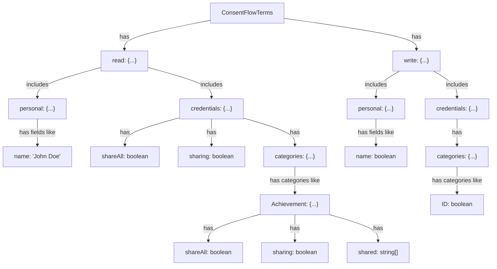
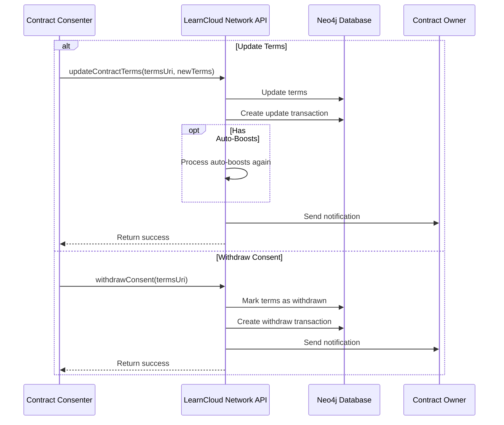

# User Consent & Terms

Discover how individuals interact with Consent Contracts by agreeing to specific "Terms." This page explains how users give, review, update, or withdraw their consent, empowering them with granular control over their data sharing preferences with different services.

### Terms Structure



A typical terms example:

```typescript
{
  read: {
    personal: { name: 'Full Fullerson' },
    credentials: {
      shareAll: true,
      sharing: true,
      categories: {
        Achievement: {
          shareAll: true,
          sharing: true,
          shared: ['achievement1', 'achievement2']
        },
        ID: { 
          shareAll: true, 
          sharing: true,
          shared: ['id1', 'id2'] 
        }
      }
    }
  },
  write: {
    personal: { name: true },
    credentials: { 
      categories: { 
        Achievement: true, 
        ID: true 
      } 
    }
  }
}
```

### Managing Consent <a href="#managing-consent" id="managing-consent"></a>

From the perspective of the user who consented to a ConsentFlow Contract, consented terms can be:

1. **Retrieved** using `getConsentedContracts` (paginated list)
2. **Updated** using `updateConsentedContractTerms`
3. **Withdrawn** using `withdrawConsent`



### &#x20;<a href="#transaction-system" id="transaction-system"></a>
