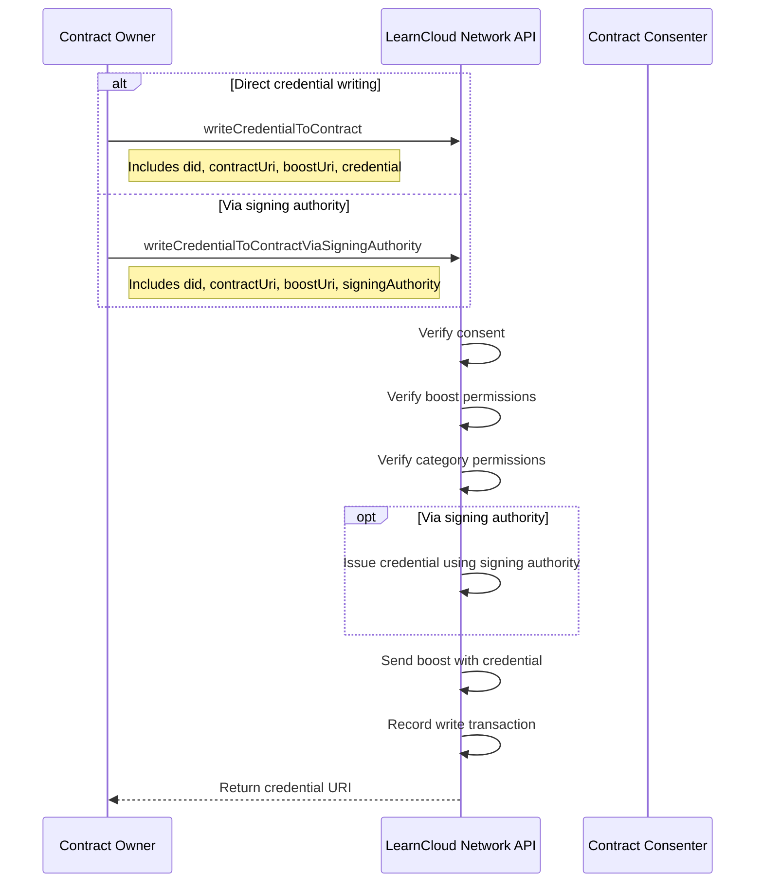
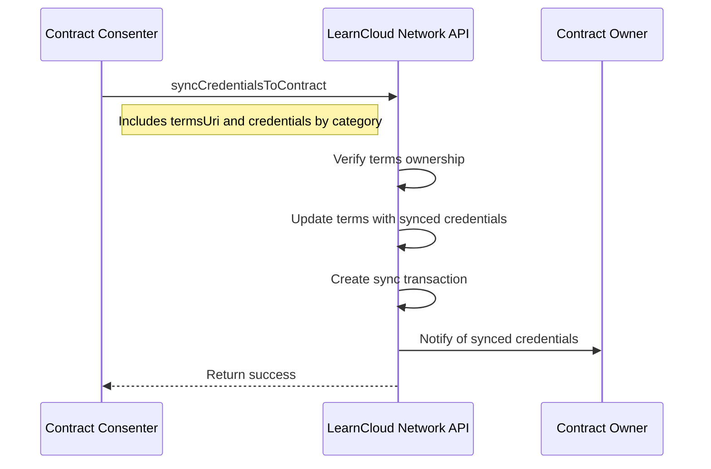

# Writing Consented Data

Understand how, after consent is given, new credentials or data can be provided to a user or recorded about them by authorized parties (like contract owners or automated systems). This covers the rules and methods for data delivery based on established consent.

## Writing Credentials to Contracts 

Contract owners can write credentials to profiles that have consented to their contracts using:

* `writeCredentialToContract`: Direct credential writing
* `writeCredentialToContractViaSigningAuthority`: Using a signing authority

The system verifies:

1. The recipient has consented to the contract
2. The contract owner has permission to issue the boost
3. The contract terms allow writing in the boost's category

## Credential Syncing 

Consented users can sync their existing credentials to a contract using `syncCredentialsToContract`.

Credential syncing allows:

1. Sharing existing credentials with contract owners
2. Organizing credentials by categories defined in the contract
3. Controlling exactly which credentials are shared

The sync process:

1. Verify the terms exist and belong to the requesting user
2. Ensure terms are still live (not withdrawn or expired)
3. Update the terms by adding the synced credentials to the shared arrays
4. Create a 'sync' transaction with the categorized credentials
5. Notify the contract owner
