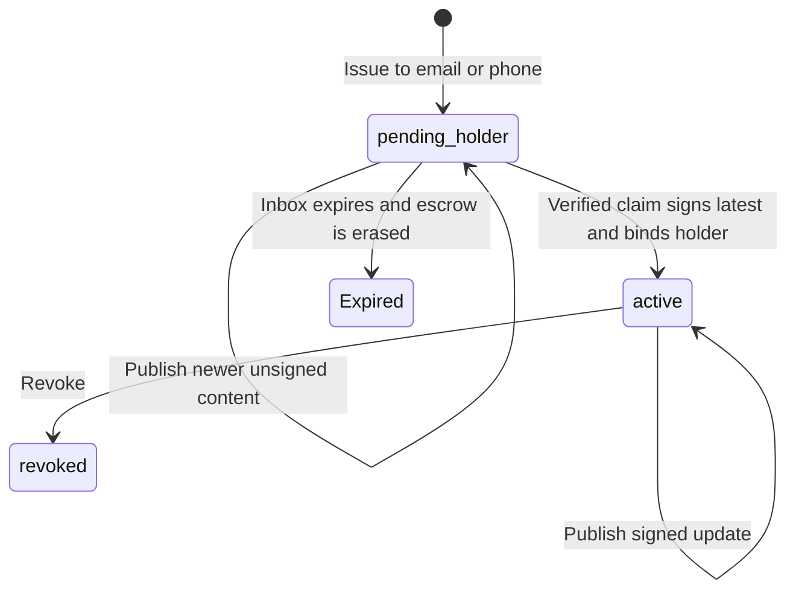

# Credential Refresh

A credential describes the world as it was when it was signed. Sometimes the world moves on: a provisional transcript becomes final, a certification gains an endorsement, a license renews. Credential refresh lets an issuer publish a newer version of a credential they already sent, and lets the recipient's wallet swap its copy for the new one without a duplicate appearing.

To do it, follow [Issue and Refresh a Managed Credential](../how-to-guides/issue-and-refresh-a-managed-credential.md). This page explains what's going on.

## The standard part

The [W3C Verifiable Credentials](credentials-and-data/verifiable-credentials-vcs.md) data model lets a credential carry a `refreshService`: a small object saying "here's where to ask for a fresher version." [1EdTech's Credential Refresh Service](https://www.imsglobal.org/spec/vccr/v1p0/) defines the common shape: a `1EdTechCredentialRefresh` service that answers a plain `GET` with the updated, signed credential.

LearnCard wallets consume those services from any issuer, whether or not the issuer uses LearnCard. The wallet verifies the returned credential's signature, checks that the issuer and credential ID match what it already holds, checks that it isn't older, and then replaces its copy. Refresh works for VCDM 1.1, VCDM 2.0, Open Badges 3.0, and CLR 2.0 credentials.

## The LearnCard-managed part

Running a refresh endpoint yourself means running a server that hands out credentials to anyone who asks for the URL. Many issuers would rather not. So the LearnCard Network can host it for you.

A managed service looks like this inside the signed credential:

```json
{
    "refreshService": {
        "id": "https://network.learncard.app/refresh/a1b2c3…",
        "type": "LearnCardCredentialRefresh2026",
        "authorization": { "type": "LearnCardDIDAuth" }
    }
}
```

Two things differ from the plain 1EdTech service. The URL is unguessable, and the endpoint requires the wallet to prove it controls the recipient's identity before it answers. That means a standard 1EdTech client can't read a managed service, and LearnCard wallets never send their identity proof to a standard service.

The service also carries its own JSON-LD context terms. You never write them by hand: when a credential with a managed service is signed — through `send({ refresh: true })`, `sendBoost(…, { enableRefresh: true })`, or a plain `issueCredential` — the SDK injects the definitions automatically before the proof is created, and the network does the same when it signs or publishes on an issuer's behalf.

### What the network stores

Every signed version of a managed credential is stored encrypted to the recipient. Universal Inbox has an earlier `pending_holder` state: its unsigned content remains in the existing encrypted, expiring inbox escrow so it can be signed for the verified claimant. At claim the latest pending content is signed, holder binding and delivery commit together, and inbox escrow is wiped. Once signed and delivered, the stored credential can be decrypted by the recipient (and authorized account managers), not the network or issuer. During publication the network briefly sees the new version in memory to verify the signature and decide whether the change is worth a notification, but plaintext is never written to storage, logs, or error messages.

The endpoint gives nothing away to someone who doesn't hold the recipient's keys: the first response is the same authentication challenge whether or not the URL exists.

#For Universal Inbox, holder binding is deferred until verified claim:



## The lifecycle

1. **Allocate.** Before signing, a refresh service is allocated for a stable credential ID. Immediate sends also bind the intended recipient; Universal Inbox binds the holder at verified claim. `send({ refresh: true })` allocates, signs, and delivers in one step; the [lower-level path](../how-to-guides/issue-and-refresh-a-managed-credential.md#the-lower-level-path) exposes the same steps individually. Either way the service goes into the credential and gets signed along with everything else, which is why it can't be added afterwards. The send response includes a receipt — `refreshId`, `refreshService`, and the signed identity — which is what you keep to publish updates later.
2. **Send and claim.** The credential is delivered like any other. The issuer may publish updates before the recipient claims, but nothing is served or announced until they do.
3. **Publish.** The issuer publishes a complete new version rebuilt from their own claims plus the receipt — same ID, issuer, subject, refresh service, and status descriptor — either signed by them or signed by the network with their [signing authority](identities-and-keys/signing-authorities.md). The network checks the signature, that the issuer and credential ID haven't changed, and that the version isn't dated earlier than the current one. Signed versions are never rewritten; a new one is appended and becomes current. Before Inbox claim, publication replaces unsigned escrow with the newest content and retains revision metadata; only the latest revision is signed at claim.
4. **Serve.** The wallet authenticates and receives the current version, or a `304 Not Modified` if it already has it.
5. **Revoke.** Revocation stops the network from serving anything. The recipient keeps what's already in their wallet.

### What the recipient sees

The LearnCard app checks refreshable credentials when it opens or resumes (at most once a day per credential) and right away when the user taps a "credential updated" notification. There's no background polling.

When a newer version arrives, the app replaces the credential in place. The previous version is kept, encrypted, under **View Previous Versions**, and the credential shows an **Updated** marker until the user opens it. If anything fails on the way, the current credential is untouched.

Issuers don't get to spam. The network only notifies when the change is something the recipient would notice (new grades, a new title, new evidence), not when a signature or timestamp changes. Repeated updates within a day collapse into one notification. Issuers can override this with `notifyHolder: true` or `false`.

## What can go wrong

Refresh on the wallet side never throws. It returns one of:

| Status        | Meaning                                                                            |
| ------------- | ---------------------------------------------------------------------------------- |
| `updated`     | A verified newer version came back                                                 |
| `unchanged`   | What you hold is current                                                           |
| `unsupported` | The credential has no refresh service the wallet understands                       |
| `failed`      | Something went wrong; a `code` says what and `retryable` says whether to try later |

Failure codes: `UNAVAILABLE` and `TIMEOUT` (retryable), then `UNAUTHORIZED`, `MALFORMED_RESPONSE`, `INVALID_PROOF`, `ISSUER_MISMATCH`, `ID_MISMATCH`, `ROLLBACK` (the service returned something older than you hold), `REVOKED`, `UNSUPPORTED_SERVICE`, and `UNSAFE_ENDPOINT`.

That last one matters. A `refreshService` URL is data from a credential, which is to say from a stranger, so the wallet treats it as untrusted: HTTPS only, no private or loopback addresses, a redirect limit, a timeout, and a response size cap. Local development can opt out; production code shouldn't.

## Current limits

- Refresh must be set up before signing. It can't be retrofitted.
- Wallet checks happen in the foreground only. A manual refresh control is planned.
- Two devices refreshing the same credential at the same time converge on the next check rather than coordinating in real time.
- The standard-service adapter accepts signed JSON credentials only, not compact JWT responses.

## Where to go next

- [Issue and Refresh a Managed Credential](../how-to-guides/issue-and-refresh-a-managed-credential.md)
- [Credentials & Data](credentials-and-data/verifiable-credentials-vcs.md)
- [Credential Status & Revocation](credentials-and-data/credential-status-and-bitstring-status-lists.md)
