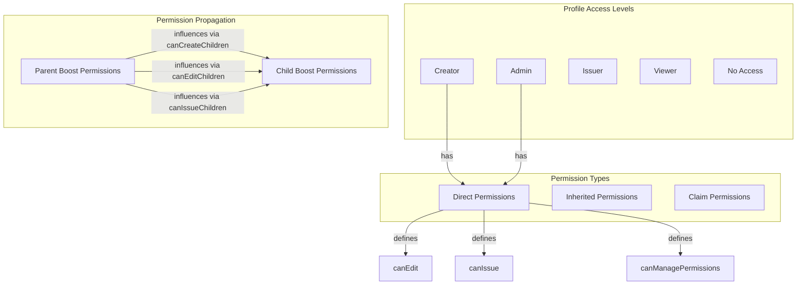

# Boost Credentials

## What is a Boost?

A Boost is LearnCard's enhanced version of a standard Verifiable Credential (VC). It extends the Open Badges v3 and W3C Verifiable Credentials standards by adding useful features for credential display, management, and governance while maintaining full compatibility with standard credential verifiers.

Think of a Boost as a "VC+" - all the standard credential fields you expect, plus additional capabilities that make credentials more useful and manageable in real-world applications.

They can be:

1. Created with customizable properties
2. Organized in hierarchical structures (parent-child relationships)
3. Issued to recipients
4. Managed with fine-grained permissions



## Why Use Boosts?

Boosts solve several common challenges when working with credentials:

1. **Display Control**: Customize how credentials appear in wallets and viewers
2. **Governance**: Define and enforce rules about who can issue what credentials
3. **Network Validation**: Get network-level verification that a credential was issued following proper procedures
4. **Extended Functionality**: Support for additional features like BoostIDs for identity verification


## Boost Hierarchies & Relationships

Boosts can have various relationships with other entities in the system:

#### Hierarchical Relationships <a href="#hierarchical-relationships" id="hierarchical-relationships"></a>

Boosts can be organized in a hierarchical structure:

1. **Parent-Child**: A Boost can have parent and child Boosts
2. **Siblings**: Boosts that share the same parent
3. **Familial**: The extended family of Boosts (parents, children, siblings)

These relationships allow for organizing credentials into families or pathways.

#### Administrative Relationships <a href="#administrative-relationships" id="administrative-relationships"></a>

1. **Admins**: Profiles that have administrative permissions over a Boost
2. **Recipients**: Profiles that have received/been issued a Boost
3. **Creator**: The original profile that created the Boost

### Example Hierarchy



Our system uses a clear parent-child relationship between badges:

* **Martial Arts** is the top-level parent badge
  * **Black Belt** is a child of Martial Arts
    * **Brown Belt** is a child of Black Belt
      * Additional belts follow in sequence (indicated as "n + 1")
  * **Self-Defense Expert** is another child of Martial Arts (sibling to Black Belt)

#### Role-Based Permissions

Two key roles exist in the system:

* **Admin**: Has top-level permissions to manage the entire badge system
* **Coach**: Has permissions to issue specific badges to students

#### Credential Issuance Process

1. An admin (like "Admin Urmila") with "admin" role permissions manages the badge hierarchy
2. The admin grants "coach" role permissions to instructors (like "Coach J")
3. Coach J can then create credential instances of badges they're authorized to issue
4. When a student (like "Student P") earns a badge, Coach J issues a specific credential instance (e.g., "Brown Belt for Student P")
5. This credential is then linked directly to Student P's profile

#### Key Relationships

* **PARENT\_OF**: Establishes the badge hierarchy
* **HAS\_PERMISSIONS**: Links roles to users
* **INSTANCE\_OF**: Connects a specific credential to its badge type
* **ISSUED\_TO**: Associates a credential with a student profile

This hierarchical structure ensures proper badge progression while maintaining clear permissions for who can issue credentials.

## Boost Lifecycle

### Creation <a href="#creation" id="creation"></a>

Boosts can be created in two ways:

1. **Create a new Boost**: Create a standalone Boost
2. **Create a Child Boost**: Create a Boost as a child of an existing Boost

When creating a Boost, you can specify:

* The credential template
* Metadata such as name, category, and type
* Default claim permissions


### Publishing and Updating <a href="#publishing-and-updating" id="publishing-and-updating"></a>

Boosts have two status states:

* **DRAFT**: Can be edited freely
* **LIVE**: Only metadata can be updated

When a Boost is published (status changed to LIVE), its core properties are finalized and cannot be changed. This ensures that issued credentials based on this Boost maintain their integrity.

### Sending to Recipients <a href="#sending-to-recipients" id="sending-to-recipients"></a>

Boosts can be sent to recipients, which creates a credential instance for that recipient. This requires:

1. The sender to have permission to issue the Boost
2. The Boost to be in LIVE status (not DRAFT)

The system checks permissions, creates a credential, sends it to the recipient, and optionally notifies them.


### Claiming <a href="#claiming" id="claiming"></a>

Recipients have the option to accept/claim Boosts that have been sent to them. When a Boost is claimed:

1. A credential received relationship is created
2. The default claim permissions are applied, if specified
3. The recipient may gain certain permissions over the Boost

## Boost Permission Model <a href="#boost-permission-model" id="boost-permission-model"></a>

The Boost permission system is comprehensive, allowing fine-grained control over who can perform different actions on Boosts. Permissions can be:

* Directly assigned to profiles
* Inherited through the Boost hierarchy
* Granted when claiming a Boost

### Permission Properties <a href="#permission-properties" id="permission-properties"></a>

Boost permissions include:

| Permission                   | Type    | Description                                           |
| ---------------------------- | ------- | ----------------------------------------------------- |
| role                         | string  | Role identifier                                       |
| canEdit                      | boolean | Can edit the Boost metadata                           |
| canIssue                     | boolean | Can issue the Boost to recipients                     |
| canRevoke                    | boolean | Can revoke issued Boosts                              |
| canManagePermissions         | boolean | Can manage permissions of the Boost                   |
| canIssueChildren             | string  | Permission level for issuing child Boosts             |
| canCreateChildren            | string  | Permission level for creating child Boosts            |
| canEditChildren              | string  | Permission level for editing child Boosts             |
| canRevokeChildren            | string  | Permission level for revoking child Boosts            |
| canManageChildrenPermissions | string  | Permission level for managing child Boost permissions |
| canManageChildrenProfiles    | boolean | Can manage profiles related to child Boosts           |
| canViewAnalytics             | boolean | Can view analytics for the Boost                      |




### Permission Administration <a href="#permission-administration" id="permission-administration"></a>

The system provides several endpoints for managing permissions:

1. **Add Boost Admin**: Grants a profile admin permissions for a Boost
2. **Remove Boost Admin**: Removes admin permissions
3. **Get Boost Admins**: Lists all admin profiles for a Boost
4. **Get Boost Permissions**: Gets permissions for a specific profile
5. **Update Boost Permissions**: Updates permissions for a profile

## Boost Queries <a href="#boost-queries" id="boost-queries"></a>

The system supports complex querying of Boosts with a flexible query language, allowing filtering by:

* String properties (exact match)
* Array inclusion (`$in` operator)
* Regular expression patterns (`$regex` operator)

```typescript
// Example query structure
const query = {
  category: "Education",              // Exact match
  type: { $in: ["Badge", "Certificate"] },  // Array inclusion
  name: { $regex: /introduction/i }   // Regex pattern
};
```

The query system is powered by a Neo4j database and includes helper functions for converting JavaScript query objects to Neo4j-compatible formats.

## Types of Boosts

### Basic Boost

The simplest form of a boost adds display options to a standard credential:

```javascript
{
  type: ["VerifiableCredential", "OpenBadgeCredential", "BoostCredential"],
  // Standard VC fields...
  display: {
    backgroundColor: "#353E64",
    backgroundImage: "https://example.com/background.jpg",
    displayType: "badge" // or "certificate"
  }
}
```


**Use Display Types**:

* `badge` for compact achievements
* `certificate` for formal credentials


### ID Boost

Special type for creating digital IDs with custom styling:

```javascript
{
  type: ["VerifiableCredential", "OpenBadgeCredential", "BoostCredential", "BoostID"],
  // ... standard fields
  boostID: {
    IDIssuerName: "Organization Name",
    accentColor: "#FF0000",
    backgroundImage: "https://example.com/id-background.jpg",
    dimBackgroundImage: true,
    fontColor: "#FFFFFF",
    issuerThumbnail: "https://example.com/logo.png",
    showIssuerThumbnail: true
  }
}
```

### Network Certification

When a Boost is issued through the LearnCard Network, it gets wrapped in a CertifiedBoostCredential:

```javascript
{
  type: ["VerifiableCredential", "CertifiedBoostCredential"],
  issuer: "did:web:network.learncard.com",
  boostCredential: {
    // Your original boost here
  },
  boostId: "lc:network:example.com/boost:123"
}
```

This wrapper:

* Validates the issuer's authority to send the boost
* Provides a unique network identifier
* Adds a network-level signature
* Maintains the original peer-to-peer signatures

### Further Resources

* [W3C Verifiable Credentials Standard](https://www.w3.org/TR/vc-data-model/)
* [Open Badges v3 Specification](https://www.imsglobal.org/spec/ob/v3p0/)
* [JSON-LD Playground](https://json-ld.org/playground/)
