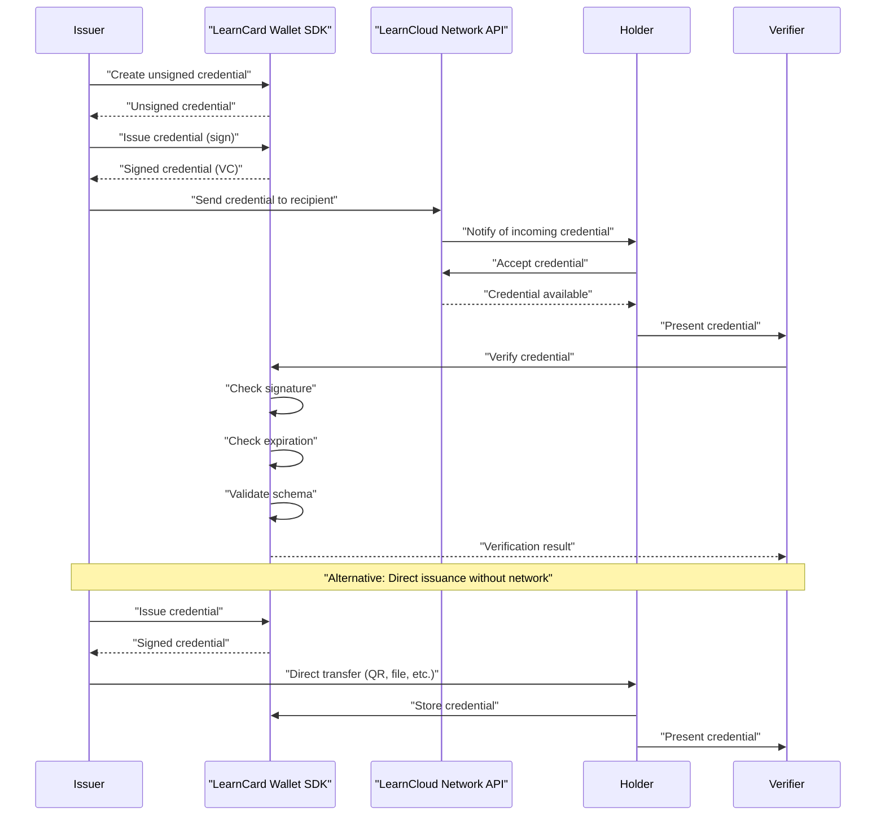

# Credential Lifecycle

A **Verifiable Credential (VC)** is a secure, digital representation of information (claims or attributes) about an entity. VCs are typically controlled by the individual or organization they pertain to. This document outlines the standard lifecycle of a VC—from its creation and issuance to its presentation and verification—as illustrated in the accompanying diagram. Understanding this process is key to recognizing the utility of VCs across various applications.



### Key Roles in the Credential Lifecycle

Several distinct roles are involved in the lifecycle of a Verifiable Credential:

* **Issuer:** An entity responsible for creating, digitally signing, and distributing VCs.
  * _Example:_ A university issuing a digital diploma.
* **Holder:** An individual or entity that receives, stores, and manages their VCs. The Holder decides when and with whom to share their credentials.
* **Verifier:** An entity that requests VCs from a Holder and checks them to confirm their authenticity and the validity of the information they contain.
  * _Example:_ An employer validating a job applicant's claimed degree.
* **LearnCard & LearnCloud:** The software providing the tools and infrastructure for Issuers to create VCs, Holders to manage them , and Verifiers to check their validity.

### The Credential Lifecycle: Step-by-Step

The following steps describe the typical lifecycle of a Verifiable Credential, as shown in the diagram below:

1. **Issuance (Creation & Signing)**
   * The **Issuer** uses **LearnCard Wallet SDK** to initiate the creation of a new credential (e.g., an "achievement" credential).
   * LearnCard SDK prepares an initial, unsigned version of the credential data.
   * The Issuer then directs the LearnCard SDK to apply a **digital signature** using the Issuer's unique cryptographic key (often associated with their Decentralized Identifier or DID). This signature ensures the credential's authenticity (proof of origin) and integrity (proof it hasn't been tampered with).
   * LearnCard SDK returns the signed Verifiable Credential (VC) to the Issuer.
2. **Delivery and Storage**
   * The **Issuer** delivers the signed VC to the **Holder** (e.g., via LearnCloud Network).
   * The Holder uses **LearnCard App** or another interoperable wallet to securely store the VC in a storage provider (e.g. LearnCloud Storage) which provides a unique link (URI) for referencing the credential.
3. **Indexing (Optional)**
   * To facilitate easier management and retrieval, the **Holder** can use **LearnCard SDK** (e.g., via LearnCloud Storage) to index the credential, linking its identifier to its storage location or metadata.
4. **Presentation**
   * When the **Holder** needs to prove a claim to a **Verifier**, they select the relevant VC(s) from their wallet and presents them to the Verifier (e.g., via LearnCloud Network, by sharing a data file, displaying a QR code, or via a direct application-to-application exchange).
5. **Verification**
   * The **Verifier** receives the VC(s) from the Holder.
   * The Verifier uses **LearnCard SDK** (or an interoperable verification service) to check the VC's validity.
   * LearnCard SDK typically performs several validation steps:
     * Verifying the **digital signature** against the Issuer's public key to ensure authenticity and integrity.
     * Validating the credential's structure and data types against its defined **schema**.
     * Checking **issuance and expiration dates** (if applicable) and potentially its revocation status.
   * LearnCard SDK then returns a verification result (e.g., valid or invalid) to the **Verifier**.

### Practical Use Cases for Verifiable Credentials

The VC lifecycle enables a wide range of applications by providing a standardized, secure, and user-centric way to issue and verify digital information:

* **Academic & Professional Achievements:** Issuing and verifying digital diplomas, course certificates, skill badges, and professional licenses.
* **Access Control:** Using VCs as digital keys or passes for entry to physical locations, online services, or events (e.g., digital tickets, membership authenticators).
* **Identity & Attribute Verification:** Presenting verified personal attributes for processes like "Know Your Customer" (KYC), age verification, or as digital employee/student IDs, often enabling selective disclosure of information.

**Key advantages of this model include:**

* Increased data security and integrity through cryptography.
* Enhanced user control and privacy over personal information.
* Improved portability of credentials across different systems.
* More efficient and streamlined verification processes.

### Key Terminology

Understanding these terms is helpful when working with Verifiable Credentials:

* **Verifiable Credential (VC):** A digital document containing claims (statements) made by an Issuer about a Holder. It is cryptographically secured and can be independently verified.
* **Issuer:** The entity that creates, digitally signs, and distributes VCs.
* **Holder:** The entity (typically an individual or organization) that possesses and controls their VCs.
* **Verifier:** The entity that requests and validates VCs presented by a Holder to confirm their authenticity and the claims within.
* **LearnCard & LearnCloud:** The software platform providing the necessary infrastructure and tools for VC issuance, storage, management, and verification.
* **Digital Signature:** A cryptographic mechanism used to prove the authenticity (who signed it) and integrity (it hasn't been changed) of a VC, linking it to the Issuer.
* **DID (Decentralized Identifier):** A globally unique, verifiable identifier that does not require a central registration authority. DIDs are often used to identify Issuers and Holders.
* **Schema:** The defined structure, data types, and format for a specific type of credential, outlining what information fields it should contain (e.g., a "Diploma" schema would specify fields for name, institution, degree, etc.).

### Diagram of the Lifecycle

The following diagram illustrates the Verifiable Credential lifecycle described above:

