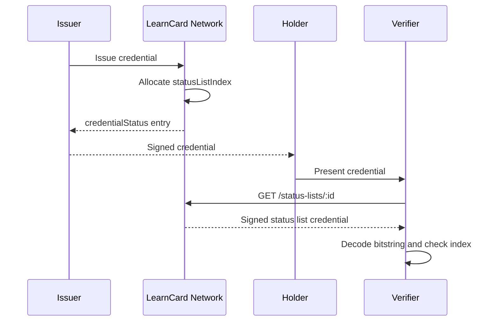

# Credential Status & Bitstring Status Lists

Credential status lets an issuer say whether a signed credential is still usable without changing the credential itself. LearnCard Network uses [W3C Bitstring Status List](https://www.w3.org/TR/vc-bitstring-status-list/) for VC 2.0 credentials issued through the network.

The credential keeps a `credentialStatus` entry. That entry points to a public, signed status list credential. Verifiers fetch the list, decode the compressed bitstring, and check the credential's assigned `statusListIndex`.

## How Status Works



For each credential, the network allocates a status list index from an issuer-owned list. The list is scoped by:

-   The issuer profile
-   The status purpose
-   The configured list size

The default list size is `131,072` bits. When a list fills up, the network closes it and creates a new list automatically. New credentials receive entries that point at the new list URL.

## Status Purposes

LearnCard Network supports two status purposes:

| Purpose      | Meaning when the bit is clear       | Meaning when the bit is set     |
| ------------ | ----------------------------------- | ------------------------------- |
| `revocation` | The credential has not been revoked | The credential has been revoked |
| `suspension` | The credential is not suspended     | The credential is suspended     |

A credential can include either purpose or both:

```json
{
    "credentialStatus": [
        {
            "type": "BitstringStatusListEntry",
            "statusPurpose": "revocation",
            "statusListIndex": "42",
            "statusListCredential": "https://network.learncard.com/status-lists/..."
        },
        {
            "type": "BitstringStatusListEntry",
            "statusPurpose": "suspension",
            "statusListIndex": "87",
            "statusListCredential": "https://network.learncard.com/status-lists/..."
        }
    ]
}
```

Revocation and suspension are independent. Suspending a credential does not revoke it. Unsuspending a credential clears only the suspension bit.

## Pending Credentials

Status belongs to the issued credential, not only to the accepted credential record. This matters because an issuer can revoke or suspend a credential before the recipient accepts it.

If a pending credential is revoked or suspended, the network updates the status list and the recipient cannot accept that credential as active.

## Public Status Lists

Status list credentials are available from stable public URLs:

```http
GET /status-lists/:id
```

The response is a signed verifiable credential. Its `credentialSubject.encodedList` value contains the compressed bitstring, encoded according to the W3C Bitstring Status List format.

Public status lists do not include recipient identities or credential contents. A verifier needs the credential's `credentialStatus` entry to know which index to check.

## Verification Results

Verification checks each `credentialStatus` entry and returns status results alongside proof, expiration, and other checks.

For user-facing output, LearnCard formats status results with friendly labels, such as:

-   `Status: Active`
-   `Status: Not Revoked`
-   `Status: Revoked`
-   `Status: Suspended`
-   `Status: Not Suspended`

For API usage, see [Bitstring Status Lists](../../sdks/learncard-network/bitstring-status-lists.md).
