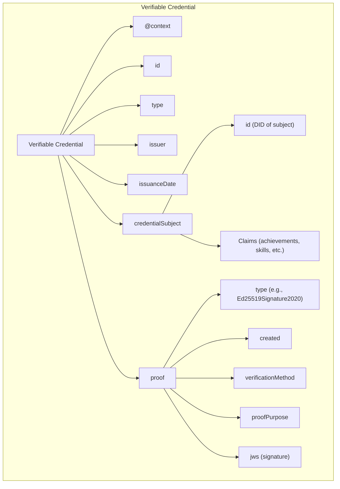
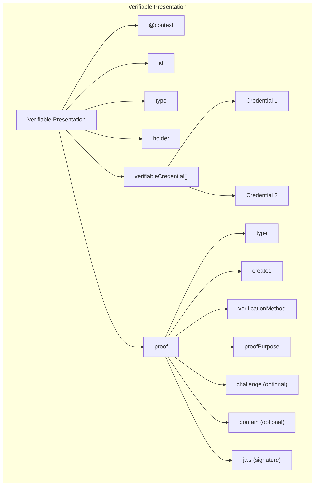

# Verifiable Credentials (VCs)

Verifiable Credentials are a W3C standard for expressing credentials in a way that is cryptographically secure, privacy-respecting, and machine-verifiable. They enable trusted digital claims about subjects.

### Verifiable Credential Data Model 

LearnCard implements the W3C Verifiable Credentials Data Model, with support for both VC 1.0 and VC 2.0 formats. The core data types are defined using Zod validators.

#### Credential Structure 

| Component           | Description                              | Required |
| ------------------- | ---------------------------------------- | -------- |
| `@context`          | JSON-LD contexts defining the vocabulary | Yes      |
| `id`                | Unique identifier for the credential     | No       |
| `type`              | Array of credential types                | Yes      |
| `issuer`            | Entity that issued the credential        | Yes      |
| `credentialSubject` | Entity the credential is about           | Yes      |
| `proof`             | Cryptographic proof of authenticity      | Yes      |

Version differences:

* VC 1.0 uses `issuanceDate` and `expirationDate`
* VC 2.0 uses `validFrom` and `validUntil`



 

## Verifiable Presentations (VPs) 

Verifiable Presentations allow holders to bundle and selectively disclose credentials:

