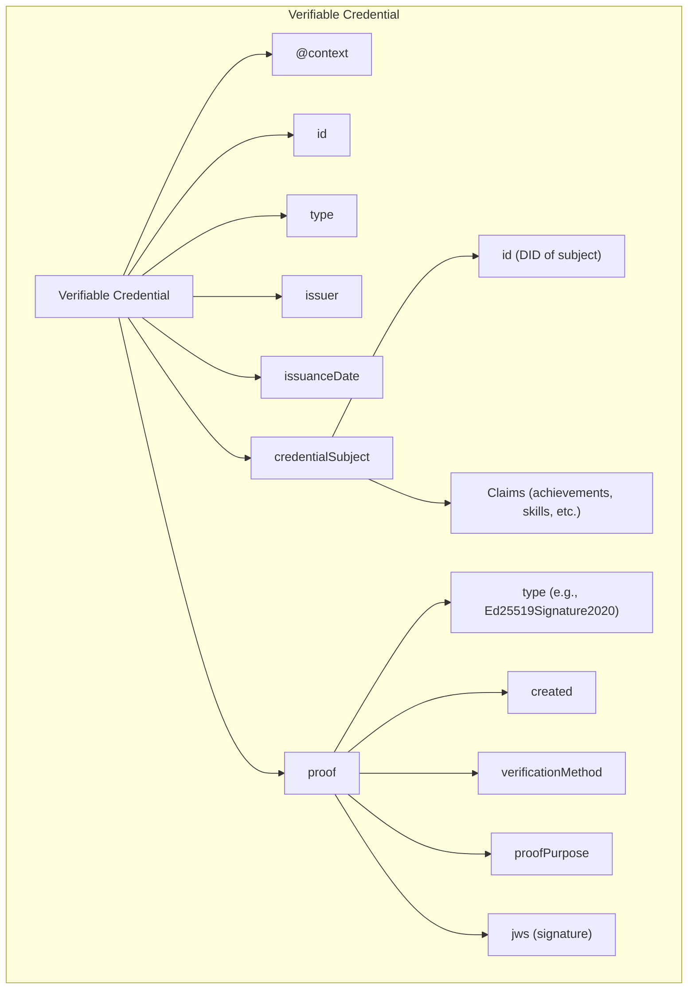
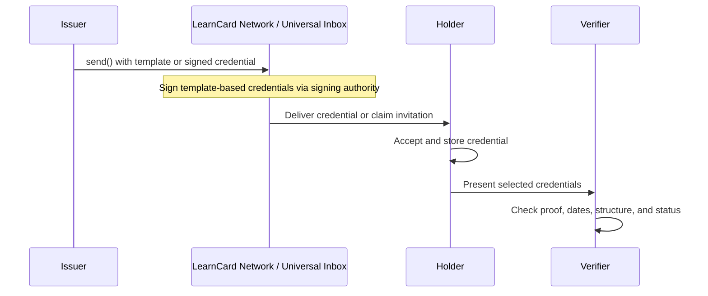
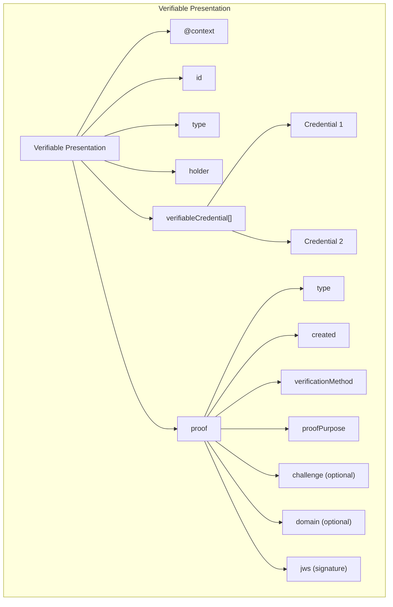

# Verifiable Credentials (VCs)

A Verifiable Credential is a digital certificate or badge — like a diploma, a skill badge, or a license — that proves something about a person. It's cryptographically signed, so anyone can check it's real without calling the issuer, and the person who earned it owns it and can share it anywhere.

Technically, Verifiable Credentials are a W3C standard for expressing credentials in a way that is cryptographically secure, privacy-respecting, and machine-verifiable.

LearnCard's interoperability ecosystem includes these open standards and data models:

- **Open Badges v3 (OBv3)**
- **Comprehensive Learner Record (CLR)**
- **Learning Tools Interoperability (LTI)**
- **Learning and Employment Records (LER)**
- **Learner Information Framework (LIF)**

### Verifiable Credential Data Model 

LearnCard implements the W3C Verifiable Credentials Data Model, with support for both VC 1.0 and VC 2.0 formats. The core data types are defined using Zod validators.

#### Credential Structure 

```mermaid
graph
    subgraph "Verifiable Credential"
        VC["Verifiable Credential"]
        VC --> Context["@context"]
        VC --> ID["id"]
        VC --> Type["type"]
        VC --> Issuer["issuer"]
        VC --> IssuanceDate["issuanceDate"]
        VC --> Subject["credentialSubject"]
        VC --> Proof["proof"]

        Subject --> SubjectID["id (DID of subject)"]
        Subject --> Claims["Claims (achievements, skills, etc.)"]

        Proof --> ProofType["type (e.g., Ed25519Signature2020)"]
        Proof --> Created["created"]
        Proof --> VM["verificationMethod"]
        Proof --> Purpose["proofPurpose"]
        Proof --> JWS["jws (signature)"]
    end
```

| Component           | Description                              | Required |
| ------------------- | ---------------------------------------- | -------- |
| `@context`          | JSON-LD contexts defining the vocabulary | Yes      |
| `id`                | Unique identifier for the credential     | No       |
| `type`              | Array of credential types                | Yes      |
| `issuer`            | Entity that issued the credential        | Yes      |
| `credentialSubject` | Entity the credential is about           | Yes      |
| `proof`             | Cryptographic proof of authenticity      | Yes      |

Version differences:

- VC 1.0 uses `issuanceDate` and `expirationDate`
- VC 2.0 uses `validFrom` and `validUntil`



 

## Lifecycle

1. **Issue:** Prepare the claims and sign the credential. Template-based `send()` can use a signing authority; a pre-signed credential retains its proof.
2. **Deliver:** `send()` routes to a profile or DID directly, or through Universal Inbox for an email or phone recipient, with a claim link when needed.
3. **Store:** After acceptance, the holder keeps the credential in their account, using storage such as LearnCloud and an index for retrieval.
4. **Present:** The holder chooses which credentials to share, individually or in a Verifiable Presentation.
5. **Verify:** The verifier checks the signature, applicable dates, structure, and [credential status](credential-status-and-bitstring-status-lists.md), then decides whether to trust the issuer and claims.

```mermaid
sequenceDiagram
    participant Issuer
    participant Network as LearnCard Network / Universal Inbox
    participant Holder
    participant Verifier
    Issuer->>Network: send() with template or signed credential
    Note over Network: Sign template-based credentials via signing authority
    Network->>Holder: Deliver credential or claim invitation
    Holder->>Holder: Accept and store credential
    Holder->>Verifier: Present selected credentials
    Verifier->>Verifier: Check proof, dates, structure, and status
```

Direct issuance and transfer by file or QR are also possible without network delivery; see [Send & Issue Credentials](../../how-to-guides/send-credentials.md).

## Verifiable Presentations (VPs) 

Verifiable Presentations allow holders to bundle and selectively disclose credentials:

```mermaid
graph
    subgraph "Verifiable Presentation"
        VP["Verifiable Presentation"]
        VP --> VPContext["@context"]
        VP --> VPID["id"]
        VP --> VPType["type"]
        VP --> Holder["holder"]
        VP --> VCs["verifiableCredential[]"]
        VP --> VPProof["proof"]

        VCs --> VC1["Credential 1"]
        VCs --> VC2["Credential 2"]

        VPProof --> VPProofType["type"]
        VPProof --> VPCreated["created"]
        VPProof --> VPVM["verificationMethod"]
        VPProof --> VPPurpose["proofPurpose"]
        VPProof --> Challenge["challenge (optional)"]
        VPProof --> Domain["domain (optional)"]
        VPProof --> VPJWS["jws (signature)"]
    end
```
