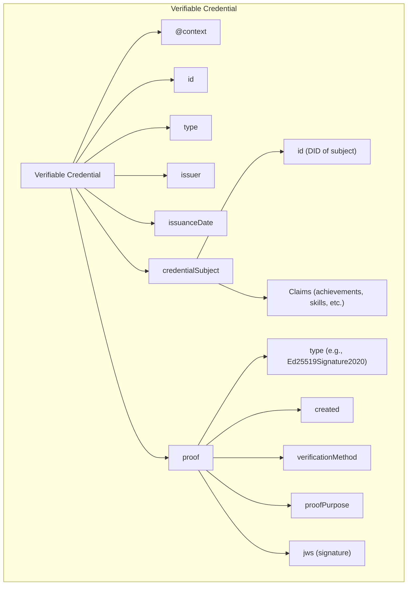
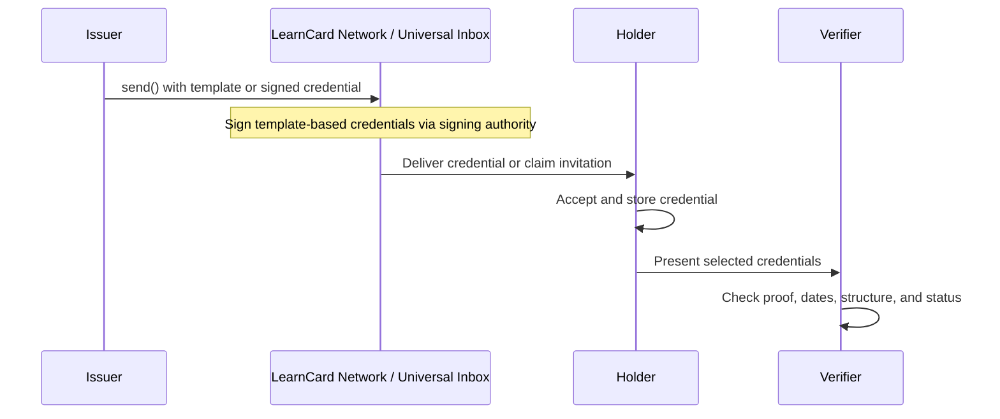
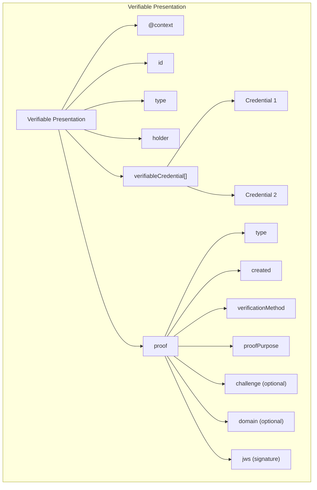

# Verifiable Credentials (VCs)

A Verifiable Credential is a digital certificate or badge — like a diploma, a skill badge, or a license — that proves something about a person. It's cryptographically signed, so anyone can check it's real without calling the issuer, and the person who earned it owns it and can share it anywhere.

Formally, a Verifiable Credential is a [W3C standard](https://www.w3.org/TR/vc-data-model-2.0/) JSON document: a set of claims about a subject, signed by an issuer. LearnCard issues and verifies two profiles of it:

- **Open Badges v3 (OBv3)** — badges, certificates, and achievements. This is what `send()` produces by default and what the examples in these docs use.
- **Comprehensive Learner Record v2 (CLR)** — a signed bundle of many achievements from one or more issuers, for transcripts and records.

Both are plain W3C credentials underneath, so any conformant wallet or verifier can read them. See [Interoperability](../../introduction/interoperability.md) for the full list of standards LearnCard speaks.

## What's inside a credential 

LearnCard supports both VC 1.0 and VC 2.0. The shapes are defined as Zod validators in `@learncard/types`, so what you get back from the SDK is already type-checked.

```mermaid
graph
    subgraph "Verifiable Credential"
        VC["Verifiable Credential"]
        VC --> Context["@context"]
        VC --> ID["id"]
        VC --> Type["type"]
        VC --> Issuer["issuer"]
        VC --> IssuanceDate["issuanceDate"]
        VC --> Subject["credentialSubject"]
        VC --> Proof["proof"]

        Subject --> SubjectID["id (DID of subject)"]
        Subject --> Claims["Claims (achievements, skills, etc.)"]

        Proof --> ProofType["type (e.g., Ed25519Signature2020)"]
        Proof --> Created["created"]
        Proof --> VM["verificationMethod"]
        Proof --> Purpose["proofPurpose"]
        Proof --> JWS["jws (signature)"]
    end
```

| Component           | Description                              | Required |
| ------------------- | ---------------------------------------- | -------- |
| `@context`          | JSON-LD contexts defining the vocabulary | Yes      |
| `id`                | Unique identifier for the credential     | No       |
| `type`              | Array of credential types                | Yes      |
| `issuer`            | Entity that issued the credential        | Yes      |
| `credentialSubject` | Entity the credential is about           | Yes      |
| `proof`             | Cryptographic proof of authenticity      | Yes      |

The one difference you'll notice between versions: VC 1.0 uses `issuanceDate` / `expirationDate`; VC 2.0 uses `validFrom` / `validUntil`. New credentials should use 2.0.



 

## Lifecycle

1. **Issue.** The issuer builds the claims and signs them — with its own key, or through a [signing authority](../identities-and-keys/signing-authorities.md) LearnCard hosts for it.
2. **Deliver.** `send()` delivers to a LearnCard profile directly, or to an email or phone number through the [Universal Inbox](../network-and-interactions/universal-inbox.md), which holds the credential until the recipient claims it.
3. **Store.** Once claimed, the credential lives in the holder's account, encrypted, under the holder's key.
4. **Present.** The holder chooses what to share — one credential, or several bundled in a Verifiable Presentation.
5. **Verify.** The verifier checks the signature, the dates, and the [status list](credential-status-and-bitstring-status-lists.md). It never needs to contact the issuer.

```mermaid
sequenceDiagram
    participant Issuer
    participant Network as LearnCard Network / Universal Inbox
    participant Holder
    participant Verifier
    Issuer->>Network: send() with template or signed credential
    Note over Network: Sign template-based credentials via signing authority
    Network->>Holder: Deliver credential or claim invitation
    Holder->>Holder: Accept and store credential
    Holder->>Verifier: Present selected credentials
    Verifier->>Verifier: Check proof, dates, structure, and status
```

To do this yourself: [Send & Issue Credentials](../../how-to-guides/send-credentials.md) and [Verify Credentials](../../tutorials/verify-credentials.md).

## Verifiable Presentations (VPs) 

A Verifiable Presentation is how a holder _shares_ credentials. It wraps one or more credentials and is signed by the holder, which proves two things at once: the credentials are genuine (their issuer signatures still verify) and the person presenting them is the person they were issued to (the `holder` matches `credentialSubject.id`). A verifier can add a `challenge` and `domain` so a presentation can't be replayed elsewhere.

LearnCard also uses a presentation with no credentials in it — a **DID-Auth** presentation — as a login proof: signing it shows you control the DID.

```mermaid
graph
    subgraph "Verifiable Presentation"
        VP["Verifiable Presentation"]
        VP --> VPContext["@context"]
        VP --> VPID["id"]
        VP --> VPType["type"]
        VP --> Holder["holder"]
        VP --> VCs["verifiableCredential[]"]
        VP --> VPProof["proof"]

        VCs --> VC1["Credential 1"]
        VCs --> VC2["Credential 2"]

        VPProof --> VPProofType["type"]
        VPProof --> VPCreated["created"]
        VPProof --> VPVM["verificationMethod"]
        VPProof --> VPPurpose["proofPurpose"]
        VPProof --> Challenge["challenge (optional)"]
        VPProof --> Domain["domain (optional)"]
        VPProof --> VPJWS["jws (signature)"]
    end
```
