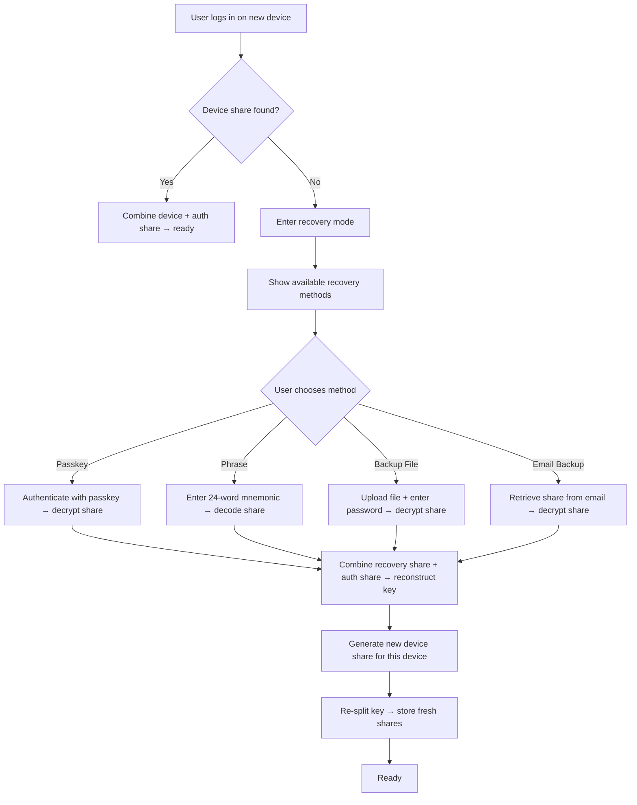

# Account Recovery

## What is this section about?

This section explains how LearnCard users recover access to their private key when they lose their device, clear their browser storage, or sign in on a new device. Recovery is built on the [SSS key management](key-management-sss.md) system — specifically, the ability to reconstruct the private key from any two of its three shares.

## Why is this important?

Without recovery, losing a device means permanently losing access to the private key — and with it, the user's entire digital identity. Recovery methods provide a safety net that lets users regain access without compromising security.

---

## When Recovery Is Needed

The **AuthCoordinator** automatically detects when recovery is required. This happens when:

- The user authenticates successfully (e.g., via Firebase), **but**
- No **device share** is found in local storage (IndexedDB)

This typically means the user is on a new device or has cleared their browser data. The coordinator enters the `needs_recovery` state and prompts the user to choose a recovery method.

---

## Recovery Methods

Each method provides a different way to supply the **recovery share** (the third SSS share). Combined with the **auth share** from the server, these two shares reconstruct the private key.

### Passkey (WebAuthn PRF)

- **How it works:** The recovery share is encrypted using a key derived from the passkey's [PRF (Pseudo-Random Function)](https://w3c.github.io/webauthn/#prf-extension) output. The encrypted share is stored on the server. During recovery, the user authenticates with their passkey, the PRF output is used to decrypt the share, and the key is reconstructed.
- **Security:** Hardware-bound, phishing-resistant. The passkey never leaves the authenticator device.
- **Best for:** Users with platform authenticators (Touch ID, Face ID, Windows Hello) or hardware security keys (YubiKey).
- **Limitation:** Requires a browser and device that supports WebAuthn PRF. Not available on all platforms.

### Recovery Phrase

- **How it works:** The recovery share is encoded as a **24-word mnemonic** (BIP39-style). The user writes down the phrase and stores it somewhere safe. During recovery, the user enters the 24 words, which are decoded back into the share.
- **Security:** As secure as the user's physical storage of the phrase. Anyone who obtains the 24 words can use them for recovery.
- **Best for:** Users who want an offline, hardware-independent backup.
- **Limitation:** Requires the user to accurately transcribe and safeguard 24 words.

### Backup File

- **How it works:** The recovery share is encrypted with a **user-chosen password** using Argon2id for key derivation and AES-GCM for encryption. The result is packaged as a downloadable JSON file. During recovery, the user uploads the file and enters their password.
- **Security:** Protected by the strength of the user's password. Argon2id provides resistance against brute-force attacks.
- **Best for:** Users who want a portable, password-protected backup they can store in cloud storage or on a USB drive.
- **Limitation:** If the user forgets the password, the backup file is useless.

### Email Backup

- **How it works:** The encrypted backup share is sent to the user's **verified recovery email** address. During recovery, the user retrieves the share from their email and provides it to the app.
- **Security:** Depends on the security of the user's email account. The share is encrypted before being sent.
- **Best for:** Users who want a "set and forget" backup that's always accessible via email.
- **Limitation:** Requires a verified recovery email. Email accounts can be compromised.

---

## Recovery Flow

After recovery:

1. The private key is reconstructed from the recovery share + auth share.
2. A **new device share** is created and stored locally.
3. The key is **re-split** so that all three shares are refreshed.
4. Share versioning on the server ensures that existing recovery methods remain valid against their original share version.

---

## Setting Up Recovery Methods

Users are prompted to set up recovery methods after their initial key setup. A **RecoveryBanner** appears on the main app screen until at least one method is configured.

Users can manage their recovery methods from the **Account Recovery** section in their profile settings, where they can:

- Add a passkey
- Generate a recovery phrase
- Download a backup file
- Add and verify a recovery email

Multiple methods can be active simultaneously for maximum resilience.

---

## Recovery Email Verification

Before a recovery email can be used, it must be verified:

1. The user enters their desired recovery email address.
2. A **6-digit verification code** is sent to that address.
3. The user enters the code to confirm ownership.
4. Once verified, the recovery email is stored (masked for privacy) and can be used for email backup.

---

## Key Takeaways

- Recovery is needed when a user logs in but has **no device share** (new device or cleared storage).
- **Four recovery methods** are available: passkey, recovery phrase, backup file, and email backup.
- Any recovery method + the server's auth share = full key reconstruction.
- After recovery, the key is **re-split** with a new device share for the current device.
- Users should set up **at least one recovery method** to avoid permanent key loss.
- Multiple recovery methods can coexist for added resilience.
