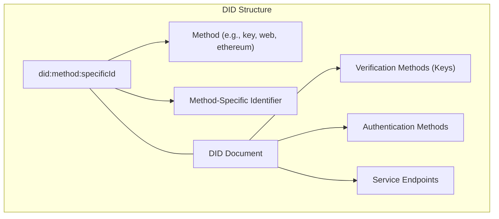
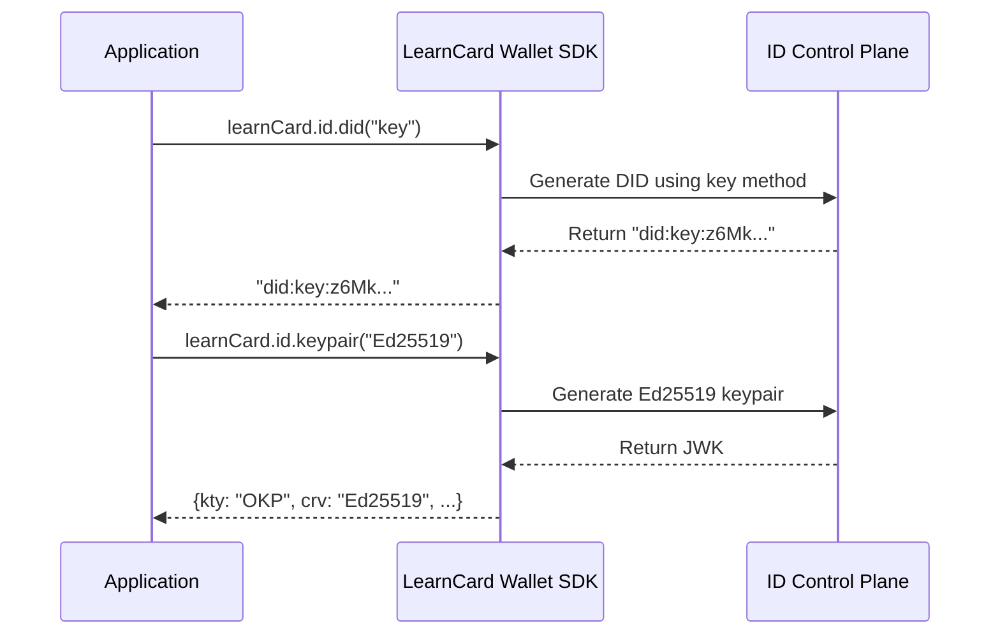

# Decentralized Identifiers (DIDs)

Decentralized Identifiers (DIDs) are a type of globally unique identifier that enables verifiable, decentralized digital identity. Unlike traditional identifiers, DIDs are:

* **Self-sovereign**: Controlled by the identity owner, not a central authority
* **Persistent**: Do not require the continued operation of an underlying organization
* **Cryptographically verifiable**: Allow the controller to prove control without requiring permission

A DID looks like this: `did:method:specific-idstring`, where the method specifies how the DID operates.

## DID Methods

LearnCard supports multiple DID methods, each with different characteristics:

<table data-header-hidden data-full-width="true"><thead><tr><th>DID Method</th><th>Description</th><th>Common Use Case</th></tr></thead><tbody><tr><td>did:key</td><td>Generates a digital ID directly from a cryptographic key, often stored locally (e.g., in a JWK file).</td><td>Simple IDs tied directly to a specific crypto key.</td></tr><tr><td>did:web</td><td>Uses a standard website address (domain name) to make a digital ID's information publicly and securely findable online.</td><td>Digital IDs for organizations or websites.</td></tr><tr><td>did:pkh</td><td>Creates a digital ID directly from a public blockchain address (like a crypto wallet address), supporting multiple blockchain types through a common standard (CAIP).</td><td>Linking digital IDs to various blockchain accounts.</td></tr><tr><td>did:jwk</td><td>Directly transforms a cryptographic key (in JWK format) into a full digital ID and its associated information.</td><td>Representing a cryptographic key as a complete digital ID.</td></tr><tr><td>did:test</td><td>Generates sample digital IDs and related data, specifically for testing software that uses DIDs.</td><td>Testing and ensuring DID systems work correctly.</td></tr><tr><td>did:ethr</td><td>A widely-used method for digital IDs on the Ethereum blockchain, common in many Web3 applications.</td><td>Digital IDs for apps and services on Ethereum.</td></tr><tr><td>did:ion</td><td>Creates highly scalable and decentralized digital IDs using the Bitcoin network, secured by the Sidetree protocol.</td><td>Scalable and secure IDs on the Bitcoin blockchain.</td></tr><tr><td>did:tezos</td><td>Creates digital IDs that are linked to accounts on the Tezos blockchain.</td><td>Digital IDs for users and apps on Tezos.</td></tr></tbody></table>

## Verifiable Proof Types

<table data-header-hidden data-full-width="true"><thead><tr><th width="318.6605224609375"></th><th></th><th></th></tr></thead><tbody><tr><td>Proof Type</td><td>Description</td><td>Common Use Case</td></tr><tr><td>RSASignature2018</td><td>A widely recognized digital signature method using RSA cryptography, common in traditional web security.</td><td>Verifying authenticity in systems familiar with established RSA standards.</td></tr><tr><td>Ed25519VerificationKey2018 / Ed25519Signature2018</td><td>A modern, fast, and secure digital signature method using Ed25519 keys.</td><td>High-performance, secure verification in newer systems and many blockchains.</td></tr><tr><td>EcdsaSecp256k1Signature2019</td><td>A digital signature method widely used by Bitcoin, Ethereum, and other blockchain platforms (uses the secp256k1 curve).</td><td>Securing transactions and identities in many popular blockchain ecosystems.</td></tr><tr><td>EcdsaSecp256r1Signature2019</td><td>A digital signature method commonly used in web security (like TLS/SSL) and various industry standards (uses the P-256 curve).</td><td>Ensuring authenticity in standard web communications and enterprise applications.</td></tr><tr><td>EcdsaSecp256k1RecoverySignature2020</td><td>A specialized digital signature (secp256k1 curve) where the signer's public key (or address) can be found directly from the signature itself.</td><td>Creating compact proofs in systems like Ethereum where sender identity is derived.</td></tr><tr><td>Eip712Signature2021</td><td>A way to sign structured, human-readable data on Ethereum, making it clearer to users what they are approving.</td><td>User-friendly signing of detailed information in Ethereum applications.</td></tr><tr><td>JsonWebSignature2020 (JWS)</td><td>A standard method for creating digital signatures using JSON, offering flexibility with different signature algorithms.</td><td>Securely signing data for web applications and APIs, commonly used with JWTs.</td></tr></tbody></table>

## ID Control Plane

When using the [LearnCard Wallet SDK](../../sdks/learncard-core/), the ID control plane provides standardized methods for working with DIDs:

