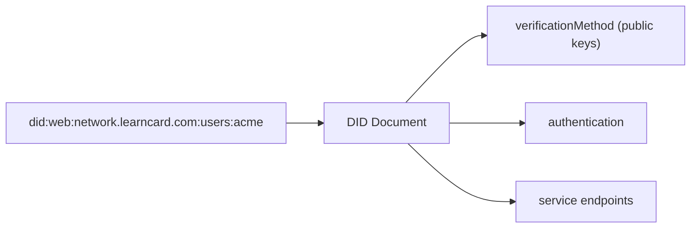

# Decentralized Identifiers (DIDs)

A DID is a username that no company owns. It's a globally unique identifier — like `did:key:z6Mk...` — that a person or organization controls with a private key, so their identity and everything attached to it keep working even if any single platform disappears.

Every credential names two DIDs: the `issuer` who signed it and the `credentialSubject.id` it's about. Verifiers resolve those DIDs to public keys and check the signatures. No account lookup, no API call to the issuer.

## The two DIDs you'll actually see

| DID                                               | Where it comes from                                                                | Use it for                                                                     |
| ------------------------------------------------- | ---------------------------------------------------------------------------------- | ------------------------------------------------------------------------------ |
| `did:key:z6Mk…`                                   | Derived directly from a key. `initLearnCard({ seed })` gives you one.              | Issuing from your server; any identity that doesn't need a human-readable name |
| `did:web:network.learncard.com:users:<profileId>` | Assigned when you create a network profile. Resolves through the network's domain. | Your public issuer identity — the one recipients and registries see            |

A `did:key` is self-contained: the public key is encoded in the identifier, so anyone can verify signatures with no network access. A `did:web` is resolvable: the DID Document is served over HTTPS, so the network can rotate keys or add service endpoints without changing the identifier.

Both resolve to the same thing — a **DID Document** listing the public keys that may sign for this identity and how to authenticate as it.


```mermaid
graph LR
    DID["did:web:network.learncard.com:users:acme"] --> Doc["DID Document"]
    Doc --> Keys["verificationMethod (public keys)"]
    Doc --> Auth["authentication"]
    Doc --> Svc["service endpoints"]
```

LearnCard can also resolve `did:jwk`, `did:pkh`, `did:ethr`, `did:ion`, and `did:tezos` credentials issued elsewhere. You won't create those with LearnCard; you'll only verify them.

## Signing in with a DID

DID-Auth proves you control a DID by signing a challenge with its private key — no password, no email. It's how the SDK authenticates to the LearnCard Network, how the redirect back from a [consent flow](../consent-and-permissions/consentflow-overview.md) proves who consented, and how an [embedded app](../../how-to-guides/publish-your-app.md#know-who-the-user-is) learns who its user is. Details: [SDK Authentication](../../sdks/learncard-core/authentication.md).

## In the SDK

Set `SECURE_SEED` to your 64-hex seed and `PROFILE_ID` to a unique profile ID. This creates a profile if needed and prints only the key type and curve, not private key material.

<!-- snippet: understand/dids.mjs -->

```javascript
import { initLearnCard } from '@learncard/init';

const { SECURE_SEED, PROFILE_ID } = process.env;
if (!SECURE_SEED || !PROFILE_ID) throw new Error('Set SECURE_SEED and PROFILE_ID');
const learnCard = await initLearnCard({ seed: SECURE_SEED, network: true });
if (!(await learnCard.invoke.getProfile())) {
    await learnCard.invoke.createProfile({ profileId: PROFILE_ID, displayName: 'Understand DIDs' });
}
console.log('profile:', learnCard.id.did());
console.log('key:', learnCard.id.did('key'));
const { kty, crv } = learnCard.id.keypair();
console.log('keypair:', kty, crv); // Never print the private JWK fields.
```

<!-- /snippet -->

With seed-based network initialization, `id.did()` starts as `did:key` and switches to the profile's `did:web` when the profile is loaded or created. `id.did('key')` always derives the key DID from your seed.

Without `network: true`, `id.did()` returns the `did:key`. The `id` [control plane](../architecture-and-principles/control-planes.md) is the same regardless of which plugin provides the keys.

## Related

- [Seed Phrases](seed-phrases.md) — where the key behind a `did:key` comes from
- [Network Profiles](network-profiles.md) — where a `did:web` comes from
