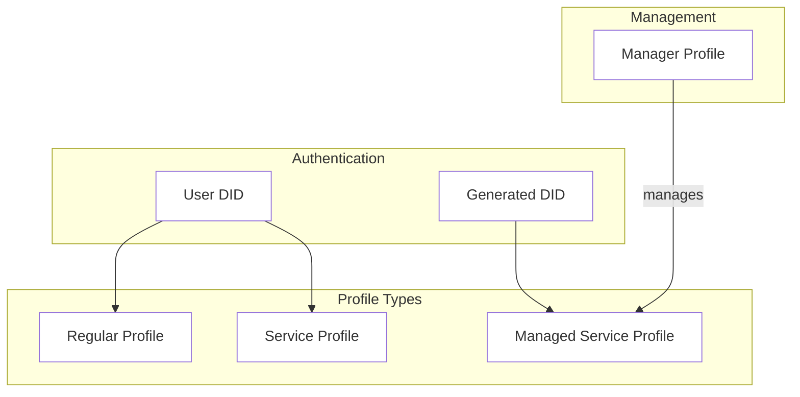

# Network Profiles

LearnCloud Network provides rich DID-based user profiles. They are the foundation for user identity and relationship management in the Network. The LearnCloud Network implements functionality for creating and managing user profiles, establishing connections between users, and managing authentication and authorization.

## Profile Types and Data Model

The LearnCard Network supports three distinct types of profiles, each serving different use cases while sharing the same underlying data model.

<table data-header-hidden data-full-width="true"><thead><tr><th width="162.50115966796875">Profile Type</th><th>Description</th><th>When to Use / Key Use Cases</th></tr></thead><tbody><tr><td>Regular Profile</td><td>
Represents an individual person directly using an application or service. This is the standard type for most human users. 

<code>isServiceProfile = false</code>
</td><td>Ideal for individual human users. Enables direct self-management of personal data and settings. Suits typical interactive use, like logging into apps or websites.</td></tr><tr><td>Service Profile</td><td>Represents a non-human actor, like an application, script, or automated process, that needs to interact with APIs or services programmatically. <code>isServiceProfile = true</code></td><td>For automated systems or applications needing API access. Used for backend processes, server-to-server communication, and automated tasks. Assigns specific, often limited, permissions to software components.</td></tr><tr><td>Managed Profile</td><td>A profile whose activities, permissions, or data are overseen or controlled by another designated "Manager Profile." This supports delegation and oversight. They are created using the <code>createManagedServiceProfile</code></td><td>For accounts requiring supervision (e.g., a child's profile managed by a guardian). Represents organizational sub-units (like a department) controlled by a parent organizational account. When an entity needs to operate with permissions granted and managed by a separate authority.</td></tr></tbody></table>

