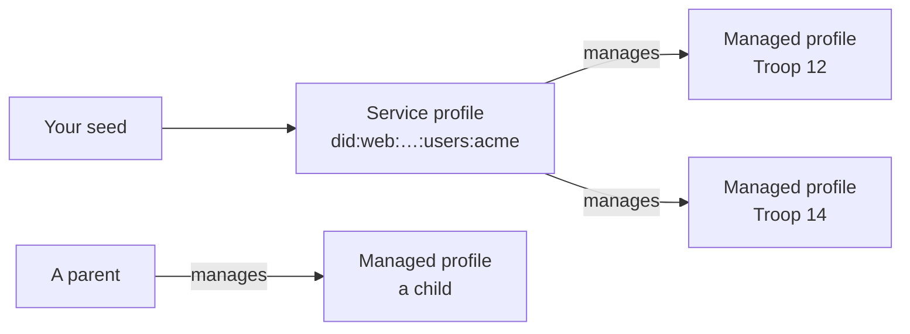

# Network Profiles

A DID is an identifier. A **profile** is what makes it a participant on the LearnCard Network: a `profileId` others can address, a display name and image recipients see, and a `did:web` the network resolves for you. You need a profile before you can send, receive, or connect.

## Three kinds

| Profile     | Represents                                                                    | Created with                                               | Key held by                                |
| ----------- | ----------------------------------------------------------------------------- | ---------------------------------------------------------- | ------------------------------------------ |
| **Regular** | A person using the LearnCard app or your app                                  | Sign-up in the app, or `createProfile()`                   | The person                                 |
| **Service** | Your server, bot, or organization — anything that issues programmatically     | `createServiceProfile()`; the Quickstart does this         | You (a seed or a hosted signing authority) |
| **Managed** | An account someone else administers: a child's account, a department, a troop | `createManagedProfile()` / `createManagedServiceProfile()` | The network, on behalf of the manager      |

Regular and Service profiles are the same data model with `isServiceProfile` flipped; the flag mostly affects how the app displays them and which features (like the Developer Portal) they can use.

A **Managed** profile has no seed of its own. The network generates its DID and lets the **manager** — a Regular or Service profile — act for it. That's how a guardian approves credentials for a child, and how ScoutPass runs a national organization → troop → scout hierarchy where each level is a managed profile under the one above.

```mermaid
graph LR
    You["Your seed"] --> SP["Service profile<br/>did:web:…:users:acme"]
    SP -->|manages| MP1["Managed profile<br/>Troop 12"]
    SP -->|manages| MP2["Managed profile<br/>Troop 14"]
    Parent["A parent"] -->|manages| Child["Managed profile<br/>a child"]
```

## What a profile gives you

- **An address.** `send({ recipient: 'acme' })` works once `acme` is a profileId. Email and phone recipients don't need one yet — the [Universal Inbox](../network-and-interactions/universal-inbox.md) holds the credential until they create one.
- **A `did:web`.** `did:web:network.learncard.com:users:<profileId>` resolves through the network, so you can rotate keys or move signing to a hosted authority without changing your issuer identity.
- **A face.** The `displayName` and `image` are what recipients see in the claim email and in their LearnCard.
- **Connections.** Profiles can connect to each other, which unlocks direct sends without a claim step.

## Per network

Profiles live on one network. Your staging profile and your production profile are different records, even from the same seed — see [Test Safely](../../how-to-guides/deploy-infrastructure/test-safely.md).
