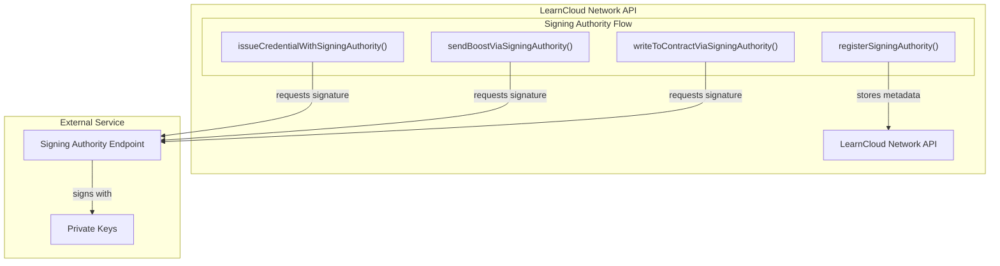

# Signing Authorities

## **What is a Signing Authority and Why Use It?**

Imagine your organization (the Owner) wants to allow a specific department's application or a trusted partner service to issue "Course Completion" badges on its behalf. You wouldn't want to give that application your organization's main private key.

A **Signing Authority** is a separate service with its own unique identity and keys. The Owner can authorize this Signing Authority to issue specific credentials on their behalf. When a credential needs to be issued:

1. The Owner (or an application acting for the Owner) requests the issuance via the LearnCloud Network.
2. The request specifies that the designated, registered Signing Authority should perform the actual cryptographic signing.
3. The LearnCloud Network contacts your AWS-hosted Signing Authority.
4. Your Signing Authority signs the credential using _its own keys_.
5. The resulting Verifiable Credential (VC) still shows the Owner as the `issuer`, but the cryptographic `proof` indicates it was generated by your AWS-hosted Signing Authority, as authorized by the Owner.

**Benefits:**

* **Enhanced Security:** The Owner's primary keys are not shared with the services performing routine issuance.
* **Delegation:** Safely delegate issuance capabilities to other applications or services.
* **Cloud Scalability & Reliability:** Leverage AWS infrastructure for your signing operations.
* **Scoped Permissions:** (Future capability) Potentially limit what types of credentials a specific authority can issue.&#x20;

Signing Authorities allow third-party services to issue credentials on behalf of profiles. This enables credential issuance without requiring direct access to private keys.

