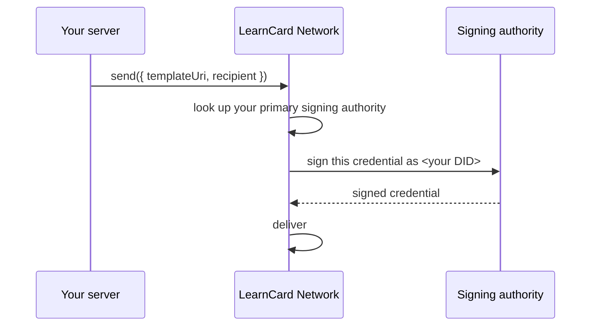

# Signing Authorities

Every credential is signed by a private key. A **signing authority** is a key that signs _on your behalf_ — so `send()` can produce credentials issued by you without your server ever holding the key.

## Why it exists

Two things want to sign credentials as you but shouldn't have your seed:

- **LearnCard itself**, when you send from a template, use the Developer Portal, or run an embedded app. There's no code of yours in the loop to do the signing.
- **A separate service**, when your organization runs its own signing infrastructure and wants LearnCard to call it rather than hand keys around.

A signing authority solves both. You register a signer — its endpoint, a name, and its DID — against your profile. From then on, when the network needs to issue something as you, it asks that signer.

## Two kinds

|                   | **Hosted**                                                                                             | **Your own**                                                           |
| :---------------- | :----------------------------------------------------------------------------------------------------- | :--------------------------------------------------------------------- |
| Who holds the key | LearnCard, tied to your profile                                                                        | You, on a server you run                                               |
| How you create it | One click in the Developer Portal, or `createSigningAuthority()`                                       | Deploy a [VC-API](https://w3c-ccg.github.io/vc-api/) `/issue` endpoint |
| Then              | `registerSigningAuthority()` + `setPrimaryRegisteredSigningAuthority()` — the Portal does both for you | Same two calls, with your endpoint                                     |
| Choose it when    | You'd rather not manage keys; you use templates or API tokens                                          | Compliance or policy requires your keys to stay on your infrastructure |

Almost everyone wants **hosted**. The setup walkthrough is [Who Signs Your Credentials?](../../how-to-guides/create-signing-authority.md)

## What the credential looks like

The credential's `issuer` is still **you** — your profile's DID. The `proof` is made by the signing authority's key, which your registration has authorized to sign for that DID. Verifiers resolve your DID, find the authority's key among its verification methods, and the signature checks out. Recipients see your name and logo, not the authority's.

## How it's used

```mermaid
sequenceDiagram
    participant You as Your server
    participant Net as LearnCard Network
    participant SA as Signing authority
    You->>Net: send({ templateUri, recipient })
    Net->>Net: look up your primary signing authority
    Net->>SA: sign this credential as <your DID>
    SA-->>Net: signed credential
    Net->>Net: deliver
```

You can register several authorities; `send()` always uses the one marked **primary**. Auto-issued credentials from a [consent contract](../consent-and-permissions/auto-boosts.md) name their authority explicitly in the contract.

If you pass a `signedCredential` to `send()` instead of a template, no signing authority is involved — you already signed it.
