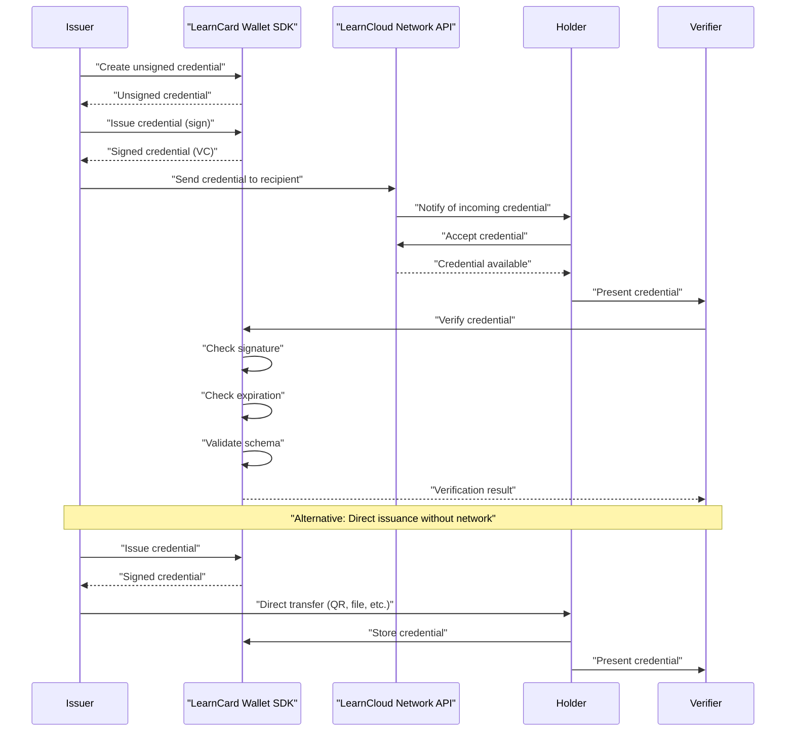
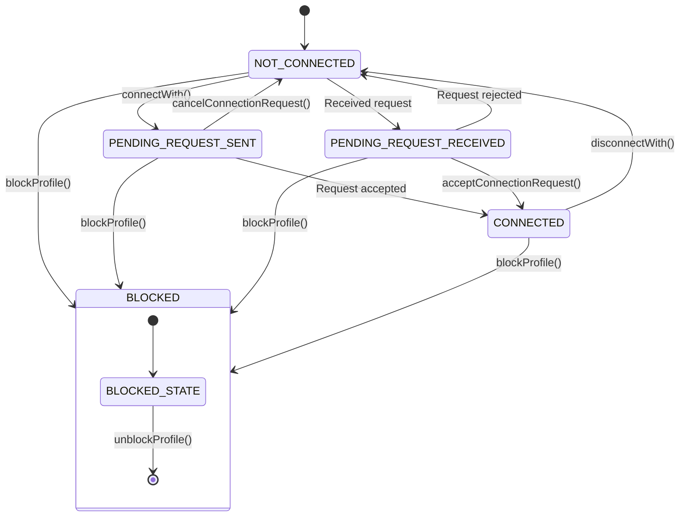
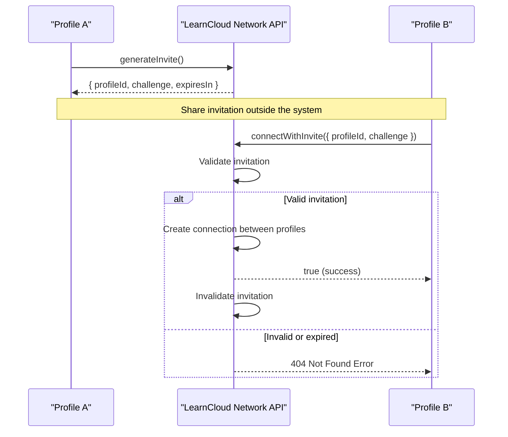
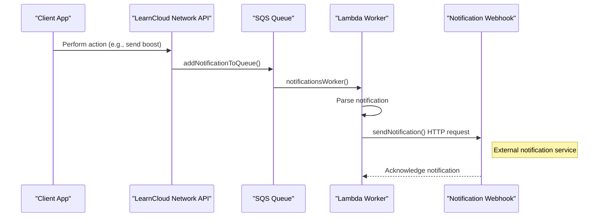

# Core Interaction Workflows

This page illustrates common end-to-end scenarios showing how participants interact on the LearnCard Network to achieve key goals like obtaining or presenting credentials.

## Send Verifiable Credentials



## Send Boost Credentials

When you need to issue multiple credentials all tied to the same "template" credential, use a Boost Credential.



## Issue, Accept, Verify, & Present Credentials

## Manage Connections Between Profiles 

The LearnCard Network implements a bidirectional connection system similar to "friend" relationships in social networks. These connections enable profiles to share credentials, boosts, and other data with each other.

### Connection States 

Connections between profiles can be in one of these states (defined in `LCNProfileConnectionStatusEnum`):

* `NOT_CONNECTED`: No connection exists between profiles
* `PENDING_REQUEST_SENT`: The current profile has sent a connection request that's awaiting acceptance
* `PENDING_REQUEST_RECEIVED`: The current profile has received a connection request awaiting action
* `CONNECTED`: The profiles have an active bidirectional connection

### Connection Invitations 

The system supports direct connection via invitation:

* `generateInvite`: Creates a time-limited invitation challenge
* `connectWithInvite`: Establishes a connection using a valid challenge

This is useful for connecting profiles without requiring the standard request-accept flow, such as when onboarding users from an external system.

## Notifications & Webhooks

In addition to direct request-response patterns, the LearnCloud Network utilizes an asynchronous notification system to inform applications and users of important events in real-time, such as receiving a new credential or a connection request. This is typically achieved by configuring a webhook.&#x20;

For detailed information on configuring webhooks and the specific event payloads, refer to the [Notifications & Webhooks guide in the LearnCloud Network API Reference](../../sdks/learncard-network/notifications.md)

