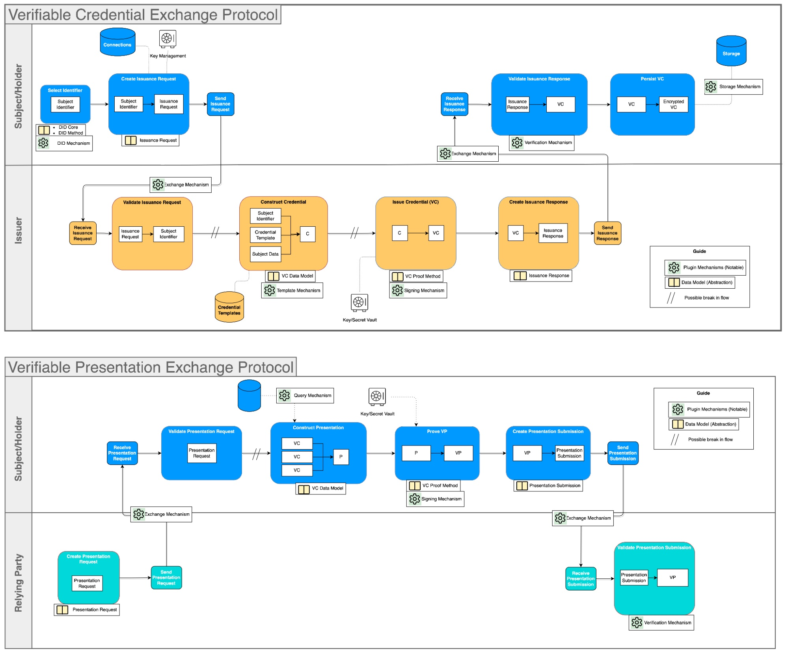

# Key Network Procedures

The LearnCard Network protocol is built upon a set of standardized procedures, or actions, that enable various interactions. This page provides a conceptual overview of each key procedure and its purpose

## Conceptual Interaction Examples

Interactions on the LearnCloud Network follow defined patterns and utilize a set of core procedures. These ensure that when credentials are exchanged or presented, all parties understand the steps involved and can trust the process.

To illustrate how these interactions work, let's consider two common scenarios:

A. Credential Exchange Example (Receiving a Credential

Imagine Alice has just completed an online course on "Sustainable Design" from an institution, "EcoLearn University."

1. **Preparation & Issuance:** Upon Alice's successful course completion, EcoLearn University (the **Issuer**) uses its systems (which interact with the LearnCloud Network protocols) to prepare a "Sustainable Design Certificate" Verifiable Credential for Alice. They use Alice's DID (Decentralized Identifier) and their own Issuer DID to construct and digitally sign the VC.
2. **Delivery:** EcoLearn University then uses an agreed-upon exchange mechanism facilitated by the LearnCloud Network to send the signed VC to Alice (the **Holder**).
3. **Receipt & Verification:** Alice receives the VC in her digital wallet (e.g., her LearnCard-powered app). Her wallet automatically helps her verify that the VC was indeed signed by EcoLearn University and that its contents match the expected format for a course certificate.
4. **Storage:** Satisfied, Alice stores the VC securely in her wallet, ready to be used.

<strong>B. Presentation Exchange Example (Sharing a Credential)</strong>

Now, Alice wants to apply for a "Green Initiatives Grant" offered by "FutureOrg," which requires proof of knowledge in sustainable design.

1. **Proof Request:** As part of the application, FutureOrg (the **Verifier**) requests Alice (the **Holder**) to present a Verifiable Credential proving her competency in sustainable design. This request might come through an application portal that uses LearnCloud Network protocols.
2. **Preparation of Presentation:** Alice receives the request. She reviews it to confirm what's being asked. Using her digital wallet, she selects her "Sustainable Design Certificate" VC. Her wallet then helps her prepare a Verifiable Presentation (VP), which is essentially a secure package containing the VC and her own digital signature proving she is the one presenting it. She might choose to only disclose necessary information.
3. **Delivery of Presentation:** Alice sends the VP to FutureOrg through the agreed-upon exchange mechanism.
4. **Receipt & Verification:** FutureOrg receives the VP. Their system (interacting with LearnCloud Network protocols) verifies Alice's signature on the VP. It then deconstructs the VP to examine the "Sustainable Design Certificate" VC itself, verifying its signature from EcoLearn University and checking its validity.
5. **Decision:** FutureOrg, now confident in Alice's credential, can proceed with evaluating her grant application.

## Core Procedures

The interactions described above are made possible by a set of standardized "Core Procedures" within the LearnCloud Network protocol. These procedures define the common language and steps for managing credentials. Here's a conceptual overview of the main ones:

1. **Construct Credential:** The initial step of assembling the necessary information for a new credential, based on a defined template and the subject's details, preparing it for official issuance.
2. **Issue Credential:** An Issuer applies their unique digital signature to a constructed credential, transforming it into a secure, tamper-proof Verifiable Credential ready for use on the network.
3. **Exchange Credential:** Defines how a signed Verifiable Credential is securely transmitted from one party (like an Issuer) to another (like a Holder).
4. **Verify & Validate Credential:** The process by which a recipient of a credential checks its digital signature to ensure authenticity and integrity (Verify) and checks its content against expected rules or schemas (Validate).
5. **Store Credential:** A procedure for a Holder to securely store their received credentials in their chosen repository or digital wallet.
6. **Construct Presentation:** The process by which a Holder selects one or more of their credentials and prepares them to be shared with a Verifier in a structured format.
7. **Prove Presentation (Sign Presentation):** The Holder applies their digital signature to the constructed presentation, creating a Verifiable Presentation that proves they are the one sharing the credentials.
8. **Exchange Presentation:** Defines how a signed Verifiable Presentation is securely transmitted from a Holder to a Verifier.
9. **Verify & Validate Presentation:** The process by which a Verifier checks the Holder's signature on the presentation (Verify) and then proceeds to verify and validate the individual credentials contained within it.

Additionally, **Supplemental Procedures** exist to support these core actions, such as:

* **Select Identifier:** Managing and retrieving DIDs.
* **Request Issuance/Presentation:** Formalizing requests for credentials or presentations.
* **Credential Templates:** Accessing standardized templates for creating credentials.
* **Query VCs:** Searching or filtering stored credentials.

These procedures, working together, form the backbone of trustworthy and interoperable digital credential interactions on the LearnCloud Network.
