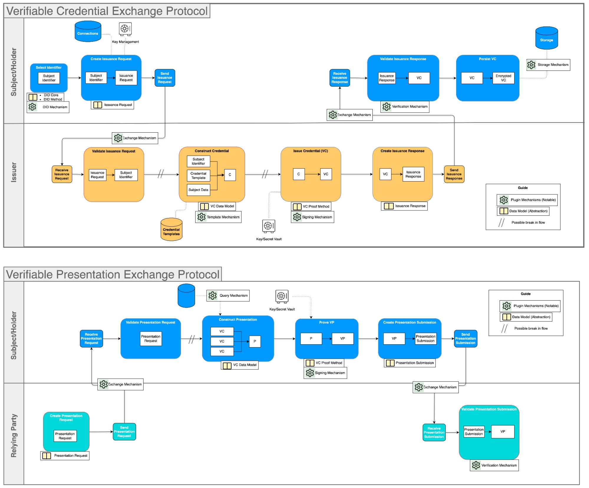
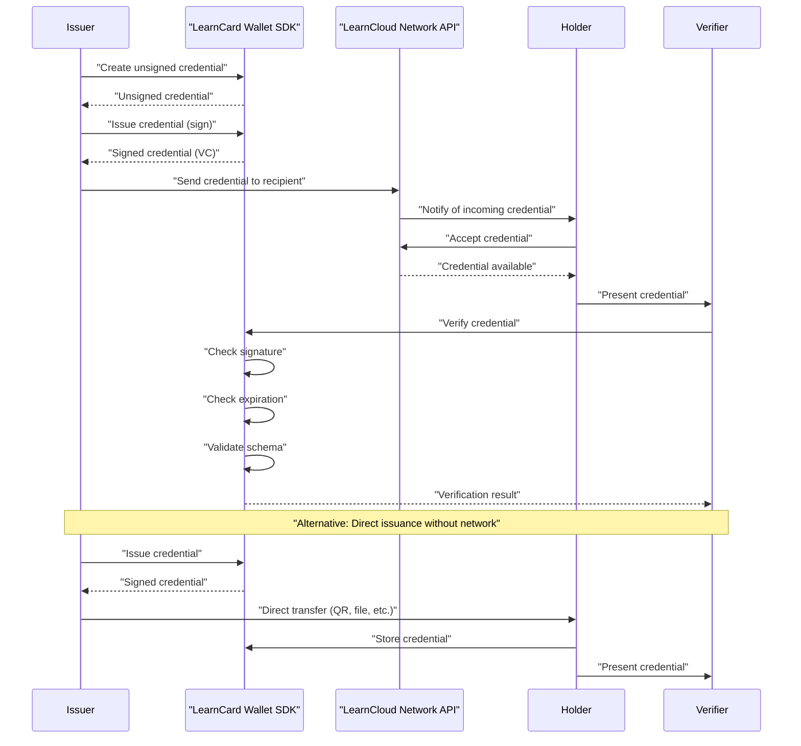
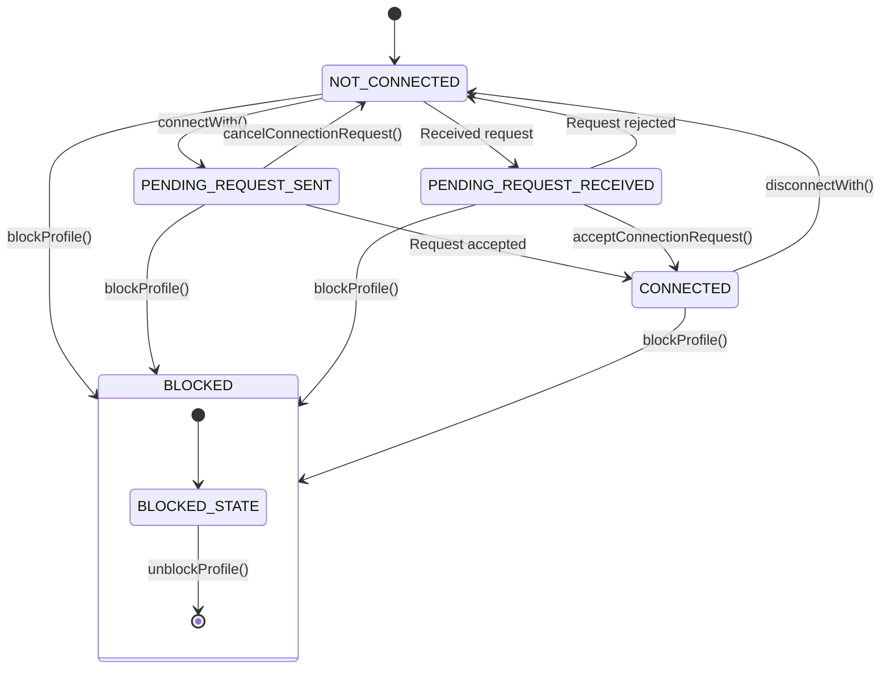
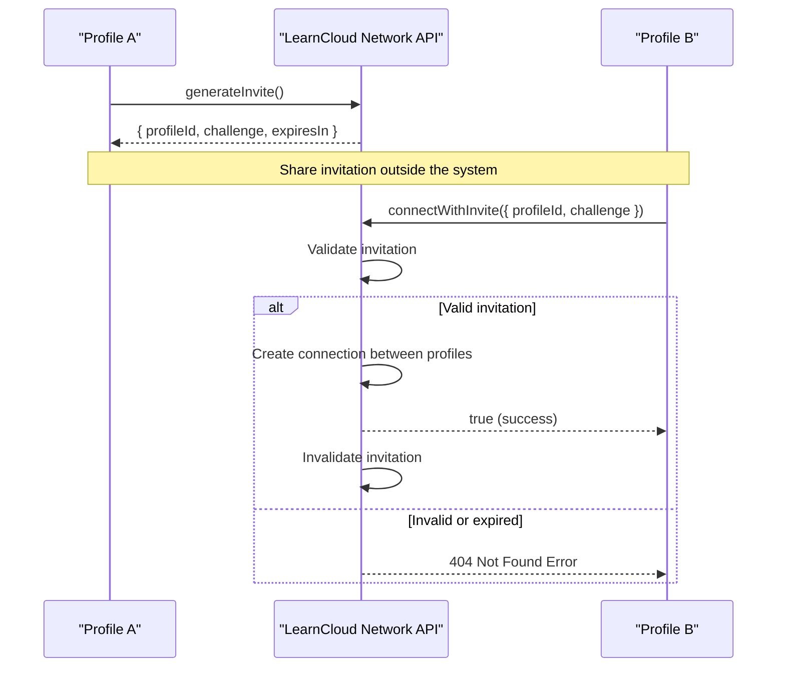
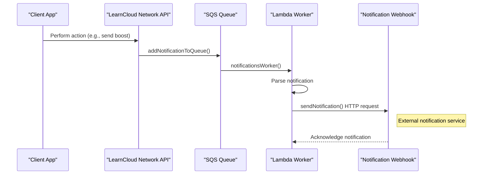

# Network Architecture

## Vision & Principles

This section details how different components and participants within the LearnCard ecosystem communicate and interact. It covers the underlying principles of these interactions, common patterns for using APIs, and the typical order of operations (Sequencing) for key processes.

Understanding this is crucial because it explains the "rules of the road" for how digital credentials and data move and are verified within the LearnCard environment, enabling you to build robust and interoperable applications.

#### Why a Credential Network?

For decades, credentials like diplomas, licenses, and certificates have been largely physical or, if digital, often locked into specific, isolated systems. This made them hard to share, difficult to verify quickly, and limited in their use.

The advent of **Decentralized Identifiers (DIDs)** and **Verifiable Credentials (VCs)** (which you can learn more about in our ["Identities & Keys" ](../identities-and-keys/)and "[Credentials & Data"](../credentials-and-data/) sections) has started a digital transformation. We now have the tools for anyone to issue a verifiable digital credential to anyone else, for that credential to be securely stored by its holder, and then presented to third parties for verification in a trustworthy way.

However, just having these tools isn't enough. To unlock their full potential—to move beyond simply digitizing old processes into creating dynamic, programmable, and broadly trusted interactions—we need common protocols and an open environment. Without this, digital credentialing could remain fragmented, preventing the powerful **network effects** (where a service becomes more valuable as more people use it) seen in other areas of the web.

## The LearnCloud Network

The **LearnCloud Network** is envisioned as an open and interoperable ecosystem designed to facilitate the exchange, storage, programmability, and verification of Verifiable Credentials. It's not a single, centralized database, but rather a set of rules, protocols, and open-source tools that allow different systems and participants to interact seamlessly and securely.

Our **vision** is to foster an environment where the use of verifiable credentials becomes widespread, intuitive, and innovative. We aim to enable a new generation of applications where trust is built digitally, individuals have more control over their data, and new use cases for verifiable information can emerge rapidly across diverse fields like education, employment, and community engagement.

### Core Goals of the Network

To achieve this vision, the LearnCloud Network is built around these primary goals:

1. **Standardized Core Interactions:** Provide clear, unified procedures for the essential lifecycle actions of Verifiable Credentials and Presentations – such as their creation, issuance, secure exchange, storage, and verification.
2. **Openness and Extensibility:** Develop the network using open-source principles and international standards. This allows for broad participation and ensures that the system can be extended and adapted by the community (for example, by "bringing your own implementation" for certain components while still adhering to the core protocol).
3. **Broad Participation:** Enable any individual, organization, or service to participate in the network, provided they meet minimal technical requirements, fostering inclusivity and accelerating adoption.

### Key Participants & The Triangle of Trust

Interactions on the LearnCloud Network typically involve the classic roles of the "Triangle of Trust," now operating in a digital, networked context:

-   **Issuers:** Entities that create and digitally sign credentials to vouch for certain information about a Subject.
-   **Holders:** Individuals or entities who receive credentials, store them securely (often in a digital wallet like one powered by LearnCard SDK), and decide when and with whom to share them.
-   **Verifiers (Relying Parties):** Entities that receive credentials (often as part of a Verifiable Presentation from a Holder) and check their authenticity and validity to make informed decisions.

The LearnCloud Network provides the protocols and infrastructure to facilitate trustworthy interactions between these participants, ensuring that each role can operate with confidence in the integrity of the data and the identity of the other parties.

### Guiding Principles

The design and operation of the LearnCloud Network are guided by principles such as:

-   **Interoperability:** Adherence to W3C standards and promotion of common formats to ensure credentials can be used across different systems and wallets.
-   **Security & Verifiability:** Leveraging strong cryptography for digital signatures to ensure credentials are tamper-evident and their origin can be proven.
-   **User Control & Privacy:** Empowering Holders to manage their own credentials and consent to how their data is shared, often using principles of data minimization.
-   **Decentralization:** Reducing reliance on single points of failure or control where appropriate, often through the use of DIDs.

## Key Network Procedures

The LearnCard Network protocol is built upon a set of standardized procedures, or actions, that enable various interactions. This page provides a conceptual overview of each key procedure and its purpose

## Conceptual Interaction Examples

Interactions on the LearnCloud Network follow defined patterns and utilize a set of core procedures. These ensure that when credentials are exchanged or presented, all parties understand the steps involved and can trust the process.

To illustrate how these interactions work, let's consider two common scenarios:

A. Credential Exchange Example (Receiving a Credential

Imagine Alice has just completed an online course on "Sustainable Design" from an institution, "EcoLearn University."

1. **Preparation & Issuance:** Upon Alice's successful course completion, EcoLearn University (the **Issuer**) uses its systems (which interact with the LearnCloud Network protocols) to prepare a "Sustainable Design Certificate" Verifiable Credential for Alice. They use Alice's DID (Decentralized Identifier) and their own Issuer DID to construct and digitally sign the VC.
2. **Delivery:** EcoLearn University then uses an agreed-upon exchange mechanism facilitated by the LearnCloud Network to send the signed VC to Alice (the **Holder**).
3. **Receipt & Verification:** Alice receives the VC in her digital wallet (e.g., her LearnCard-powered app). Her wallet automatically helps her verify that the VC was indeed signed by EcoLearn University and that its contents match the expected format for a course certificate.
4. **Storage:** Satisfied, Alice stores the VC securely in her wallet, ready to be used.

<strong>B. Presentation Exchange Example (Sharing a Credential)</strong>

Now, Alice wants to apply for a "Green Initiatives Grant" offered by "FutureOrg," which requires proof of knowledge in sustainable design.

1. **Proof Request:** As part of the application, FutureOrg (the **Verifier**) requests Alice (the **Holder**) to present a Verifiable Credential proving her competency in sustainable design. This request might come through an application portal that uses LearnCloud Network protocols.
2. **Preparation of Presentation:** Alice receives the request. She reviews it to confirm what's being asked. Using her digital wallet, she selects her "Sustainable Design Certificate" VC. Her wallet then helps her prepare a Verifiable Presentation (VP), which is essentially a secure package containing the VC and her own digital signature proving she is the one presenting it. She might choose to only disclose necessary information.
3. **Delivery of Presentation:** Alice sends the VP to FutureOrg through the agreed-upon exchange mechanism.
4. **Receipt & Verification:** FutureOrg receives the VP. Their system (interacting with LearnCloud Network protocols) verifies Alice's signature on the VP. It then deconstructs the VP to examine the "Sustainable Design Certificate" VC itself, verifying its signature from EcoLearn University and checking its validity.
5. **Decision:** FutureOrg, now confident in Alice's credential, can proceed with evaluating her grant application.

## Core Procedures

The interactions described above are made possible by a set of standardized "Core Procedures" within the LearnCloud Network protocol. These procedures define the common language and steps for managing credentials. Here's a conceptual overview of the main ones:

1. **Construct Credential:** The initial step of assembling the necessary information for a new credential, based on a defined template and the subject's details, preparing it for official issuance.
2. **Issue Credential:** An Issuer applies their unique digital signature to a constructed credential, transforming it into a secure, tamper-proof Verifiable Credential ready for use on the network.
3. **Exchange Credential:** Defines how a signed Verifiable Credential is securely transmitted from one party (like an Issuer) to another (like a Holder).
4. **Verify & Validate Credential:** The process by which a recipient of a credential checks its digital signature to ensure authenticity and integrity (Verify) and checks its content against expected rules or schemas (Validate).
5. **Store Credential:** A procedure for a Holder to securely store their received credentials in their chosen repository or digital wallet.
6. **Construct Presentation:** The process by which a Holder selects one or more of their credentials and prepares them to be shared with a Verifier in a structured format.
7. **Prove Presentation (Sign Presentation):** The Holder applies their digital signature to the constructed presentation, creating a Verifiable Presentation that proves they are the one sharing the credentials.
8. **Exchange Presentation:** Defines how a signed Verifiable Presentation is securely transmitted from a Holder to a Verifier.
9. **Verify & Validate Presentation:** The process by which a Verifier checks the Holder's signature on the presentation (Verify) and then proceeds to verify and validate the individual credentials contained within it.

Additionally, **Supplemental Procedures** exist to support these core actions, such as:

-   **Select Identifier:** Managing and retrieving DIDs.
-   **Request Issuance/Presentation:** Formalizing requests for credentials or presentations.
-   **Credential Templates:** Accessing standardized templates for creating credentials.
-   **Query VCs:** Searching or filtering stored credentials.

These procedures, working together, form the backbone of trustworthy and interoperable digital credential interactions on the LearnCloud Network.

## Core Interaction Workflows

This page illustrates common end-to-end scenarios showing how participants interact on the LearnCard Network to achieve key goals like obtaining or presenting credentials.

## Send Verifiable Credentials



## Send Boost Credentials

When you need to issue multiple credentials all tied to the same "template" credential, use a Boost Credential.



## Issue, Accept, Verify, & Present Credentials

## Manage Connections Between Profiles 

The LearnCard Network implements a bidirectional connection system similar to "friend" relationships in social networks. These connections enable profiles to share credentials, boosts, and other data with each other.

### Connection States 

Connections between profiles can be in one of these states (defined in `LCNProfileConnectionStatusEnum`):

-   `NOT_CONNECTED`: No connection exists between profiles
-   `PENDING_REQUEST_SENT`: The current profile has sent a connection request that's awaiting acceptance
-   `PENDING_REQUEST_RECEIVED`: The current profile has received a connection request awaiting action
-   `CONNECTED`: The profiles have an active bidirectional connection

### Connection Invitations 

The system supports direct connection via invitation:

-   `generateInvite`: Creates a time-limited invitation challenge
-   `connectWithInvite`: Establishes a connection using a valid challenge

This is useful for connecting profiles without requiring the standard request-accept flow, such as when onboarding users from an external system.

## Notifications & Webhooks

In addition to direct request-response patterns, the LearnCloud Network utilizes an asynchronous notification system to inform applications and users of important events in real-time, such as receiving a new credential or a connection request. This is typically achieved by configuring a webhook.&#x20;

For detailed information on configuring webhooks and the specific event payloads, refer to the [Notifications & Webhooks guide in the LearnCloud Network API Reference](../../sdks/learncard-network/notifications.md)
